# 大数据泛构

# 一度量空间数据管理分析初探

# Big Data Genhierarchy

—A metric-space data processing paradigm

毛睿

# 目录

目录  
序1：陈国良院士  
序2：李廉教授  
前言 vi

第1章大数据泛构的基本概念 7

1.1 通用数据管理分析模式的研究意义  
1.2 通用数据管理分析模式的实现途径 ..... 11  
1.3 大数据泛构 14  
1.4 度量空间数据管理分析的基本法则 ..... 15  
1.5 本章讨论与展望 ..... 19

第2章 常见的度量空间实例 21

2.1 基于向量的度量空间实例 ..... 21  
2.2 基于字符串的度量空间实例 ..... 25  
2.3 其它度量空间实例 29  
2.4 本章讨论与展望 30

第3章度量空间索引概述 32

3.1 相似性查询 32  
3.2 相似性索引 36  
3.3 支撑点表（Pivot Table） 40

3.3.1 Pivot Table 的结构和批建 ..... 40  
3.3.2 Pivot Table 的范围查询 ..... 42  
3.3.3 Pivot Table 的扩展 ..... 45

3.4 超平面树（General Hyper-plane Tree） 46

3.4.1GH树的结构和批建 46  
3.4.2GH树的范围查询 48  
3.4.3GH树的扩展 53

3.5 优势点树（Vantage Point Tree） 54

3.5.1VP树的结构和批建 55  
3.5.2VP树的范围查询 57  
3.5.3 MVP 树 ..... 59  
3.5.4VP树的其它扩展 62

3.6 度量树（Metric Tree） 63  
3.7 本章讨论与展望 64

第4章 支撑点空间模型 65

4.1 支撑点空间 65  
4.2 支撑点空间中的距离扭曲 70  
4.3 完全支撑点空间及其距离扭曲 72  
4.4 球形在支撑点空间中的像 75  
4.5 本章讨论与展望

第5章 支撑点选择 79

5.1 支撑点选择的必要性 ..... 79  
5.2 支撑点选择方法重要性的例证 ..... 81  
5.3 支撑点个数 86

5.3.1支撑点个数与本征维度 86  
5.3.2 度量空间本征维度估算方法 ..... 88

5.4 目标函数和选择算法 91

5.4.1 Yianilos 目标函数 ..... 91  
5.4.2Bustos 目标函数 91  
5.4.3半径敏感目标函数 91

5.5 选择算法 ..... 91

5.5.1启发式选择算法 91  
5.5.2 抽样式选择算法 91  
5.5.3 降维式选择算法 ..... 91

5.6层次化选择 91

5.6.1层次化选择的支撑点个数 91  
5.6.2 基于外部支撑点的距离扭曲 91  
5.6.3层次化支撑点选择方法 91

5.7 性能上界 91  
5.8 本章讨论与展望 ..... 91

第6章数据划分 92

6.1 划分方式的统一 92

6.1.1 超平面划分的统一 92  
6.1.2 超平面和包络球划分的统一 92  
6.1.3 超平面和球形划分的统一 92

6.2 划分方式的性能评价 95

6.2.1 r-邻域及其大小 ..... 95  
6.2.2 划分边界的夹角 95

6.3 完全线性划分 100

6.4 划分算法 ..... 100

6.4.1平衡划分 100  
6.4.2 聚类划分 ..... 100  
6.4.3 三路划分 ..... 100  
6.4.4 逐个支撑点划分框架 ..... 100

6.5 本章讨论与展望 ..... 100

总结及进一步的工作 101  
实验数据集概况 102  
参考文献 103  
图索引 109  
表格索引 111  
名词索引 112  
符号和标记列表 114  
后记与致谢 115

# 序1：陈国良院士

# 序2：李廉教授

# 前言

写书的过程真的是一个学习提高的过程，而且越提高越发现不懂的东西更多。本书一定存在不少谬误，真诚欢迎和感谢任何形式的批评、建议和斧正，请联系 metricist@qq.com。

# 第1章大数据泛构的基本概念

大数据除了大容量（Volume）和变化快（Velocity）外，还有一个相对研究较少的重要特性或者面临的挑战就是多样性（Variety），一般泛指类型和来源的广泛。处理种类繁多的数据一般可以有两个模式：专用模式，它为每种数据类型量身定做处理系统，性能好但代价高；通用模式，通过构建单一且通用的系统处理多种类型数据，如果性能满足应用需求，则具有很高的性价比，因而往往成为应用软件开发的首选。构建通用系统一般是先找出可以涵盖多种数据类型的统一抽象类型，然后根据统一类型的特点构建系统，这样的系统就可以适用于统一类型所涵盖的多种数据类型了。

本章将首先说明通用数据管理分析模式的研究意义和实现途径，然后给出大数据泛构（Big Data Genhierarchy）的概念，最后举例说明在度量空间中进行通用数据管理分析的基本法则。

# 1.1 通用数据管理分析模式的研究意义

达尔文如此阐释科学：“Science consists in grouping facts so that general laws or conclusions may be drawn from them”[1]。笔者愿意把这句话引申为：科学在于通用。从某种意义上说，通用性是科学和工程的主要差异之一。也就是说，科学偏重于研究发现普遍通用的规律，而工程偏重于把通用的科学规律具象化之后运用到具体的应用之上。通俗地说，科学是搞清楚怎么回事，是知其所以然，把真理展示于世人面前，解决的是“why”的问题；工程是把事情做了，是知其然，解决的是“how”的问题。

科学研究、工程应用、乃至社会生产的方方面面中往往存在着通用模式和专用模式。专用模式为每个要解决的问题量身定做专门的方案，而通用模式设计一个统一的方案来解决多个不同的问题。专用和通用之争是一个长期讨论的问题，两者各有优缺点和适用的场景，并没有绝对的优劣之分。例如，儒家思想中“车同轨，书同文，行同伦”是推崇标准化的做法，是通用模式，一般认为其对中华文明的形成和发展起到了巨大的推动作用，但同时也有人认为如此损害了科学和文化的多样性；被誉为现代经济学鼻祖的亚当·斯密所著的现代经济学开山之作《国富论》的主要观点之一就是劳动分工是提高生产力的关键，这是对专用模式的推崇，但也明确指出其前提是市场足够大；福特开创的大规模流水线生产模式是现代工

业的标志之一，这也是专用模式，但与此同时没人能够否认提升劳动者综合素质对生产率的基础性促进作用；现代医疗模式一般是生病先看全科医生，而大病再看专科医生；计算机领域，CPU和GPU也是通用和专用的例子，CPU适用范围广，而GPU用于特定类型计算的性能更高。类似的例子不胜枚举。

立足信息技术领域，按照从系统底层到上层的顺序，以下分别从半导体产业、计算机体系结构、系统软件（数据库管理系统、云服务）等三个层面举例讨论通用和专用。

  
图1Makimoto's Wave

半导体产业层面关于通用和专用的一个代表性论断是著名的牧村定律（Makimoto's Wave）²[86]，由日立公司原总工程师牧村次夫（Tsugio Makimoto）在1987年提出并于2013年扩充。其认为半导体产业的发展大概每十年在分层解耦（通用）和垂直整合（专用）之间交替波动一次[87]。牧村定律作为一个预测/论断的背后是性能功耗和开发效率之间的平衡。

在计算机体系机构层面，2018年6月3-4日，“新一代计算机体系结构特邀研讨会”在北京召开[2]。这是一次规模小而层次高的会议。总数不到30位的与会人员包括了几乎全部国内计算机体系结构顶尖研究单位的核心代表，含6位院士，且其他参会人员中有2位于翌年当选中国工程院院士，有1位于2021年当选中国科学院院士。会议对后摩尔定律时代计算机系统结构发展方向进行了深入的讨论，其中通用与专用道路的取舍是重要讨论内容之一。相关的观点主要包括<sup>3</sup>：

- 在性能满足应用需求的前提下，通用系统往往具有较高的性价比；

- 计算系统往往是先专用后通用交替发展的；  
- 在摩尔定律临近失效及人工智能和大数据背景下，专用为主的时代可能要到来了；  
- 通用是计算机学科存在的基础，一直都是至关重要的。

在系统软件层面的数据库管理系统领域，为了总结数据库研究进展、展望十四五期间发展趋势、形成数据库领域发展共识，中国计算机学会数据库专业委员会于2021年7月21~24日在甘肃敦煌组织了首届CCF数据库启智会。启智会邀请了18位国内数据库专家参与研讨，笔者亦有幸参加。与会专家逐一介绍了对数据库相关研究方向未来发展趋势的思考，之后所有专家进行了广泛深入的研讨。数位专家指出，在数据库管理系统按照功能日渐分化的时代背景下，其通用性和“平民化”依然非常关键，应充分重视。会后与会专家撰写了相关研究方向的未来发展趋势，最后形成了“十四五"数据库发展趋势与挑战报告[88]。

在系统软件层面的云服务领域，据互联网上公开但未经核实的信息，通用与专用之争在华为也存在<sup>4</sup>。据多家媒体报道，华为于2020年5月将私有云服务整合并入公有云。据报道，华为中央软件院的座谈中有如下观点：“过去按客户定制，限制死了我们的能力，一个个小的软件包，不可复制，不可拷贝，不能重复销售、多客户共用。业软走的失败道路，我们坚决不能再走”，“面向具体客户的个性化开发，需求是存在的，我们不要去否定这些客户需求，而且市场还很大，但，不是大公司的生意，我们一定要抵制住诱惑，这是小公司和系统集成商的生意，也就是大公司的生态伙伴的生意”。也就是说，在专用和通用之间，华为在云服务方面这次选择了通用。

具体到本书重点讨论的大数据领域，当前，大数据应用领域急需通用的功能强大且易于使用和维护的数据管理分析系统。初期大部分的大数据管理分析系统都是基于Map-Reduce执行模式和Hadoop分布式文件系统的，而Map-Reduce最初是由谷歌设计用于日志处理的。这里有两个要素值得注意。第一，Google既具备雄厚的技术实力，也具备雄厚的资金实力，可以支持专用系统的开发，而这样的实力是大部分大数据用户所不具备的，他们需要性价比更高的通用系统。第二，Map-Reduce是为日志扫描等相对较为简单的数据管理任务设计的，虽然它在可处理的数据量上远远超过了传统数据库，但是其在功能的多样性、容错安全性和事务处理等方面的性能远远落后于传统数据库。目前，在银行或通信等对安全稳定性敏感的领域，绝大多数的用户还是采用传统数据库作为其一线生产系统。随着Spark等新的开源软件的出现，主流大数据管理分析系统功能不断丰富，易用性逐渐提高，向传统数据库的高度通用性发展的趋势已逐渐明朗。

一般认为，大数据至少具有3个方面的特点或挑战[3,4]：（1)数据体量巨大（Volume）、（2）变化快及处理速度要求快（Velocity）、（3)数据类型、格式、来源等的多样性（Variety）。以上3个V中，关于Volume和Velocity已经开展了很多研究，而关于Variety的探索则相对较少。面对Variety所包含的数据种类繁多问题，也可以有专用或通用两种模式。专用模式为每种数据类型量身定做专门的处理系统。而通用模式开发一个统一的系统来处理多种类型的数据。例如，现在很多搜索引擎都提供了多种数据类型的搜索模式，最常见的是用文本搜索，很多搜索引擎可以用图片来搜索图片，还有一些搜索引擎可以通过哼唱来搜索音乐。目前大部分搜索引擎都是用不同的软件模块来实现上述的不同数据类型的搜索模式，其开发和维护代价是巨大的。如果能用同一套软件来实现这些功能，虽然用户的使用体验可能没什么变化，但是搜索引擎提供商的开发和维护成本显然会大大降低。代码复用是软件开发的基本目标之一。很多商业软件为了追求最大的利润，往往采用通用的模式，通过薄利多销的高性价比来吸引用户。

表 1 专用模式和通用模式的对比  

<table><tr><td></td><td>性能</td><td>开发维护成本</td><td>适用范围</td><td>性价比</td><td>商业潜力</td></tr><tr><td>专用模式</td><td>较好</td><td>高</td><td>窄</td><td>低</td><td>小</td></tr><tr><td>通用模式</td><td>稍差</td><td>低</td><td>广</td><td>高</td><td>大</td></tr></table>

综上所述，一般来说可以从如下几个方面评析通用和专用模式的异同：

- 通用模式性价比比较高。专用模式为每个要解决的问题量身定做专门的方案，因此需要为多个问题设计多个方案，性能较好但是开发维护的成本高，适用范围窄。而通用模式设计一个统一的方案来解决多个不同的问题，性能往往相对较差，但是具有较低的开发维护成本和较宽广的适用范围。通用模式和专用模式的对比如表1所示。  
- 通用和专用模式往往是交替发展的。当一代应用需求刚刚出现时，由于没有现成的解决方案，一般首先（也只能）为每个应用研发专用的解决方案，进入专用为主的阶段。随着类似的应用需求不断出现，共性的问题会被总结出来，通用方案也随之研发出来，并以之为基础解决随后出现的类似的需求，进而逐渐代替专用方案，进入通用为主的阶段。随着应用的不断发展，新一代的应用需求出现，并且难以用通用方案满足，又会进入专用为主的阶段。如此交替发展下去。  
- 通用模式的功能和性能等能否满足应用需求是取舍通用和专用的关键因素。当新的应用需求出现时，如果已有通用方案的功能和性能满足新需求，则不会研发专用方案。反之，则需要为新需求量身定做专用解决方案。  
- 通用模式是重要的敏捷开发手段。如果一个新的应用需求可以用已有的通用方案

解决，其工程开发是敏捷的。即使已有通用方案不能完全满足新需求，在新的专用方案研发完成之前，已有通用方案也可以作为专用方案的过渡，先敏捷开发并运用起来以满足部分需求，例如对候选项作初步筛选等。

- 通用和专用模式都具有重要的研究意义。两者没有绝对的优劣之分，各有利弊。通用模式偏科学，专用模式偏工程，两者对于科学研究和工程应用等来说都是必不可少的。

本书的研究重点是支持多种数据类型的通用数据管理分析模式。

# 1.2 通用数据管理分析模式的实现途径

回顾数据管理系统的进化历史，从专用到通用的演进一直贯穿于每一次进化的过程中。每次进化的开始都是大量新型数据的出现导致多个专用数据管理系统的建设。随后，针对新型数据的抽象规范被提出，基于抽象规范的低价易用的通用数据管理系统被设计出来。最后，专用系统逐渐被通用系统取代。

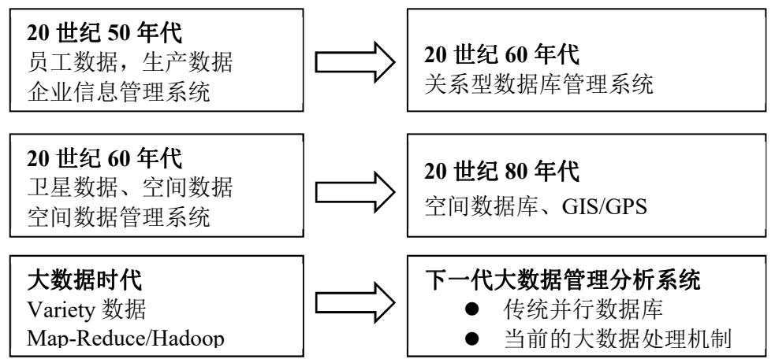  
图2数据管理系统从专用到通用化的演进

第一次演进（图2）开始于上世纪50年代。当时，随着计算机第一次大规模应用于企业人事和库存信息，很多企业和组织各自建设了自己的信息管理系统；进入60年代以后，这些系统被关系型数据库管理系统（RDBMS）取代。第二次演进（图2）开始于上世纪60年代。卫星技术的发展产生了大量的空间数据和卫星数据，各种专用管理系统应运而生；进入80年代以后，地理信息系统（GIS）一统天下。

通过分析数据管理系统历次演进过程可以看出从专用向通用演进的技术途径：

第一次演进（图3）中出现的数据类型包括员工编号、产品编号和姓名等。这些数据类

型首先被抽象成统一的一维实数类型，然后针对一维实数类型设计出了一维索引如B-树[5]等，最后通用的数据管理系统整合了包括一维索引在内的一维数据分析管理模块，完成了第一次演进。

第二次演进（图3）中出现的主要是包括图片和声音等的多媒体数据，这些数据往往用特征向量表示，数据间的匹配往往以特征向量间的欧几里德距离或其它闵可夫斯基距离（L距离）衡量。这些数据类型首先被抽象成统一的多维实数向量类型，然后针对多维实数类型设计出了多维索引[8,9]如R-tree[7]、k-d tree[6]等，最后通用的数据管理系统如GPS、GIS系统等整合了包括多维索引在内的多维数据分析管理模块，完成了第二次演进。换句话说，数据管理系统是“车同轨”思想的一个生动的例子。

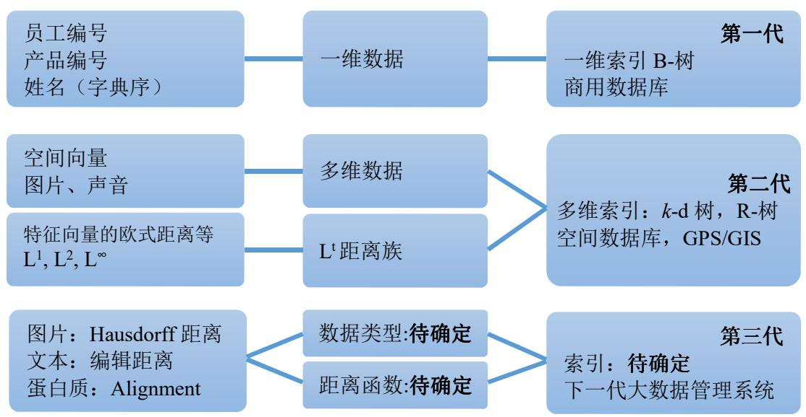  
图3数据管理系统从专用向通用演进的技术途径

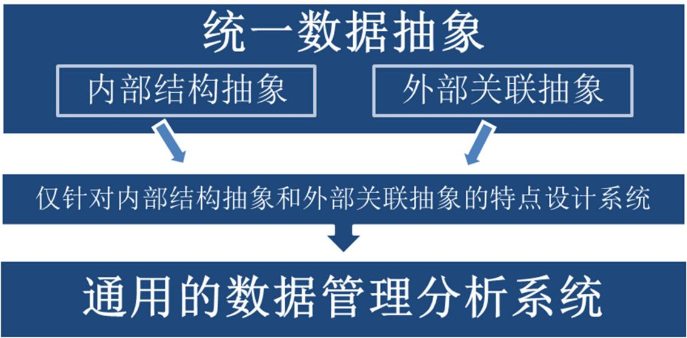  
图4专用到通用数据管理分析演进的技术路线

综合前两次演进，我们可以看出专用到通用数据管理分析演进的技术途径核心思想可以概括为“求同存异”，即建立并仅利用可以涵盖多种数据和应用的统一数据抽象。不同数据的内部结构可能相同也可能不同。例如有的数据内部是用数组表示的，而有的数据内部是用字符串表示的。当然，相同的内部结构可能具有不同的物理含义。同时，同一个数据类型的数据间关联关系也可能随时应用需求的不同而不同。因此，上述统一数据抽象需要至少包括数据内部结构抽象和数据外部关联抽象两个部分。内部结构抽象是按照多种数据类型内部结构的共性抽象得到统一的数据类型或内部结构。数据外部关联是指由数据和应用决定的数据元素间的关联关系，最常见的是描述数据元素间相似度的距离函数，普遍出现在相似性搜索、分类、聚类、异常点检测等常见数据管理分析应用中。外部关联抽象是按照不同数据和应用中定义的数据外部关联的共性抽象得到统一的数据外部关联。有了统一数据抽象以后，针对其内部结构抽象和外部关联抽象的特点设计的数据管理分析方法就可以通用于统一数据抽象所涵盖的多种数据和应用了（图4）。这个途径类似于面向对象程序设计里面多态（polymorphism）的想法，即首先给多种数据内部结构和外部关联找到一个父类，仅针对这个父类的特性实现数据管理分析模块；然后用户定义出具体数据和应用的子类，仅需重写（override）其内部结构和外部关联方法，直接继承已经针对父类实现的数据管理分析功能模块。这样的框架是可以应用于被统一数据抽象所涵盖的特定数据内部结构和外部关联的。如此就实现了通用。

通用模式的统一数据抽象不是唯一的，根据其覆盖的具体数据类型的范围不同，其通用性/性能和适用的范围也会不同。最早也是最常见的统一数据抽象是数字类型的。例如，数据管理系统发展历史上用过的一维数据（标量）和多维数据（向量）（详见1.2节）都是各自通用模式的统一数据抽象，都是数字类型的。随着近期人工智能及其应用的飞速发展，很多学者用张量作为通用模式下的统一数据抽象。以上几种统一数据抽象之上的数据管理分析操作往往效率比较高，例如标量或向量的索引查询操作往往是对数或亚线性的时间复杂度。但是，上述数字类型的统一数据抽象对所涵盖数据的内部结构有所要求，例如多维数据管理分析往往附带了两个限制：

- 数据必须可以抽象成多维实数空间的点，即向量。  
- 数据间的匹配度必须用包括欧几里德距离在内的闵可夫斯基距离或其变形等等来衡量。

在当前的大数据时代，很多数据类型是不满足上述限制的。例如采用Hausdorff距离的图片、采用编辑距离的文本或采用比对（Alignment）的蛋白质序列等[10, 11]。面对多样的大数据，各种专用管理系统已经建设或正在建设中，例如用于生物序列比对的BLAST[12]、常见搜索引擎的以图搜图和音乐哼唱搜索等。多个专用系统的大量建设导致了人力、物力和

时间的巨大浪费，迫切需要研发新一代的通用数据管理分析机制。

与上述数字类型的统一数据抽象不同，图（Graph）数据管理分析领域把数据抽象成图的顶点，以边及其权值来表达顶点/数据间的关系，对数据的内部结构和外部关联基本没有限制，因而具备了极高的通用性，可能是目前涵盖范围最广的通用模式统一数据抽象。但是，图上的算法往往时间/空间复杂度都很高，往往至少是边数和/或顶点数的线性以上的复杂度，这在面对海量大数据的时候常常是难以接受的。同时，图的边的权值没有明确的性质，不能像数字类型那样在需要的时候通过给定的距离函数（如欧几里得距离）来计算，只能事先存储，开销很大。这些都是高度通用性的代价。

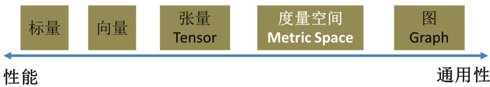  
图5不同统一数据抽象的性能和通用性对比

本书讨论的是以度量空间作为统一数据抽象的通用数据管理分析模式。度量空间模式和图模式一样对数据内部结构没有要求，因此具备了比数字类型的统一数据抽象更广的通用性。同时，度量空间模式中数据的外部关联表现为数据对象间的距离，可以通过距离函数计算而无需存储，并且可以利用距离函数的性质加速数据管理分析操作，一般比图上的操作更快。也就是说，度量空间是一种通用性/性能介于数字类型和图之间的统一数据抽象，实现了通用性和性能之间的一个折衷。不同统一数据抽象的性能和通用性的对比如图5所示。

# 1.3 大数据泛构

定义1-1：度量空间（Metric Space，亦称为尺度空间等）[13]可以定义为一个二元组  $(M, d)$ ，其中  $M$  是非空的数据集合，而  $d$  是定义在  $M$  的元素对上的具有如下性质的距离函数：

（1）正定性：对于任意  $x,y\in M,d(x,y)\geqslant 0$  ，并且  $d(x,y) = 0$  当且仅当  $x = y$  。  
(2) 对称性：对于任意  $x, y \in M, d(x, y) = d(y, x)$ 。  
（3）三角不等性：对于任意  $x,y,z\in M,d(x,y) + d(y,z)\geqslant d(x,z)$

度量空间对数据的内部结构不作要求，仅要求定义在数据之间的满足度量空间性质的距离函数。目前相当多的常见或新型数据类型都具有或者可构建符合度量空间特性的距离函数（详见第二章）。例如，向量数据和闵可夫斯基距离就构成了度量空间，也就是说，度量空

间是比上节介绍的第二代数据库中的多维数据和闵可夫斯基距离涵盖范围更广泛的数据抽象。同时，字符串和采用满足特定性质的编辑操作代价数值的编辑距离构成了度量空间[13]，蛋白质序列和采用满足特定性质的替换矩阵的比对距离（Alignment）也构成了度量空间[14]。因此，度量空间可以作为相当多数据类型及其距离函数的抽象规范。

定义1-2大数据泛构（Big Data Genhierarchy）：我们把以度量空间作为统一的数据类型和匹配衡量方法，构建以度量空间作为基本数据抽象的通用大数据管理分析框架的通用数据管理分析模式称为大数据泛构[15, 16]。

大数据泛构把复杂的数据对象抽象成度量空间中的元素，而距离函数的具体实现和数据的具体表达都是透明的，用户只需要提供自定义的距离函数，同样的算法可以应用于不同的数据，实现了广泛通用的数据管理和分析模式。基于大数据泛构模式的度量空间大数据管理分析可以胜任当前相当多新型数据管理任务，有望成为下一代数据库管理系统的核心组件。事实上，索引[17,18,19,20]、分类等数据管理分析领域已经存在一些度量空间的运用案例。

需要说明的是，大数据泛构不是类似多模态数据管理分析那样把不同类型的数据混在一起处理。度量空间嵌入了用户定义的数据类型和距离函数以后就形成了度量空间的实例。大数据泛构不是把多种不同的数据类型抽象到同一个度量空间实例，而是把不同的数据类型抽象到各自的度量空间实例。不同的度量空间实例使用相同的针对度量空间性质设计的数据管理分析算法，因此实现了通用。实际上，在进行具体的数据管理分析的时候，不同的数据类型之间往往不会发生直接的匹配，一般都是先转化成相同的类型，然后再进行匹配。例如，使用文本进行图片搜索的时候，往往不是把要查询的文本和图片直接匹配，而是把要查询的文本和图像的文本标签进行匹配。

终上所述，大数据泛构是应对大数据多样性（Variety）挑战的有效途径之一，有望成为大数据产业的一个重要发展方向。

# 1.4 度量空间数据管理分析的基本法则

如上所述，度量空间对数据的内部结构没有任何限制，只要求定义满足度量空间性质的距离函数。度量空间数据管理分析过程中只利用距离函数所满足的度量空间三大性质（正定、对称、和三角不等性等），而不利用具体度量空间实例的领域性质，因此适用于任意度量空

间，就具备了通用性。特别的，三角不等性是度量空间数据管理分析中使用最多的距离函数性质，可以称为度量空间数据管理分析的基本法则。

本节分别以图片和基因序列搜索为例说明如何利用三角不等性等实现通用的度量空间数据管理。对于每个例子本节将分别介绍针对该具体数据类型的专用方案和基于度量空间的通用方案。其中专用方案因为不是本书的重点，本节将只从算法的角度给出简单的介绍。一个简单的度量空间通用方案是计算待查询数据与数据库中所有数据的距离，然后找出最小的。但这个线性扫描方案的代价与数据库的大小成正比，不适用于大型数据库。一个搜索效率较高方案的时间复杂度应该是低于线性的。一般来说，复杂数据的距离计算开销也是巨大的，往往构成了搜索耗时的主要部分。所以，领域中在主要关注算法层面的时候，往往以距离计算的次数作为一个独立于算法实现方式的衡量算法性能的指标[17]。也就是说，一个搜索效率较高的度量空间搜索方案需要的距离计算次数应该是少于数据库中数据总数的。

  
Mickey

  
Minnie

  
Goofy

# 预处理阶段：

$$
d (\text {M i c k e y}, \text {M i n n i e}) = 1 5 0
$$

$$
d (\text {M i c k e y}, \text {G o o f y}) = 2 0 0
$$

$$
d (\text {M i n n i e}, \text {G o o f y}) = 2 5 0
$$

  
Query

# 查询阶段：

$$
d (\text {M i c k e y}, \text {Q u e r y}) = 1
$$

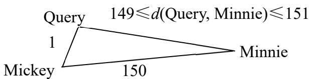  
图6卡通图片数据库及其度量空间通用查询方案

例1-1 图片搜索（图6）：假设图片数据库中存储有3个卡通角色的图片：Mickey，Minnie和Goofy。Mickey的另外一张图片（称为Query）用作查询图片，要找出这张图片是哪个卡通角色，或者说这张图片和数据库里面的哪个卡通图片距离最小。

解决方案：以下分别介绍面向图片（特征向量）数据类型的专用解决方案和基于度量空

间的通用解决方案。

- 专用方案：从算法的角度简单地说，用特征向量表示的图片数据库搜索问题一般用多维索引[8，9]解决。常见的树状多维索引一般先通过递归的方式依据向量的各维数值划分数据以建立索引树，然后搜索的时候从索引树根开始依据待查询特征向量的各维数值逐层剪枝，直到叶子节点计算出最终结果。

- 通用方案：如前所述，因为数据库中有3张图片，一个有效的度量空间搜索方案的距离计算次数应少于3。假设在建立索引的时候根据给定的距离函数计算并保存了三者之间的距离，分别为： $d(\text{Mickey}, \text{Minnie}) = 150$ ， $d(\text{Mickey}, \text{Goofy}) = 200$ ，及  $d(\text{Minnie}, \text{Goofy}) = 250$ 。注意这些距离计算发生在预处理阶段，不计入搜索阶段的距离计算次数。搜索过程中首先计算Query和Mickey的距离。因为他们其实是同一个卡通角色的不同图片，距离应该很小，所以可以假定  $d(\text{Mickey}, \text{Query}) = 1$ 。然后，根据索引中保存的  $d(\text{Mickey}, \text{Minnie}) = 150$  利用三角不等式可以推导出  $149 \leqslant d(\text{Minnie}, \text{Query}) \leqslant 151$ （图6）；类似的，根据索引中保存的  $d(\text{Mickey}, \text{Goofy}) = 200$  利用三角不等式可以推导出  $199 \leqslant d(\text{Goofy}, \text{Query}) \leqslant 201$ 。因此推出Query和Mickey的距离很小，应该是同一主体，而Query和Minnie及Goofy的距离较大，应该不是同一主体。也就是说，这个方案只进行了1次距离计算，然后利用三角不等式就完成了对包含3张图片的数据库的查询。

当然，如果 Query 首先和另外两张卡通图片计算距离，则三角不等式可能难以发挥作用，查询的开销可能会更高一些。例如，如果首先计算 Query 和 Minnie 的距离，因为 Query 实际上是 Mickey，所以可以假定  $d(\text{Minnie}, \text{Query}) = 151$ ，与  $d(\text{Mickey}, \text{Minnie}) = 150$  相近。则根据三角不等式可以推导出  $99 \leqslant d(\text{Goofy}, \text{Query}) \leqslant 401$ ， $1 \leqslant d(\text{Mickey}, \text{Query}) \leqslant 301$ ，显然至少 Mickey 无法利用三角不等式排除，需要进行更多的距离计算。

因此，选择首先和哪个图片计算距离可能对查询性能有比较大的影响，所涉及的技术称为“支撑点选择”，将在后续章节详细讨论。

例 1- 2 基因序列搜索（图 7）：假设基因序列数据库中存储有 3 段基因序列：基因 1，基因 2 和基因 3。基因 1 经少量突变后得到的基因  $q$  用作查询基因序列，要找出基因  $q$  是哪个基因序列突变得到的，或者说基因去和数据库里面的哪个基因序列距离最小，假设基因序列距离是基于 mPAM 替换矩阵[14]的序列比对（Alignment）[10]。

解决方案：以下分别介绍面向基因序列数据类型的专用解决方案和基于度量空间的通用解决方案。

- 专用方案：在计算生物学中有很多种面向基因序列的搜索方法[11],例如前缀树、

后缀树、BLAST[12]等等。限于本书讨论的重点和篇幅，以上方法的细节不在此介绍。需要强调的是，以上方法都是只能用于序列搜索的专用方法。

- 通用方案：如前所述，因为数据库中有3个基因序列，一个有效的度量空间搜索方案的距离计算次数应少于3。假设在建立索引的时候根据给定的距离函数计算并保存了三者之间的距离，分别为： $d(\text{基因1，基因2}) = 150$ ， $d(\text{基因1，基因3}) = 200$ ，及 $d(\text{基因2，基因3}) = 250$ 。注意这些距离计算发生在预处理阶段，不计入搜索阶段的距离计算次数。搜索过程中首先计算基因 $q$ 和基因1的距离。因为基因 $q$ 是基因1少量突变得到的，距离应该很小，所以可以假定 $d(\text{基因1，基因} q) = 1$ 。然后，根据索引中保存的 $d(\text{基因1，基因2}) = 150$ 利用三角不等式可以推导出 $149 \leqslant d(\text{基因2，基因} q) \leqslant 151$ （图6）；类似的，根据索引中保存的 $d(\text{基因1，基因3}) = 200$ 利用三角不等式可以推导出 $199 \leqslant d(\text{基因3，基因} q) \leqslant 201$ 。因此推出基因 $q$ 和基因1的距离最小。也就是说，这个方案只进行了1次距离计算，然后利用三角不等式就完成了对包含3个基因序列的数据库的查询。

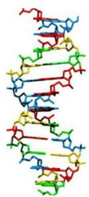  
基因1

  
基因2

  
基因3

# 预处理阶段：

$d$  (基因1，基因2)  $= 150$

$d$  (基因 1, 基因 3) = 200

$d$  (基因2，基因3)  $= 250$

  
基因  $q$

# 查询阶段：

$d(\text { 基因 } 1, \text { 基因 } q) = 1$

基因  $q$ $149 \leqslant d$  (基因 2, 基因  $q) \leqslant 151$

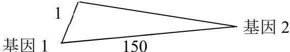  
图7基因序列数据库及其度量空间通用查询方案

对比例1和例2可以看到，它们的通用方案是一模一样的。换句话说，度量空间方案不利用数据的内部结构信息或领域信息，只利用距离函数的度量空间性质，适用于所有度量空间实例，因而实现了通用。

# 1.5 本章讨论与展望

通用模式和专用模式之争是一个横亘人类生产生活史的话题，孰轻孰重一直没有定论，笔者认为可能也不会有定论。但无论如何，两者各自具备的重要性是毋庸置疑的。统一数据抽象不是唯一的，其通用性和性能往往是一个相互矛盾的折衷。越专用的方法，可以利用的数据所处领域具体信息越多，性能可能就越高。相反，越通用的方法，只能利用所覆盖各种类型的共同信息，不能利用各特定类型的具体信息，性能可能就较低。“又要马儿跑，又要马儿不吃草”是很难实现的。笔者认为应该在满足应用需求的前提下选择最专用的统一数据抽象，以获得最高的性能。例如，如果应用中需要处理的数据都是向量，那么可以用面向向量的方法，也可以用面向度量空间的方法，或者用面向图的方法，其中面向向量的方法是三者中最专用的，应该也是性能最好的。

从距离函数的角度来看，虽然大数据泛构模式只要求距离函数满足度量空间性质而其实现是透明的，但该模式下通用算法能利用的信息基本都来自于距离函数，而距离函数的某些特性可能会对通用算法的性能或效率有比较大的影响。例如，如果一个距离函数定义相同数据距离为0而不同数据距离为1，其依然是一个度量空间距离函数。但是，从该函数只能判断两个数据是否相同，而不能判断或推测两个不同数据之间的差异程度。如果这样的距离函数用于例1-1和例1-2中，则例子中通用搜索方案的性能会大幅降低。换句话说，这样的距离函数包含的信息太少了或者其对数据的区分度太低了。在拓扑学中，这个度量空间被称为离散度量空间（discrete metric space）或孤点空间（space of isolated points）。

有些应用中使用的距离函数虽然不满足度量空间距离函数性质，但可以通过数学变换使其满足，详见第二章的讨论和展望部分。当然，高度的通用性也预示着度量空间通用模式的性能可能会受到影响。笔者认为，为具体数据类型选择处理模式的时候，可以在满足应用对性能的要求的前提下选择最通用的，以提高性价比和可扩展性。

从数据库管理系统DBMS的角度，已经有一些在SQL层面支持度量空间索引的系统实现。例如，美国得克萨斯大学奥斯汀分校（University of Texas at Austin）Daniel P. Miranker教授带领的MoBIoS团队于2003年前后基于开源的Mckoi数据库实现了对度量空间相似性索引的SQL层面支持MoBIoS-SQL（M-SQL）[21，22]。中国人民大学的卢卫老师等于2017年前后在PostgreSQL开源代码基础上实现了基于  $\mathbf{B}^{+}$  -树的度量空间相似性索引MSQL，

及其分布式版本  $\mathrm{MSQL + [23, 24]}$  。总体来看，支持度量空间的DBMS使用并不广泛，笔者认为原因之一是伴随度量空间高度通用性而产生的性能劣势，有待通过进一步的研究来提升。

# 第2章 常见的度量空间实例

虽然大数据泛构的研究重点是通用的方法，不关心数据的内部结构和距离函数的具体实现，但为了给读者一些具体直观的感受，及后续理论和实验分析的需要，本章介绍一些常见的度量空间实例，包括基于向量的和基于字符串的度量空间实例及相应距离函数，以及其它重要的度量空间实例等。

# 2.1 基于向量的度量空间实例

向量是多维数据管理的基本类型，应该也是目前使用最广泛的数据类型。很多应用中都是先从复杂的数据对象（如图片、音频、视频等）中提取特征向量，然后再对特征向量进行处理[8,9]。向量的最广泛使用的距离函数非闵可夫斯基距离家族莫属。

定义2-1 闵可夫斯基距离（Minkowski Distance）：两个  $\mathbf{n}$  维向量  $\mathrm{X} = (x_{1},\ldots ,x_{n})$  和 $\mathrm{Y} = \left(y_1,\dots ,y_n\right)$  之间的t次(t=1,2,3,...,∞)8闵可夫斯基距离L定义为：

$$
L ^ {t} \big ((x _ {1}, \ldots , x _ {n}), (y _ {1}, \ldots , y _ {n}) \big) = \sqrt [ t ]{\sum_ {i = 1} ^ {n} | x _ {i} - y _ {i} | ^ {t}}
$$

可以证明，闵可夫斯基距离  $L^t (\mathfrak{t} = 1,2,3,\dots ,\infty)$  是满足度量空间距离函数性质的，因此向量和闵可夫斯基距离就构成了度量空间。这表明度量空间的范围涵盖了多维空间，是比多维空间更通用的一种数据抽象。

以下介绍闵可夫斯基距离的几个常用的特例。

定义2-2曼哈顿距离（ManhattanDistance，亦称City-BlockDistance）：两个  $\mathbf{n}$  维向量  $\mathrm{X} = (x_{1},\ldots ,x_{n})$  和  $\mathrm{Y} = (y_1,\dots ,y_n)$  之间的曼哈顿距离  $L^1$  就是其  $\mathfrak{t} = 1$  的闵可夫斯基距离：

$$
L ^ {1} \big ((x _ {1}, \ldots , x _ {n}), (y _ {1}, \ldots , y _ {n}) \big) = \sum_ {i = 1} ^ {n} | x _ {i} - y _ {i} |
$$

定义2-3欧几里得距离（Euclidean Distance）：两个  $\mathbf{n}$  维向量  $\mathrm{X} = (x_{1},\ldots ,x_{n})$  和 $\mathrm{Y} = (y_1,\dots,y_n)$  之间的欧几里得距离  $L^2$  就是其  $\mathfrak{t} = 2$  的闵可夫斯基距离：

$$
L ^ {2} \big ((x _ {1}, \ldots , x _ {n}), (y _ {1}, \ldots , y _ {n}) \big) = \sqrt {\sum_ {i = 1} ^ {n} (x _ {i} - y _ {i}) ^ {2}}
$$

定义2-4切比雪夫距离（ChebyshevDistance，亦称Infinity/Maximum/SupremumDistance）：两个  $\mathbf{n}$  维向量  $\mathrm{X} = (x_{1},\ldots ,x_{n})$  和  $\mathrm{Y} = (y_1,\dots ,y_n)$  之间的切比雪夫距离  $L^{\infty}$  就是其 $t = \infty$  的闵可夫斯基距离：

$$
L ^ {\infty} \big ((x _ {1}, \ldots , x _ {n}), (y _ {1}, \ldots , y _ {n}) \big) = \lim _ {t \to \infty} \sqrt [ t ]{\sum_ {i = 1} ^ {n} | x _ {i} - y _ {i} | ^ {t}} = \max _ {1 \leq i \leq n} (| x _ {i} - y _ {i} |)
$$

上述定义中取极限操作可以通过下式及夹挤定理（Squeeze Theorem）消除。

$$
\lim _ {t \to \infty} \sqrt [ t ]{\left(\frac {m a x (| x _ {i} - y _ {i} |) ^ {t}}{1 \leq i \leq n}\right)} \leq \lim _ {t \to \infty} \sqrt [ t ]{\sum_ {i = 1} ^ {n} | x _ {i} - y _ {i} | ^ {t}} \leq \lim _ {t \to \infty} \sqrt [ t ]{n \cdot \frac {m a x (| x _ {i} - y _ {i} |) ^ {t}}{1 \leq i \leq n}} = \max _ {1 \leq i \leq n} (| x _ {i} - y _ {i} |)
$$

从定义可以看出，曼哈顿距离是空间两点各坐标分量的绝对差值之和，或者说是两点连线在所有坐标轴上投影所得线段的长度之和；欧几里得距离是空间两点连线的长度；切比雪夫距离是空间两点各坐标分量绝对差值的最大值，或者说是两点连线在所有坐标轴上投影所得线段的最大长度。例2-1说明了曼哈顿距离、欧几里得距离、及切比雪夫距离的几何意义和相互关系。

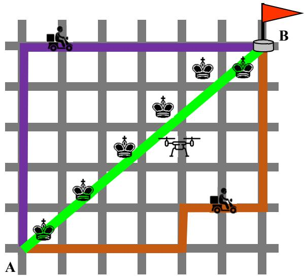  
图8网格状街区中的外卖送餐距离9

例2-1网格状街区中的外卖送餐距离：假设外卖员要从网格状街区中的A点送餐到B点（图8），依其使用的交通工具不同，送餐所需距离是不同的。以下分别讨论：

(1) 骑电动车: 这种情况下电动车只能按照横或竖的街道行驶, 有多条路线可以选择 (如图 8 中紫、橙两条路线), 其距离都是 A 和 B 点在横向和竖向的距离之和, 也就是其曼哈顿距离。  $L^{1}$  的曼哈顿距离或 City-Block Distance 的称呼就是由此而来。  
(2) 用无人机：这种情况下直线飞行的距离就是欧几里得距离（图8中绿色路线的长度）。

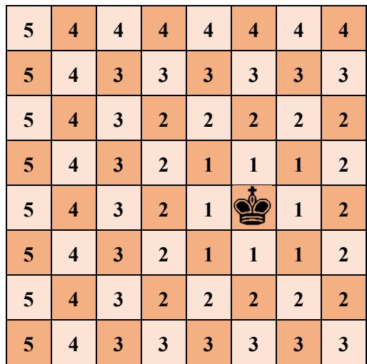  
图9国际象棋中的切比雪夫距离10

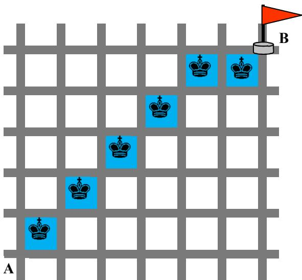  
图10网格状街区中的外卖送餐切比雪夫距离

(3) 用国际象棋中国王的走法: 国际象棋中国王可以走周围的横向、竖向、及斜向 8 个格子, 无论走上下左右还是走斜向都是算走一步。也就是说, 国际象棋中国王从一个格子走到另外一个格子的距离 (步数) 就是两个格子之间的切比雪夫距离, 因而切比雪夫距离也被称为 Chessboard distance。图 9 中标明了国王走到

其它格子的步数，即切比雪夫距离。因此，用国王的走法送餐只走了6个格子（假设有交通工具可以按照图10中给出的国王蓝色轨迹送餐），是三种走法里面距离最短的。

例2-2从单位圆和原点距大小的角度进一步说明了闵可夫斯基距离不同特例间的关系。

例2-2 不同闵可夫斯基距离的单位圆和原点距大小<sup>11</sup>：以二维平面为讨论范围（以下讨论很容易推广到多维情况），令  $UB^t$  是  $L^t$  单位圆，即到原点的  $L^t$  距离不超过1的点的集合， $L^{ot}(\mathrm{X})$  是点  $\mathrm{X} = (x_1, x_2)$  到原点的  $L^t$  距离（简称原点距），以下讨论对于  $\mathfrak{t}$  的不同取值  $UB^t$  之间的包含关系及  $L^{ot}(\mathrm{X})$  之间的大小关系：

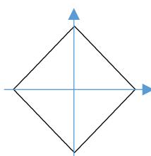  
(a)  $t = 1$

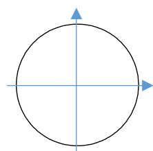  
(b)  $t = 2$

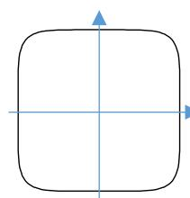  
(c)  $t = 6$

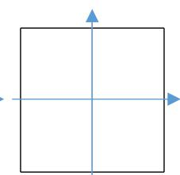  
(d)  $t = \infty$  
图11基于不同闵可夫斯基距离的单位圆

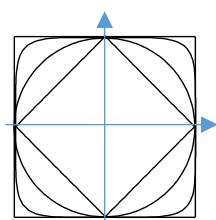  
(e)  $t = 1,2,6,\infty$

$UB^{1}$  边缘的点到原点的曼哈顿距离是1，即：

$$
L ^ {1} \big ((x _ {1}, x _ {2}), (0, 0) \big) = \sum_ {i = 1} ^ {2} | x _ {i} - 0 | = | x _ {1} | + | x _ {2} | = 1
$$

因此  $U B^{1}$  单位圆是一个菱形（图 11(a)）。

$U B^{2}$  边缘的点到原点的欧几里得距离是1，也就是一般熟悉的圆形（图11(b))。

$UB^{\infty}$  边缘的点到原点的切比雪夫距离是1，即：

$$
L ^ {\infty} \big ((x _ {1}, x _ {2}), (0, 0) \big) = \max _ {1 \leq i \leq 2} | x _ {i} - 0 | = \max (| x _ {1} |, | x _ {2} |) = 1
$$

因此  $UB^{\infty}$  单位圆是一个正方形（图11(d)）。

从图11(e)可以观察归纳出， $UB^{1}$ ， $UB^{2}$ ， $UB^{3}$ ，...， $UB^{\infty}$  是依次被下一个集合包含的，而（0,1），（1，0），（0，-1），和（-1,0）是它们的边缘上的共同的点。随着t的增加， $UB^{t}$  从菱形的4条边开始，逐渐向正方形的4个角填充，直至  $t = \infty$  时填满整个正方形。因此

有：

$$
U B ^ {1} \subseteq U B ^ {2} \subseteq \dots \subseteq U B ^ {\infty} \tag {1}
$$

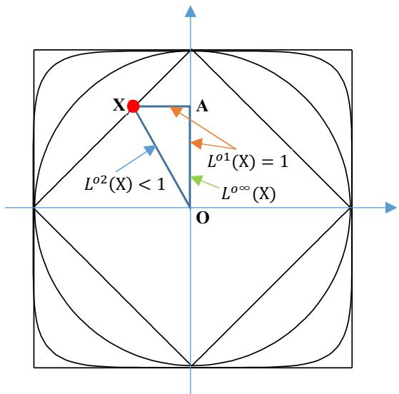  
图12基于不同闵可夫斯基距离的原点距

以下以图12为例继续讨论对于  $\mathbf{t}$  的不同取值  $L^{ot}(\mathrm{X})$  之间的大小关系，有三个不同的思路：

(1) 令  $X$  是  $U B^{1}$  边缘菱形上的一点, 则有  $L^{o_{1}}(X) = 1$  。同时, 因为  $X$  在  $U B^{2}$  内部, 因此  $L^{o_{2}}(X) < 1 = L^{o_{1}}(X)$  。由此可以归纳出:

$$
L ^ {o 1} (\mathrm {X}) \geq L ^ {o 2} (\mathrm {X}) \geq \dots \geq L ^ {o \infty} (\mathrm {X}) \tag {2}
$$

(2) 考虑图 12 中的直角三角形 OAX, 根据定义,  $L^{o1}(\mathrm{X})$  是三角形的两条直角边 OA 和 AX 的长度之和,  $L^{o2}(\mathrm{X})$  是斜边 OX 的长度, 而  $L^{o\infty}(\mathrm{X})$  是两边直角边中较长边的长度 (图 12 所示是 OA), 根据三角不等性, 显然有  $L^{o1}(\mathrm{X}) \geq L^{o2}(\mathrm{X}) \geq L^{o\infty}(\mathrm{X})$  。  
（3）从各闵可夫斯基距离的定义可以直接证明式（2），此处略去。

需要注意的是式（1）中的“ $\subseteq$ ”和式（2）中的“ $\geq$ ”的开口方向是相反的，两个式子是互为印证的关系。这个看似矛盾的现象实际是因为单位圆是距离固定而数据变化，但原点距则是数据固定而距离变化。

# 2.2 基于字符串的度量空间实例

字符串常常用于表示文本、生物序列等等，应该是除了向量以外最广泛使用的数据类型。令S[1..n]是一个字符串，S(i)是其第i个字符。常见的字符串距离函数包括海明距离，编

辑距离，及加权的编辑距离等。

海明距离简单的说就是两个字符串之间相应位置上字符不相同的数目。

定义2-5海明距离（Hamming Distance）：字符串  $\mathrm{S}_1[1..n]$  和  $\mathrm{S}_2[1..n]$  之间的海明距离为：

$$
\mathrm {H} (S _ {1}, S _ {2}) = \sum_ {i = 1} ^ {n} \left\{ \begin{array}{l l} 1, & S _ {1} (i) \neq S _ {2} (i) \\ 0, & S _ {1} (i) = S _ {2} (i) \end{array} \right.
$$

海明距离是满足度量空间距离函数性质的，因此字符串和海明距离构成了一个度量空间实例。海明距离常常用于衡量两个由“0”或“1”组成的二进制串之间的距离。也有人用其衡量两个基因序列(DNA或RNA)之间的距离，如果相应位置上的碱基不同则海明距离加1[26]。

编辑距离考虑的是如何用基本的编辑操作把一个字符串转化成另一个。

定义2-6编辑距离（Edit Distance，Levenshtein Distance）[11,77]：令插入、删除、及替换是三个基本的编辑操作，则两个字符串的编辑距离是把第一个字符串通过基本编辑操作转化为第二个字符串所需的最少的操作个数。

编辑距离的计算相对复杂。令  $\mathrm{E}(S_1,S_2)$  为字符串  $S_{1}[1..n]$  和  $S_{2}[1..m]$  之间的编辑距离， $\mathrm{E}(\mathrm{i},\mathrm{j})$  为子串  $S_{1}[1..i]$  和  $S_{2}[1..j]$  之间的编辑距离，则边际情形  $\mathrm{E}(\mathrm{i},0) = \mathrm{i},\mathrm{E}(0,\mathrm{j}) = \mathrm{j}$  。 $\mathrm{E}(\mathrm{i},\mathrm{j})$  可能来源于三种情况：（1）基于  $\mathrm{E}(\mathrm{i}-1,\mathrm{j})$  删除  $S_{1}[1..i]$  子串的最后一个字符  $S_{1}(\mathrm{i})$ ；或（2）基于  $\mathrm{E}(\mathrm{i},\mathrm{j}-1)$  在  $S_{1}[1..i]$  后面插入字符  $S_{2}(\mathrm{j})$ ；或（3）基于  $\mathrm{E}(\mathrm{i}-1,\mathrm{j}-1)$ ，如果  $S_{1}(\mathrm{i})$  和  $S_{2}(\mathrm{j})$  两个字符不同的话，把  $S_{1}[1..i-1]$  子串后面的字符  $S_{1}(\mathrm{i})$  替换为字符  $S_{2}(\mathrm{j})$ ，否则无需操作。上述计算规则可以表示为：

$$
E (i, j) = \left\{ \begin{array}{c c} i & , j = 0 \\ j & , i = 0 \\ m i n \left( \begin{array}{c} E (i - 1, j) + 1 \\ E (i, j - 1) + 1 \\ E (i - 1, j - 1) + \left\{ \begin{array}{l l} 1, & S _ {1} (i) \neq S _ {2} (i) \\ 0, & S _ {1} (i) = S _ {2} (i) \end{array} \right. \end{array} \right), o t h e r w i s e & , i = 0, \dots , n, j = 0, \dots , m \end{array} \right.
$$

编辑距离可以通过使用递归或者动态规划方法计算上面的迭代关系得出。显然，同样的编辑距离可能对应了不止一个从一个字符串转化成另一个的编辑操作流程。

编辑距离是满足度量空间距离函数性质的，因此字符串和编辑距离就构成了一个度量空间实例。

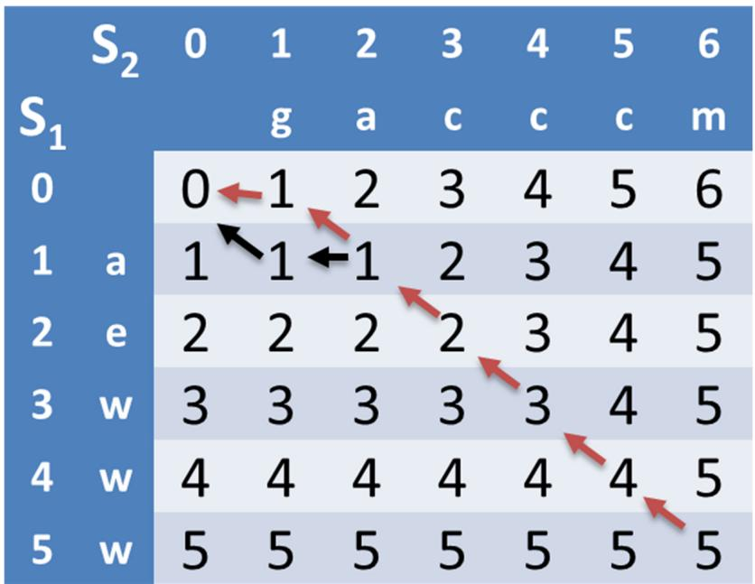  
图13  $S_{1} =$  "aewww"和  $S_{2} =$  "gacccm"的编辑距离

例2-3 编辑距离：令  $S_{1} = \text{"aewww"}$  ，  $S_{2} = \text{"gacccm"}$  ，根据上述规则可以计算出其编辑距离为5。图13给出了所有  $E(i,j)$  的值并用箭头标记了计算出最终结果的途径，不同颜色的箭头表示结果相同的不同途径。

包括生物序列比对（Alignment）在内的一些应用根据自身需求使用了加权编辑距离（Weighted Edit Distance）。加权主要体现在两个方面：（1）不同的基本编辑操作使用不同的权值（或代价），及（2）不同字符之间的替换使用不同的权值（或代价）。如果把插入或删除看作是字符和空白（gap）之间的替换的话，则（1）和（2）就统一起来了。不同字符之间的替换权值或代价可以用一个矩阵表示，称为打分矩阵(Scoring Matrix) $^{12}$ [11]。加权编辑距离的计算方法可以通过简单扩充编辑距离计算方法得到：

$$
E (i, j) = \left\{ \begin{array}{c c} \sum_ {t = 1} ^ {i} S c o r e (S _ {1} (t), g a p) & , j = 0 \\ \sum_ {t = 1} ^ {j} S c o r e (S _ {2} (t), g a p) & , i = 0 \\ m i n \left( \begin{array}{c} E (i - 1, j) + S c o r e (S _ {1} (i), g a p) \\ E (i, j - 1) + S c o r e (S _ {2} (j), g a p) \\ E (i - 1, j - 1) + S c o r e (S _ {1} (i), S _ {2} (j)) \end{array} \right), i = 1, \dots , n, j = 1, \dots , m \end{array} \right.
$$

在计算生物学中，蛋白质序列间加权编辑距离包括蛋白质序列整体之间的全局比对(Global Alignment)，以及蛋白质序列连续子串之间的局部比对(Local Alignment)[11]，相应的算法包括Needleman-Wunsch算法[29]和Smith-Waterman算法[30]。构成蛋白质的

氨基酸之间的打分矩阵有PAM[27]和BLOSUM[28]等。

  
图14氨基酸之间的mPAM打分矩阵13

Sellers已经证明，如果打分矩阵满足度量空间距离函数性质（相同字符间的替换代价为0，不同字符间的替换代价大于0，不同字符间的相互替换代价相等，两个字符间直接替换的代价小于通过另一个中介字符进行两次替换的代价之和），则相应的加权编辑距离也是满足度量空间距离函数性质的[31]。Waterman等人推广了上述结论，包括了空白的替换[32]。

PAM[27]和BLOSUM[28]是不满足度量空间距离函数性质的。mPAM（图14[33]）是一个针对蛋白质序列的打分矩阵[14]，定义了20种不同氨基酸相互间的替换代价，并规定了任意氨基酸和空白的替换代价是7。可以验证，mPAM是满足度量空间距离函数性质的，因此蛋白质序列和基于mPAM的加权编辑距离构成了一个度量空间实例。

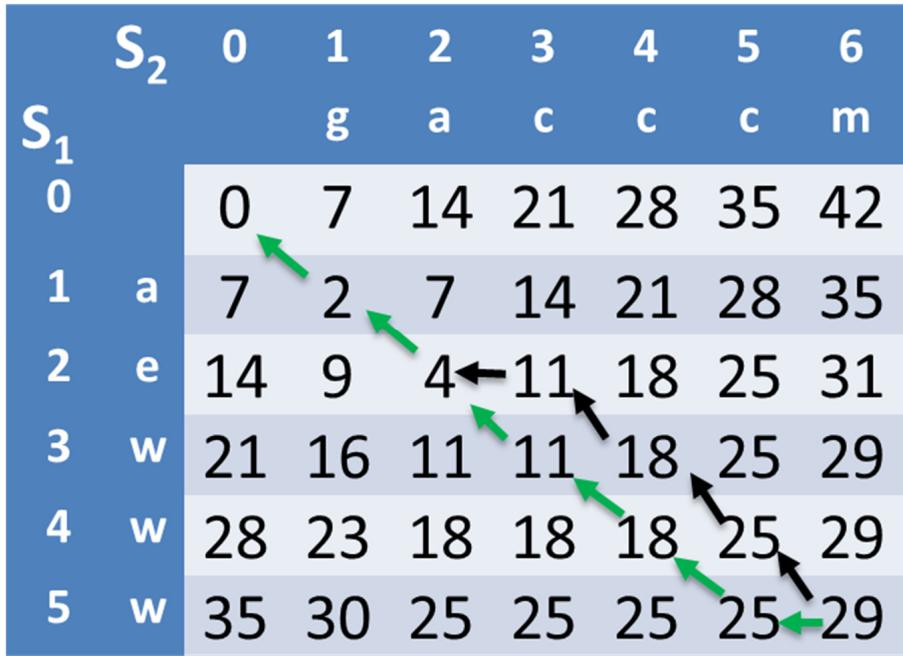  
图15  $S_{1} =$  "aewww"和  $S_{2} =$  "gaccm"基于mPAM的加权编辑距离

例 2- 4 基于 mPAM 的加权编辑距离: 令  $S_{1} = \text{"aewww"}$ ,  $S_{2} = \text{"gacccm"}$ , 根据上述规则可以计算出其基于 mPAM 的加权编辑距离为 32。图 15 给出了所有  $E(i, j)$  的值并用箭头标记了计算出最终结果的途径, 不同颜色的箭头表示结果相同的不同途径。

# 2.3 其它度量空间实例

本节首先介绍基于集合的度量空间实例，然后介绍复合的度量空间。

基于集合的度量空间实例是指以集合作为度量空间数据元素的类型，并定义了两个集合之间的距离函数。最常见的一个集合间距离函数是杰卡德距离，以两个集合间不同的元素的数目占总元素数目的比例作为两个集合间的距离。

定义2-7杰卡德距离（Jaccard Distance）：令A和B为两个集合，则A和B之间的杰卡德距离J(A,B)为：

$$
\mathrm {J} (\mathrm {A}, \mathrm {B}) = 1 - \frac {| A \cap B |}{| A \cup B |}
$$


上式中的  $\frac{|A \cap B|}{|A \cup B|}$  衡量的是两个集合之间的相似性，称为杰卡德系数。杰卡德距离是满足度量空间距离函数性质的，因此集合和杰卡德距离构成了一个度量空间实例。

杰卡德距离只考虑了不同集合元素之间相同或者不同，而豪斯多夫距离则考虑了不同集合元素之间的距离。

定义2-8豪斯多夫距离（Hausdorff Distance）：令A和B为两个集合，  $\mathrm{d}(\cdot ,\cdot)$  是定义在

A 和 B 的元素之间的度量空间距离函数, 则 A 和 B 之间的有向豪斯多夫距离  $h(A, B)$  和豪斯多夫距离为  $H(A, B)$ :

$$
\mathrm {h} (\mathrm {A}, \mathrm {B}) = \max  _ {a \in A} \left(\min  _ {b \in B} (d (a, b))\right)
$$

$$
\mathrm {H} (\mathrm {A}, \mathrm {B}) = \max  \left(\mathrm {h} (\mathrm {A}, \mathrm {B}), \mathrm {h} (\mathrm {B}, \mathrm {A})\right)
$$

一般来说  $\mathrm{h}(\mathrm{A},\mathrm{B})\neq \mathrm{h}(\mathrm{B},\mathrm{A})$ ，而  $\mathrm{H}(\mathrm{A},\mathrm{B})$  是满足度量空间距离函数性质的，因此集合和豪斯多夫距离构成了一个度量空间实例。通俗地说，豪斯多夫距离是一个集合的所有元素到其在另一个集合里的最近邻的距离的最大值。如果一个集合的每个点都接近另一个集合的某些点，那么两个集合的 Hausdorff 距离是比较小的。  $\mathrm{H}(\mathrm{A},\mathrm{B}) = 5$  意味着对于 A 里面的任一元素，在 B 里面至少存在一个元素与之距离不超过 5，反之亦然。豪斯多夫距离在图像处理特别是图像匹配领域具有广泛应用。

有些应用需要把多个度量空间复合起来。令  $(S_{1},d_{1})$  ，  $(S_{2},d_{2})$  ，…，  $(S_{n},d_{n})$  是一系列度量空间,A，  $\mathsf{B}\in S_1\times S_2\times \dots \times S_n$  ，即  $\mathrm{A} = (a_1,a_2,\ldots ,a_n)$  ，  $\mathsf{B} = (b_{1},b_{2},\ldots ,b_{n})$  ，  $a_i,b_i\in S_i$  ，令

$$
D (A, B) = c _ {1} d _ {1} \left(a _ {1}, b _ {1}\right) + c _ {2} d _ {2} \left(a _ {2}, b _ {2}\right) + \dots + c _ {n} d _ {n} \left(a _ {n}, b _ {n}\right), c _ {i} \geqslant 0
$$

则可以证明  $(S_{1} \times S_{2} \times \dots \times S_{n}, \mathrm{D})$  是一个度量空间，可以称为由  $(S_{1}, d_{1})$  ， $(S_{2}, d_{2})$  ，…， $(S_{n}, d_{n})$  复合而成的线性复合度量空间。

例如，Iqbal等人提出了一个图片的距离函数[22, 34]。首先，每张图片可以用三个特征向量表示，分别是结构向量（3维）、颜色向量（15维）和纹理向量（48维）。然后分别对两张图片用欧几里得距离求结构向量和纹理向量之间的距离，用曼哈顿距离求颜色向量间的距离。最后，将上述三个距离取平均即得到两张图片间的最终距离。显然，这个距离函数是满足度量空间距离函数的三大特性的，因此构成了一个线性复合度量空间。

# 2.4 本章讨论与展望

本章介绍了基于向量的、字符串的、集合的度量空间实例，及线性复合度量空间。向量较为直观，容易观察，且一些性质相对容易估计（如维度等），因此基于向量的度量空间实例常常用作简化研究的对象或者启发式方法的验证实例（如内在维度的估算方法）。本章介绍的闵可夫斯基距离最为常见，但是它不考虑向量分量之间的相关性及分布的差异。如果需要考虑这些因素，则可能要用到马氏距离（Mahalanobis distance）。

应用中的距离函数五花八门，其中有相当一部分是不满足度量空间性质的，因此不能直

接运用度量空间数据管理分析方法。有的距离函数可以通过数学变化的方法使其满足度量空间性质[17]。例如杰卡德系数是不满足度量空间性质的，但是用1减去杰卡德系数得到的杰卡德距离就满足了度量空间性质。再如，取对数可以把乘除运算转化为加减运算，也是一种常见的把不满足度量空间性质的距离函数转化到度量空间的方法。本章提到过的用于生物序列比对的加权编辑距离PAM打分矩阵[27]从生物意义上讲包含了序列突变概率的乘法运算，一般是不满足度量空间性质的，而满足度量空间性质的mPAM打分矩阵[14]在设计上包含了对数运算。

还有的数据类型，虽然其距离函数不满足三角不等式，但是满足三角不等式的简单变体，那么也可以通过处理方式的相应变化满足应用需求。例如，Ramakrishnan等人提出的蛋白质质谱数据的距离函数不满足三角不等式[35]。但是，给定3个质谱数据x,y和z，从d(y,z)和 $d(x,z)$ 是可以推导出  $d(x,y)$  的上限的，因此也可以基于度量空间处理方法的简单变化完成数据筛选任务[35]。

上述质谱数据的例子表明，虽然有的距离函数不满足度量空间性质，但只要距离函数包含一定的信息量，能对数据做一定的推理，度量空间方法依然可以作为研究相应数据管理分析方法的出发点。

# 第3章 度量空间索引概述

为了帮助读者熟悉度量空间数据管理分析模式，建立直观感觉，以便更易理解后续理论分析，本章将介绍一些在度量空间中进行索引的例子。选择索引这一数据管理任务作为例子的原因是索引相比聚类、分类等其它度量空间数据分析任务聚集了更多更持久的研究，形成了一系列较为完整的数据结构和算法。

度量空间索引（metric-space indexing 或 distance-based indexing）一般解决的是基于度量空间距离函数的相似性查询（similarity query）问题，其具体定义将在第一节中介绍。第二节将介绍相似性索引的基本思路并说明本章的讨论重点和范围界定。第三节将介绍最基本的度量空间索引结构—支撑点表（Pivot Table），然后在后续几节按照树状索引数据划分方式类别的不同选取各类别中最具代表性的超平面树（General Hyper-plane Tree）、优势点树（Vantage Point Tree）和 M-树（M-Tree）索引进行介绍。

# 3.1 相似性查询

顾名思义，相似性查询要从数据库中查找与给定查找对象相似的数据对象，是一种重要的信息检索类型，广泛存在于数据库和数据挖掘应用中。随着多媒体技术的发展和推广普及，基于复杂数据对象(空间数据、文本、图像、音频、视频、时空序列等)的海量数据库不断涌现，相似性搜索已经成为多媒体信息系统基于内容搜索的基本需求，其性能已经成为衡量多媒体系统查询功能的重要指标[37]。同时，近年来生物信息学的蓬勃发展也产生了庞大的复杂生物数据(基因序列、蛋白质谱等)，对这些数据的高效搜索已经成为一个迫切需要解决的问题。据统计，相似性搜索在整个计算生物学研究任务中所占比例高达  $35\%$  [38]。

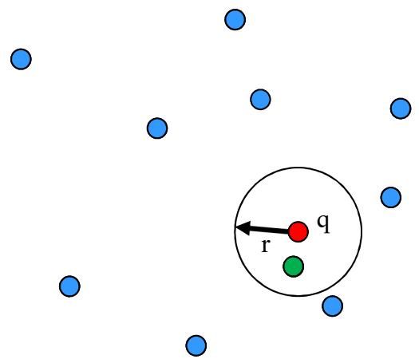  
图16 范围查询示例

常见的度量空间相似性查询有范围查询和最近邻查询两种。

定义3-1 范围查询（range query）：对于给定度量空间数据集  $S = \{s_1, \ldots, s_n\}$ ，距离函数d、查询对象q和查询半径r，范围查询R(q,r)返回S中所有和q间的距离不超过r的数据对象，即：

$$
R (q, r) = \{s | d (q, s) \leq r, \forall s \in S \}
$$

图16给出了一个范围查询的例子。需要说明的是，这个例子实际上采用的是一个特殊的度量空间实例，即平面上的点（2维向量）和欧几里得距离构成的度量空间。如此举例的好处是比较直观，易于理解。但是，这个特殊的度量空间实例无法代表所有的度量空间，如此举例有时候可能会导致误解。例如，直线的概念、勾股定理、三角公式、或其它解析几何方面的结论在一般度量空间中是不适用的。后续章节会有讨论，应特别注意。

当需要区分距离函数的时候，范围查询也可以记为  $R(q,r,d)$ 。

定义3-2k-最近邻查询（k-nearest neighbor query）：对于给定度量空间数据集  $S = \{s_1,\dots ,s_n\}$  ，距离函数d、查询对象q和查询个数k，k-最近邻查询kNN(q)返回S中和q间的距离最小的k个数据对象。

k 值为 1 的 k-最近邻查询简称为最近邻查询（nearest neighbor query）。

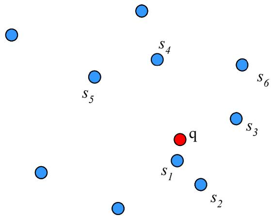  
图17k-最近邻查询示例

图17给出了一个k-最近邻查询的例子。其中数据点标记的下标是按照其到查询点的距离顺序设置的，即下标越小离查询点越近。因此，  $2\mathrm{NN}(\mathbf{q}) = \{s_1,s_2\}$  ，  $4\mathrm{NN}(\mathbf{q}) = \{s_1,s_2,s_3,s_4\}$  。

当需要区分距离函数的时候，k-最近邻查询也可以记为kNN(q,d)。

范围查询只规定了距离，所得到的查询结果取决于数据的分布，可能过多，也可能过少，甚至为0。相反，k-最近邻查询只规定了查询结果的个数，查询结果到查询对象的距离也取决于数据的分布，可能过近，也可能过于遥远而失去了实际意义。例如，在人烟稀少的地方

查询最近的很多个酒店，得到的部分酒店可能已经非常遥远了。在实际应用中，范围查询和最近邻查询往往会组合起来。

定义3-3距离受限的k-最近邻查询（distance-restricted k-nearest neighbor query）：对于给定度量空间数据集  $S = \{s_1,\dots ,s_n\}$  ，距离函数d、查询对象q、查询半径r和查询个数k，距离受限的k-最近邻查询DkNN(q,r)返回S中和q间的距离最小且不超过r的k个数据对象。

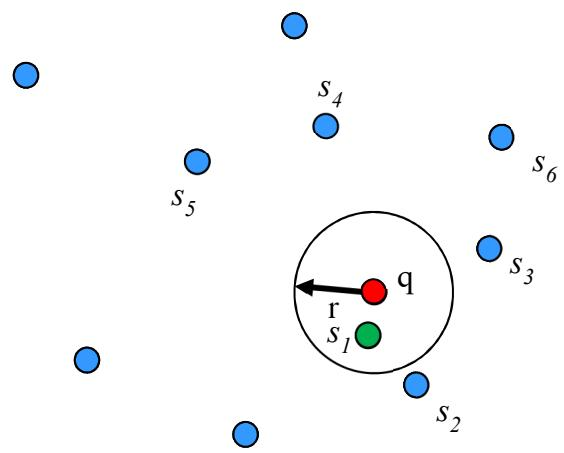  
图18 距离限制的k-最近邻查询示例  
图19 一维数据的相似性查询：学生分数查询

图18给出了一个距离受限的k-最近邻查询的例子，其中  $\mathrm{D2NN(q,r) = \{s_1\}}$  。与前述k-最近邻查询（图17）  $2\mathrm{NN}(\mathbf{q}) = \{s_1,s_2\}$  不同，因为  $\mathrm{d}(q,s_2) > r$  ，所以  $s_2$  不是  $\mathrm{D2NN(q,r)}$  的一个查询结果。

下面给出几个不同数据类型或应用领域的相似性查询的例子。需要说明的是实际的应用中往往需要考虑很多具体的因素，各种查询的实现方式可能非常复杂，下面的例子可能只是形式上的表现。

例 3- 1 一维数据的相似性查询：给定一个数据库中的表 student(name, score)，查询所有的分数在 75 和 85 之间的学生的姓名的 SQL 如图 19 所示。本例是一个范围查询，被查询的数据对象是学生的分数，一维数据，查询对象是 80，距离函数是两个数的绝对差值。

```sql
SELECT name FROM student WHERE ABS(score-80)  $<  = 5$
```

例 3- 2 多维数据/多媒体领域的相似性查询：多媒体领域往往从复杂数据（如图片、声音、视频等）中提取特征向量作为数据对象，其距离函数可以是第二章中介绍的那些基于向量的距离函数，也可能是其它更复杂的基于向量的距离函数。多媒体领域的典型相似性查询

例子包括：

- 人脸识别：在各种门禁等场合广泛存在，一般从摄像头拍到的人脸提取特征向量作为查询对象，在预先录入的人脸特征向量库中进行查询，查询类型可以是范围查询或者距离受限的最近邻查询，查询半径取决于应用中设定的匹配与否的阈值。  
- 以图搜图：在各种购物软件中普遍存在，一般从用户提供图片提取特征向量作为查询对象，在商品图片等的特征向量库中进行相似性查询，查询类型一般是距离受限的 k-最近邻查询。笔者曾参与过基于度量空间的图片搜索研究[22，34]。  
- 音乐搜索：在各种听歌软件中普遍存在，一般从用户播放或哼唱的音乐片段中提取特征向量作为查询对象，在音乐库中音乐片段的特征向量中进行相似性查询，查询类型一般是距离受限的 k-最近邻查询。  
- 兴趣点（PoI: point of interest）搜索：在各种地图/导航软件中广泛存在，例如搜索某地标附近的餐馆等，一般把地标的地址/坐标作为查询对象，在相关兴趣点的地址/坐标数据库中进行相似性查询，查询类型一般是距离受限的 k-最近邻查询。

例3-3字符串的相似性查询：广泛存在于各种办公软件、编辑软件等中的拼写检查是一个典型的字符串相似性查询的例子。当一个单词输入完成以后，如果在词库中进行精确查询没有匹配，则可以进行相似性查询，其距离函数可以是第二章中介绍的编辑距离等，查询类型一般是范围查询或者距离受限的k-最近邻查询，查询结果可以作为建议修改的单词提供给用户。

例 3- 4 计算生物学中的相似性查询：计算生物学中有很多相似性查询的应用，但是与多媒体领域不同，计算生物中的数据类型和距离函数是五花八门的。笔者参与过的几个计算生物学相似性查询应用包括：

- 引物对匹配：引物对（primer pair）是具有特定性质的基因序列片段。该应用[26]在拟南芥和水稻基因组中搜索匹配的引物对以进一步研究，其中使用第二章介绍的海明距离进行长度为18的基因序列的相似性查询。  
- 蛋白质同源性搜索: 该应用[89]在蛋白质数据库中搜索与给定蛋白质同源/相似的蛋白质, 需要先进行蛋白质序列片段的相似性查询, 再把相似的蛋白质序列片段拼接起来产生最终的搜索结果。其中蛋白质序列片段的相似性查询所采用的距离函数就是第二章介绍的基于 mPAM 替换矩阵[14, 33]的加权编辑距离。  
- 蛋白质质谱粗滤器：该应用[35]对蛋白质质谱数据进行相似性查询以达到初步粗略筛选的目的，筛选掉大部分的数据以后再对剩下的小部分数据进行更精细的分析和

生物实验。其中相似性查询中把蛋白质质谱数据抽象成高维向量，而采用的距离函数仅满足扩充了一个常数因子的三角不等式（第2.4节中亦曾提到），即  $d(x,z) + d(y,z) + \kappa \geq d(x,y)$  的形式。

广义上讲，相似性查询可以分为准确的和近似的。准确的相似性查询（注意与精确查询的区别）就是严格按照相似性查询的定义返回查询结果。而近似相似性查询（approximatisimilarity query）[39,40]允许给相似性查询的定义加上一点近似性，例如范围查询的查询半径可以稍加放宽，或者使用一些不保证正确性的搜索策略（例如启发式策略）等等。准确的相似性查询是近似相似性查询的基础，本书仅讨论准确的相似性查询。

k-最近邻查询往往可以用范围查询实现[17]，因而从一定意义上说范围查询是比k-最近邻查询更具基础性的查询类型。本书的讨论以范围查询为主。

# 3.2 相似性索引

通俗地说，索引是指为查询提供支持的数据结构，也可以广义地理解为实现查询的机制方法，其性能一般用查询速度和空间开销来衡量，对于近似性查询也会考虑查询结果的准确性和质量等等。在实际应用中，时间、空间、质量这三者往往是矛盾折衷，可以互相此消彼长的。

最基本或最简单的索引方法一般认为是线性扫描，即逐个扫描全体数据，其查询时间复杂度是线性的，没有除数据本身以外的额外空间开销。一般可以认为，线性扫描规定了有应用价值的索引方法时间复杂度的上界和空间复杂度的下界。一个索引方法的时间复杂度如果高于线性，或者更准确地说如果其查询时间比线性扫描还长，那么即使其无须使用额外空间，可能也不如直接使用线性扫描了。因此，常见的索引方法往往是在时间和空间之间的折衷，使用一定的额外空间以获取低于线性的时间复杂度，或者说是低于线性扫描的查询时间。

常见的索引机制一般分为索引构建和索引查询两个步骤。索引构建步骤会收集并存储一些信息，建立索引数据结构，供查询时候使用。一般来说一次构建索引可以供查询时候反复使用，因而可以认为是线下的步骤，能够接受相对较高的时间和空间复杂度。早期的索引方法面对较小的数据量一般更加着力于查询时间的降低，而不太关心空间开销，也就是说在时间和空间的折衷之间更加偏向于时间。但是，在大数据的背景下，因为数据量巨大，空间的开销也成为一个必须重视的问题。构建索引的时间和空间复杂度一般应该至少低于  $O(n^{2})$

往往希望是低于线性的。

索引查询步骤就是利用已经建立好的索引数据结构完成查询，一般认为是线上的，对时间和空间开销都有较高的要求。一般来说索引查询步骤的时间复杂度应该是低于线性的，而空间复杂度往往是常数的。需要说明的是一般来说索引数据结构的质量决定了查询的性能，因此索引构建算法往往比较复杂，索引查询算法往往比较简单。

在大数据背景下，构建索引的时间和空间的要求都比较高，且查询时间要求也比较高，很多应用往往不得不牺牲查询质量。当然，由于数据量巨大，很多应用从统计意义上说只要降低一点点查询质量就可以大幅节省时间和空间开销。例如，统计学的意义上说，很多种统计分布下的大数据集的某些统计量（例如均值、方差等）可以仅基于其规模小很多的数据抽样集合较为准确地估算。

比线性扫描更快的索引至少有两种基本的类型：一种基于划分和约简（reduction，即排除掉肯定不可能是查询结果的数据或肯定不可能包含查询结果的数据子集，或把肯定是查询结果的数据或肯定全部都是查询结果的数据子集直接添加到查询结果集之中） $^{14}$ ，通过缩小搜索空间（待搜索数据的数目）来节省时间；另一种基于压缩，通过减少每个数据对象的大小进而减少读取数据的开销来节省时间，如位图（bitmap）索引和 VA-File[36]等。本章仅讨论第一种方法，即基于划分和约简的度量空间索引方法。还有一些索引方法首先采用类似局部敏感哈希(Locality Sensitive Hashing, LSH)、空间填充曲线等工具把数据映射到一维空间，然后采用类似 B-树等的一维索引支持查询。这些映射方法一般无法在一维空间中保持数据原有的相互间相似程度[9]，导致难以支持准确的相似性查询，因而也不在本章的讨论范围之内。

相似性索引一般要支持的是相似性查询，与之相对应的是精确查询，即在数据库中查找与查询对象完全相同的数据对象。精确查询可以看作查询半径是 0 的范围查询，因此相似性索引也可以支持精确查询。从概念上讲，无论是什么样的数据类型，都可以把数据的二进制表示看作一个数字，用 B-树等一维数据索引方法就可以支持其精确查询，因此类似度量空间索引这样以支持相似性查询为目的的复杂查询方法一般不太考虑精确查询。

基于划分和约简的索引方法首先在索引构建的时候按照一定规则把待查询数据集划分成多个子集（本书仅考虑子集间不重叠的情况）。这样的划分一般是递归进行的，同时当数据集的数据数目足够小的时候就不再划分，作为叶子节点处理，最终就形成了树状的索引结

构。然后在树状索引的每个节点根据查询类型和查询对象的性质以及数据子集的性质对数据子集进行约简。最后对无法约简的数据子集做进一步的递归搜索。对于没有进一步划分的数据子集或叶子节点，一般可以采用类似线性扫描的方法逐个对每个数据元素进行约简或直接计算其与查询对象间的距离以最终完成搜索。

下面的例子揭示了一道常见智力题中包含的基于划分和约简的索引思想。

例3-5 二十次猜测：假设一个回答者在心里随机选定一个[1,1,000,000]中的秘密数，猜测者需要通过向回答者提问并获解答的方式把这个秘密数猜出来。猜测者可以问任意的问题，但回答者只能以“是”或“否”作答。问怎样的提问方式可以得到最少的平均提问次数。

一个笨办法是先问“是不是1？”，如果不是就接着问“是不是2？”，以此类推，直到问到答案。因为秘密数是从1百万个数里面随机选的，因此这个提问方式平均要提问近50万次才能得到答案。这个办法是线性扫描的索引思想。

一个聪明的办法是先问“是不是比50万小？”,如果是就继续问“是不是比25万小？”,否则就继续问“是不是比75万小？”,以此类推。这是典型的折半查找算法,其时间复杂度是  $O(\log_2n)$  ,  $n = 1$  百万, 略小于  $2^{20}$  , 因此其平均提问次数略小于20。这个办法每次提问实质上是对数据进行了划分得到两个数据子集, 而每次回答实质上是排除掉了其中一个数据子集, 是典型的递归地划分和约简的索引思想。

一个与上述聪明办法本质相同但更简洁的办法是逐个数位询问秘密数的二进制表示是不是1。因为秘密数最大是1百万，其二进制表示的位数不超过20，因此逐个问完20个数位分别是0还是1就可以了。每个秘密数的提问次数都是20，平均提问次数也是20。□

可用于约简数据的规则可以分为排除规则(Exclusion Rule)和包含规则(Inclusion Rule)两类。顾名思义，排除规则是指如果某数据集满足特定排除条件，则该数据集肯定不可能包括查询结果，可以被排除，实现数据约简；包含规则是指如果某数据集满足特定包含条件，则该数据集中的全部数据肯定都是查询结果，可以直接放入结果集而无须进一步搜索，实现数据约简。

令数据集S划分为数据子集  $\mathbf{S}_1$  ，  $\mathbf{S}_2$  ，…，  $\mathbf{S}_{\mathrm{k}}$  ，ER是排除条件的集合，IR是包含条件的集合，表2给出了基于划分和约简的索引树的搜索算法框架。该算法也可以稍加改动用于叶子节点，只需要把每个数据元素看作一个数据子集即可。

表 2 基于划分和约简的索引树的搜索算法框架

Algorithm: TreeSearch

Input: 数据集  $S = S_{1} \cup \ldots \cup S_{k}$ , 排除条件集合 ER, 包含条件集合 IR

Output: 搜索结果集 result

1: if  $k == 1$  //数据没有划分，递归的出口  
2: return SearchLeaf(S); //特定叶子节点搜索算法  
3: else  
4: result  $= \emptyset$  
5: end if  
6: for  $i = 1:k$  //逐个处理子集  
7: done = false;  
8: for every er in ER //尝试排除约简  
9: if  $er(S_i) == \text{true}$  
10: done  $=$  true;  
11: break;  
12: end if  
13: end for  
14: if done  $= =$  true  
15: continue; //已使用排除规则约简了  $\mathbf{S}_{\mathrm{i}}$  
16: end if  
17: for every ir in IR //尝试包含约简  
18: if  $ir(S_i) == \text{true}$  
19: done  $=$  true;  
20: result  $+ = S_{i}$  
21: break;  
22: end if  
23: end for  
24: if done == false //无法约简（无法排除或包含），进一步递归搜索  
25: result  $+ =$  TreeSearch  $(S_{i})$  
26: end if  
27: end for  
28: return result;

不同数据类型的相似性索引算法是不同的。按照图3描述的数据管理系统从专用向通用演进的技术途径，第一代索引可以支持一维数据（如数字）的相似性查询，典型的索引方法是B-树[5]，第二代索引可以支持多维数据的相似性查询，典型的索引方法是  $k$ -d tree[6]和R-tree[7]。多维数据涵盖了一维数据，因此具备了较高的通用性。度量空间涵盖了多维数据及其常见的距离函数，因此具备了更高的通用性。后面几节将介绍最典型的基于划分和约简的度量空间相似性索引。第三节介绍的支撑点表(Pivot Table)是最基本的度量空间索引结构，往往用作树状度量空间索引的叶子节点。随后的3节按照树状度量空间索引数据划分方式类别的不同选取各类别中最具代表性的超平面树（General Hyper-plane Tree）、优势点树（Vantage Point Tree）和M-树（M-Tree）索引进行介绍。索引的常见操作除了静态的查询

以外，还有动态的插入、删除、修改等。查询操作可以看作是动态操作的基础，本章将只介绍查询操作。对于每种索引，本章将首先重点介绍其数据结构和决定了索引质量和查询性能的批建（bulkload，从数据集合上一次性建立索引数据结构，不同于逐个插入数据）算法，然后介绍范围查询算法，最后概述以之为基础扩展衍生的其它索引方法。

本书聚焦最具基础性的内存一外存结构的单机串行算法，而纯内存算法和并行分布式算法不在讨论范围之内。硬盘的随机访问和顺序访问存在较大的性能差异，通常可以假设顺序访问的速度是随机访问的10倍左右。树状相似性索引一般是随机访问硬盘的，因此对于范围查询，如果查询半径过大，使得查询的选择率（selectivity，查询结果数目与总数据量的比值）大于  $10\%$  ，即使不考虑索引的额外开销，仅随机访问查询结果的时间开销已经与顺序访问全部数据相当，因而树状索引方法已经失去了现实意义，可以直接采用线性扫描。树状索引实际研究中往往仅考虑查询选择率远低于  $10\%$  的范围查询半径，例如选择率为  $1\%$  。本书的重点是理论和算法层面，不关注工程实现细节。度量空间数据管理分析中一般都假设距离函数较为复杂，距离函数计算的时间开销可以大体上代表算法的运行时间。因此，本书一般以由算法决定而和算法工程实现细节关系不大的距离计算次数作为衡量算法性能的指标，而算法的优化一般也以减少距离计算次数为核心目标。

# 3.3 支撑点表（Pivot Table）

支撑点表（Pivot Table）[41]是最基本的度量空间相似性索引结构，其思路与本书1.4节中的例子一致，基于查询对象和特定参考点之间的距离及参考点和数据间的距离利用三角不等式进行数据的约简。支撑点表是单层的，不涉及数据的划分，往往被用作其它树状度量空间相似性索引的叶子节点。

以下分别介绍支撑点表的结构和批建算法、范围查询算法、及其扩展。

# 3.3.1 Pivot Table 的结构和批建

在建立 Pivot Table 的过程中，为了能够利用三角不等式进行约简，需要首先选取一些参考点（称为支撑点，pivot），然后计算并保存支撑点到其它非支撑点数据的距离。在搜索的时候首先计算查询对象与支撑点的距离，然后就可以基于支撑点-查询对象距离及支撑点-其它非支撑点数据距离利用三角不等式进行数据的约简。Pivot Table 的数据结构如图 20 所示。

为了实现通用，一般来说，度量空间数据管理分析中假设只有具体应用中给定的数据是可用的，不考虑为了处理的方便而生成新数据的情况。因此，一般假设支撑点是从数据中选取的，本部分讨论亦是如此。当然，本部分内容经简单修改也可适用于支撑点并非从数据中选取的情况。

```txt
PivotTable  
{ data[]; //其它非支撑点数据 pivot[]; //支撑点 distance[][]; //支撑点和其它非支撑点数据间的距离}
```

图20 Pivot Table的数据结构

批建（bulkload）是指从整个数据集一次性构建索引结构的方式，与逐个数据插入的构建方式相区别。如前所述，Pivot Table 的批建较为简单明了，此处不再赘述。需要指出的是，不同的支撑点对索引的性能有直接的影响，支撑点选择是度量空间索引的核心研究内容之一，将在第 5 章深入讨论。

# 3.3.2 Pivot Table 的范围查询

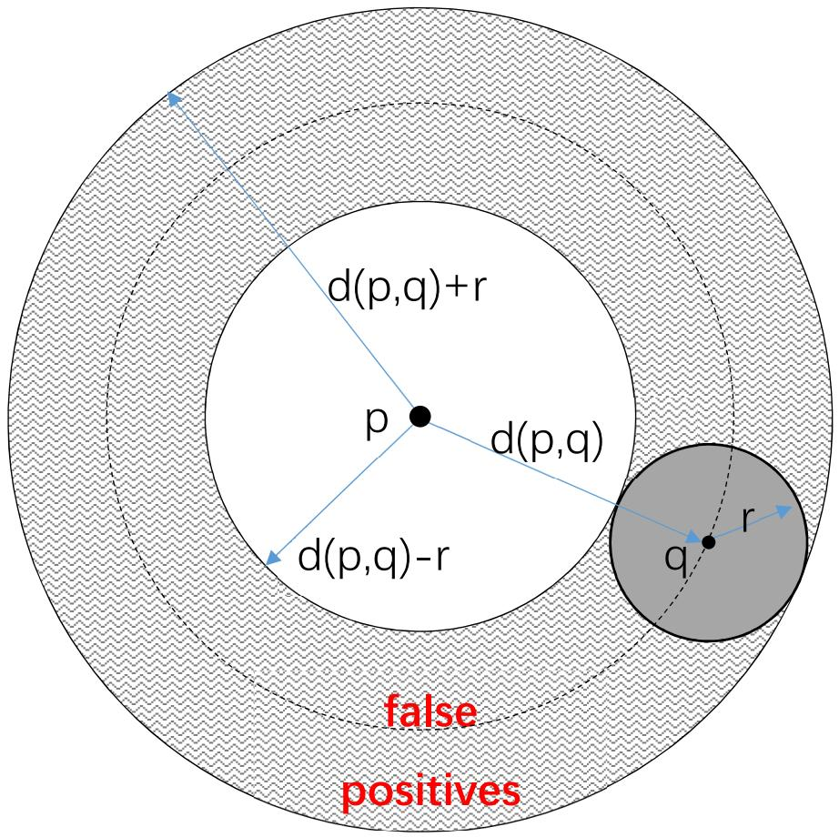  
图21 PivotTable范围查询基于单个支撑点排除数据的情况

Pivot Table 范围查询的思路与本书 1.4 节中的例子一致，即基于查询对象和参考点之间的距离及参考点和数据间的距离利用三角不等式进行数据的约简，其基本原理描述在定理 3-1 中。

定理3-1（排除规则）：对于度量空间中任意数据点  $\mathfrak{p},\mathfrak{q},\mathfrak{s}$  ，如果  $|\mathrm{d}(\mathrm{p},\mathrm{q}) - \mathrm{d}(\mathrm{p},\mathrm{s})| > \mathrm{r}$  ，那么  $\mathrm{d(q,s)} > \mathrm{r}$  。

定理3-1可以利用距离函数的三角不等性直接证明，在此不再赘述。其几何含义如图21所示。图中深灰色的小圆形表示一个范围查询，查询对象是q，查询半径是r，需要找出以q为圆心r为半径的圆所覆盖的所有数据。p是索引构建时候选定的支撑点（参考点），其与所有数据间的距离已在构建索引的时候计算并存储在索引中。查询的时候首先计算d(p,q)。根据定理3-1，可以确定的是范围查询的所有数据都被以p为中心，半径范围是[d(p,q)-r,d(p,q)+r]的环覆盖。从p的视角来看，虽然范围查询肯定是在上述环内，但是具体的位置是未知的，且环内存在不在范围查询内的数据（图21中浅灰色波浪阴影部分）。因此，可以

利用定理3-1排除数据。也就是说没有被环覆盖的环内侧或者外侧的数据都不可能是范围查询的结果，可以安全地排除了。而在环内的数据虽然不一定是查询结果，但是无法根据三角不等性排除，需要直接与q计算距离以确定其是否是查询结果。

从整个查询过程来看，如果排除掉的数据数目大于0，则整体距离计算次数是少于线性扫描的。当然，Pivot Table相比线性扫描的额外代价还包含了构建索引的时间、存储索引的空间、以及查询时读取索引数据的时间和进行三角不等性判断等的时间。进而，如果Pivot Table存储的数据很多，需要使用外存，那么顺序访问和随机访问的差异也是要考虑的因素，排除率至少要高于  $90\%$  才能优于线性扫描（见3.2节）。

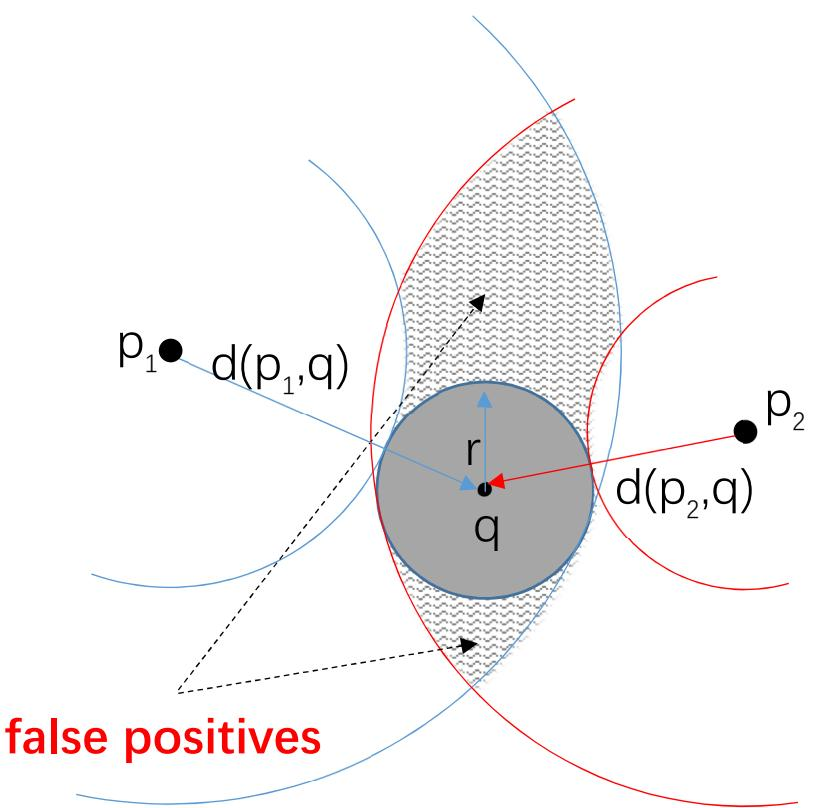  
图22 Pivot Table范围查询基于两个支撑点排除数据的情况

从图21可以看出假阳性数据（false positive，不是范围查询结果但也无法排除的数据）的面积还是比较大的，可以通过增加支撑点的方式来减少假阳性数据的面积。图22展示了基于两个支撑点排除数据的情形，显然，假阳性数据的面积比仅使用单个支撑点的情形（图21）小了很多。不难想象，增加更多的支撑点有助于排除更多的数据，但也导致了更多的上面讨论过的索引额外开销。支撑点数目的确定和选取的方法将在第5章深入讨论。

需要说明的是，在一些特定的情况下不存在假阳性数据。例如，如果距离函数是切比雪

夫距离， $\mathsf{p}_1$ ， $\mathsf{p}_2$  和  $\mathbf{q}$  三点在一条斜率为 1 或 -1 的直线上，且  $\mathbf{q}$  在  $\mathsf{p}_1$  和  $\mathsf{p}_2$  之间，则没有假阳性数据（图 23 左侧）。再如，如果距离函数是曼哈顿距离， $\mathsf{p}_1$ ， $\mathsf{p}_2$  和  $\mathbf{q}$  三点在一条水平或竖直的直线上，且  $\mathbf{q}$  在  $\mathsf{p}_1$  和  $\mathsf{p}_2$  之间，则也没有假阳性数据（图 23 右侧）。

  
图23 Pivot Table范围查询基于两个支撑点排除数据不存在假阳性的特别情况

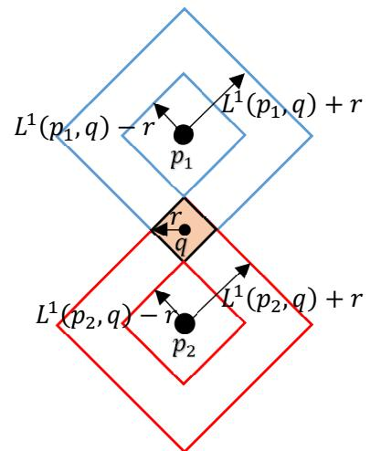

基于距离函数的三角不等性节省范围查询距离计算次数的途径除了像定理3-1那样排除一些数据以外，还可以不需距离计算直接把一些数据判定为范围查询结果。具体地说，如果支撑点离查询对象很近，本身已经是范围查询的结果之一，则离支撑点足够近的数据点也是范围查询的结果。定理3-2描述了这一情况。

定理3-2（包含规则）：对于度量空间中任意数据点  $\mathfrak{p},\mathfrak{q},\mathfrak{s}$  ，如果  $\mathrm{d}(\mathrm{p},\mathrm{s}) + \mathrm{d}(\mathrm{p},\mathrm{q})\leqslant \mathrm{r}$  ，那么  $\mathrm{d}(q,s)\leqslant r$  。

定理3-2可以利用距离函数的三角不等性直接证明，在此不再赘述。其几何含义如图24所示。从支撑点  $\mathfrak{p}$  的视角来看，数据s存在于以  $\mathfrak{p}$  为中心以  $\mathrm{d}(\mathrm{p},\mathrm{s})$  为半径的圆弧上，具体位置未知。由简单的平面几何推理可知，当  $\mathrm{d}(\mathrm{p},\mathrm{s}) + \mathrm{d}(\mathrm{p},\mathrm{q}) \leqslant \mathrm{r}$  时，s所处的圆弧完全被以查询对象q为中心以查询半径r为半径的范围查询圆覆盖，因此无需计算  $\mathrm{d}(\mathrm{q},\mathrm{s})$  也可以判定  $\mathrm{d}(\mathrm{q},\mathrm{s}) \leqslant \mathrm{r}$ ，即s是范围查询的结果之一。

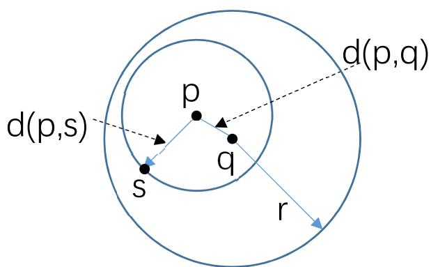

图24 Pivot Table范围查询的包含规则

综合上述讨论，可以得出 Pivot Table 的查询算法（表 3）。该算法首先计算查询对象 q 和所有支撑点的距离，并判断每个支撑点是否为查询结果。然后对每个数据点，基于所有支撑点逐个判别可否运用定理 3-1 排除或者运用定理 3-2 直接判定为查询结果，不能排除或包含的数据则与查询对象进行直接的距离计算以判断其是否为查询结果。

表 3 Pivot Table 的范围查询算法  

<table><tr><td colspan="2">Algorithm: PTRangeSearch</td></tr><tr><td colspan="2">Input: data[1...n], pivot[1...k], 支撑点-数据距离 distance[1...k][1...n], 范围查询 R(q,r)</td></tr><tr><td colspan="2">Output: 范围查询的结果集 result</td></tr><tr><td colspan="2">1: result = ∅;</td></tr><tr><td>2: for i = 1: k</td><td>//计算每个支撑点与q距离,并判断其是否是查询结果</td></tr><tr><td>3: if d(pi,q) ≤ r</td><td></td></tr><tr><td>4: result += {pi};</td><td></td></tr><tr><td>5: end if</td><td></td></tr><tr><td>6: end for</td><td></td></tr><tr><td>7: for j = 1: n</td><td>//处理每个数据对象</td></tr><tr><td>8: done = false;</td><td></td></tr><tr><td>9: for i = 1: k</td><td>//基于每个pivot尝试约简规则</td></tr><tr><td>10: if d(pi,q) + distance(i,j) ≤ r</td><td>//包含规则</td></tr><tr><td>11: result += {sj};</td><td></td></tr><tr><td>12: done = true;</td><td></td></tr><tr><td>13: break;</td><td></td></tr><tr><td>14: end if</td><td></td></tr><tr><td>15: if |d(pi,q) - distance(i,j)| &gt; r</td><td>//排除规则</td></tr><tr><td>16: done = true;</td><td></td></tr><tr><td>17: break;</td><td></td></tr><tr><td>18: end if</td><td></td></tr><tr><td>19: end for</td><td></td></tr><tr><td>20: if done == false</td><td>//无法排除或直接判定,进行直接距离计算</td></tr><tr><td>21: if d sj,q) ≤ r</td><td></td></tr><tr><td>22: result += {sj};</td><td></td></tr><tr><td>23: end if</td><td></td></tr><tr><td>24: end if</td><td></td></tr><tr><td>25: end for</td><td></td></tr><tr><td>26: return result;</td><td></td></tr></table>

# 3.3.3 Pivot Table 的扩展

Pivot Table 作为最基本的度量空间相似性索引方法，在很多研究和文献中广泛使用。前面的讨论没有明确支撑点的个数，而 AESA[42]是一个极端的情况，即把所有的数据都选作

支撑点，在索引中存储了所有数据对之间的距离，实验表明该结果的最近邻查询时间大致是常数的，但是其平方量级的空间复杂度对于较大的数据集是无法接受的。为解决 AESA 存储开销太大的问题，LAESA[43]仅使用常数个支撑点。但是，实验表明，想要获得较好的范围查询性能，LAESA 需要的支撑点数目非常大，因此也不太适用于较大的数据集。

当 Pivot Table 用作其它度量空间树状相似性索引的叶子节点的时候，可以进一步通过存储更多的数据来减少距离计算次数[46]。在构建索引的时候，在 Pivot Table 里面除了存储数据和所在叶子节点的支撑点之间的距离以外，还可以存储数据和从索引根节点到叶子的路径上所有（或部分）内部节点的支撑点之间的距离。在查询的时候，保存查询对象和从索引根节点到叶子的路径上内部节点的支撑点之间的距离。最后，在查询作为叶子节点的 Pivot Table 的时候，利用前面步骤保存的距离信息利用三角不等性按照和上一节基本一致的方式进一步约简（排除或包含）数据。这样可能会减少距离计算次数，当然增加了存储空间以及读取索引的开销。

# 3.4 超平面树（General Hyper-plane Tree）

从本节开始将讨论树状的度量空间相似性索引，其基本思路是递归地划分和约简数据，最后使用 Pivot Table 作为索引树的叶子节点。一般来说，数据划分的方式决定了约简的途径，是树状度量空间相似性索引的核心问题之一。按照数据划分方式的不同，树状度量空间相似性索引可以分为三类，本节讨论其中的超平面树。

顾名思义，超平面树（General Hyper-plane Tree，GHT）就是用超平面分割数据，是三种最常见的度量空间树状相似性索引结构之一。此处的超平面，是指度量空间中到两定点的距离相等的点的集合。

# 3.4.1 GH 树的结构和批建

GH 树的原始形式由 Uhlmann 于 1991 年[44]提出，其划分的基本思路是按照数据到两个支撑点距离的大小关系把数据划分为左右两个部分。如图 25 所示，首先从数据中选择 2 个中心点（即支撑点） $\mathbf{C}_1$  和  $\mathbf{C}_2$ ，然后把离左边的  $\mathbf{C}_1$  更近的数据划分到左子树，把离右边的  $\mathbf{C}_2$  更近的数据划分到右子树。从平面几何的角度看，是用  $\mathbf{C}_1$  和  $\mathbf{C}_2$  的连线的中垂线 L 把数据划分为两个部分；或者从空间几何的角度来看，是用到  $\mathbf{C}_1$  和  $\mathbf{C}_2$  距离相等的点形成的超平面 L 把数据划分为两个部分。上述步骤递归进行就得到了一棵二分树。GH 树的内部节点的

数据结构如图26所示。

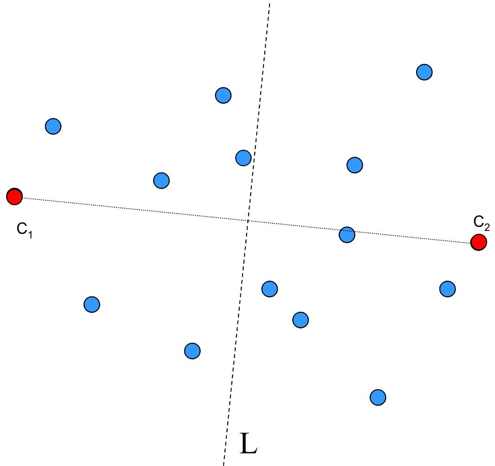  
图25GH树的划分  
图26GH树内部节点的数据结构

```txt
GHTInternalNode  
{ c1,c2; //支撑点 left,right; //左右子树 }
```

GH 树的批建算法如表 4 所示。其流程较为简单，此处不再赘述。需要说明的是，如此构建的索引树从子树所包含数据量的角度来看不一定是平衡的。

表 4 GH 树的批建算法  

<table><tr><td>Algorithm: GHTBulkload</td></tr></table>

Input: data[1...n], 叶子节点大小上界 MaxLeafSize

Output: GH 树根节点（内部节点 GHTInternalNode，或叶子节点 PivotTable）

1: if  $n \leqslant$  MaxLeafSize  
2: return new PivotTable(data);  
3: end if  
4:  $c_{1}, c_{2} = \text{pivotSelection(data)}$ ;  
5: data = data -  $\{c_1, c_2\}$ ;  
6: leftData = rightData =  $\varnothing$  
7: for  $s$  in data  
8: if  $\mathbf{d}(s, c_1) \leqslant \mathbf{d}(s, c_2)$  
9: leftData +=  $\{s\}$ ;  
10: else  
11: rightData +=  $\{s\}$ ;  
12: end if  
13: end for  
14: return GHTInternalNode(c1, c2, GHTBulkload(leftData), GHTBulkload(rightData));

//构建 Pivot Table 作为叶子

//选支撑点

# 3.4.2 GH 树的范围查询

基于划分和约简的树状度量空间相似性索引的范围查询的核心问题是约简。也就是说，尽量约简不可能包含查询结果的子树或者全部数据都可判定为查询结果的子树，然后递归查询不能约简的子树，而约简的基本途径就是利用距离函数的三角不等性。

如图27所示，GH树的范围查询有3种排除情况：范围查询  $(\mathbf{q}_1,\mathbf{r}_1)$  完全处在划分边界L的左侧，因此右子树不可能包含查询结果，可以排除；范围查询  $(\mathbf{q}_3,\mathbf{r}_3)$  完全处在划分边界L的右侧，因此左子树不可能包含查询结果，可以排除；范围查询  $(\mathbf{q}_2,\mathbf{r}_2)$  与划分边界L相交，因此左、右子树都可能（并非一定）包含查询结果，都不能排除，这是性能较差的情况。也就是说，如果范围查询和划分边界相交就无法排除，否则可以排除划分边界异侧的子树。因此，GH树范围查询排除规则的核心是判断范围查询与划分边界是否相交。

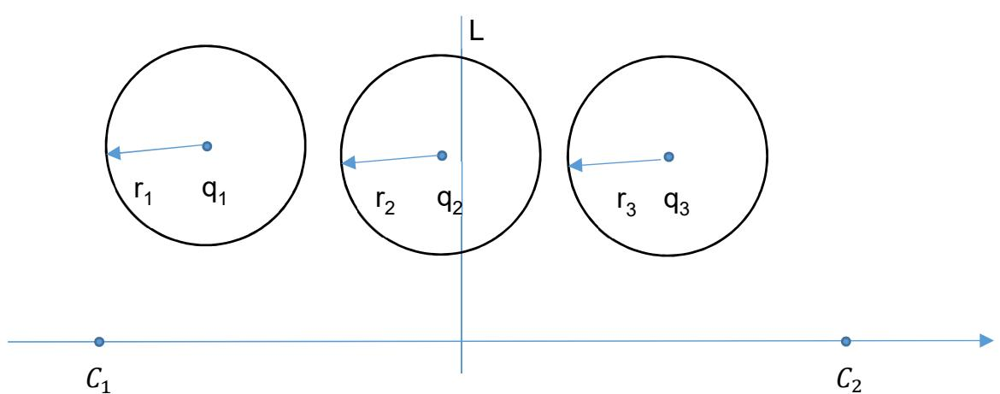

虽然图27能够直观地体现GH树范围查询的不同情况，但是如何用数学或者算法的语义判定这些情况呢？以下首先考虑数据在二维平面上的简单情况，然后考虑只利用三角不等式进行判定的情况，最后推导出适用于一般度量空间的判定方法。

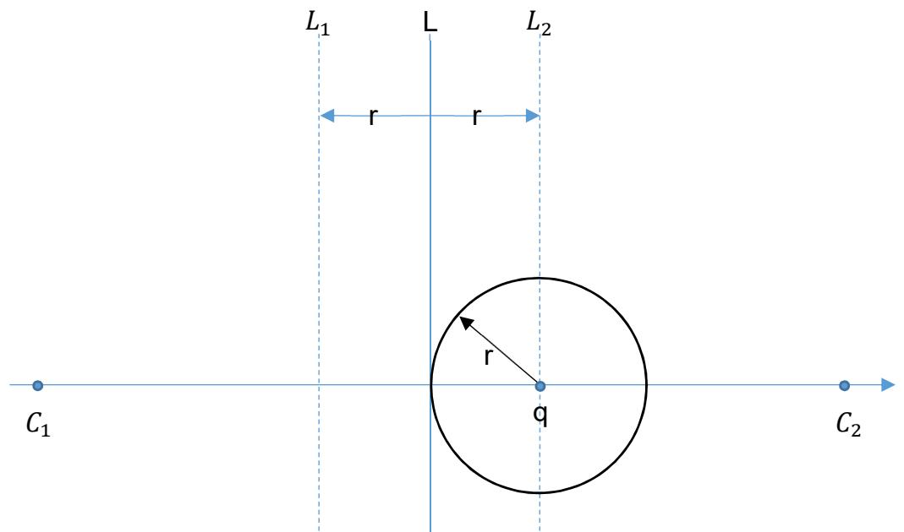  
图27GH树范围查询的3种排除情况  
图28二维平面的GH树范围查询排除规则

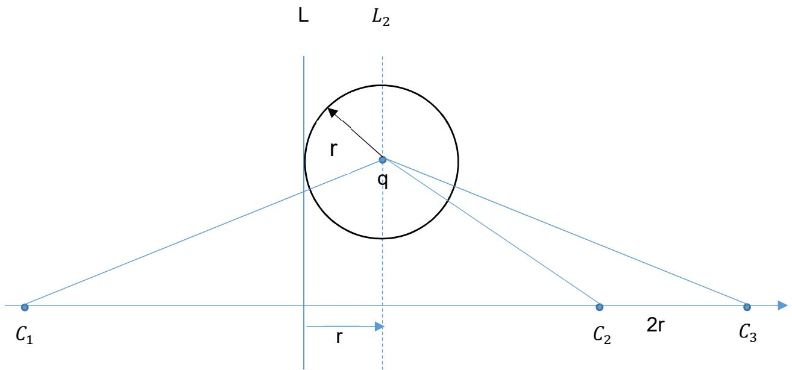  
图29只采用不等式的二维向量数据GH树范围查询排除规则

首先，考虑数据本身是有坐标的二维向量的简单情况。如图28所示， $\mathrm{L}_1$  和  $\mathrm{L}_2$  是与  $\mathrm{L}$  平行且距离为查询半径r的两条直线，显然：如果查询对象q处于  $\mathrm{L}_1$  和  $\mathrm{L}_2$  之间，则范围查询与划分边界L相交，无法排除数据；如果q在  $\mathrm{L}_1$  的左边，则右子树（L右侧）可以排除；如果q在  $\mathrm{L}_2$  的右边，则左子树（L左侧）可以排除。q和几条直线的相对位置关系可以根据

坐标通过解析几何的办法计算点和直线的距离进行判断。但是，一般的度量空间是没有坐标的，甚至除了两点连线的中垂线（到两点距离相等的点的轨迹）以外都无法表示直线，更无法使用勾股定理之类的解析几何方法，只有距离的加减、大小关系、及不等式等。

其次，尝试在二维数据上发现仅基于不等式的排除规则，为发现一般度量空间的排除规则提供启示。既然目前在度量空间中能表示的直线只有中垂线，我们尝试把  $\mathrm{L}_1$  或  $\mathrm{L}_2$  构造成中垂线。如图29所示，在  $\mathbf{C}_1$  和  $\mathbf{C}_2$  连线上向右延伸  $2\mathrm{r}$  的长度构造一个点  $\mathbf{C}_3$  ，则  $\mathrm{L}_2$  是  $\mathbf{C}_1$  和 $\mathbf{C}_3$  连线的中垂线，因此可以根据查询对象  $\mathbf{q}$  到  $\mathbf{C}_1$  和  $\mathbf{C}_3$  的距离判断其是否在  $\mathbf{L}_2$  的右侧，即如果  $\mathrm{d(q,C_1) > d(q,C_3)}$  则  $\mathbf{q}$  在  $\mathbf{L}_2$  右侧，进而左子树（L左侧）可以排除。根据度量空间距离函数的三角不等性有  $\mathrm{d(q,C_3)\leqslant d(q,C_2) + 2r}$  ，所以如果  $\mathrm{d(q,C_1) > d(q,C_2) + 2r}$  则必有  $\mathrm{d(q,C_1) > d(q,C_3)}$  。因此，二维数据上仅基于不等式的排除左子树的规则可以表示为：如果  $\mathrm{d(q,C_1) > d(q,C_2) + 2r}$  则  $\mathbf{q}$  在  $\mathbf{L}_2$  右侧，进而左子树（L左侧）可以排除。类似地，可以得出二维数据上仅基于不等式的排除右子树的规则：如果  $\mathrm{d(q,C_2) > d(q,C_1) + 2r}$  ，则  $\mathbf{q}$  在  $\mathbf{L}_1$  左侧，进而右子树（L右侧）可以排除。

定理3-3表明上述在二维数据上推演的仅基于不等式的排除规则适用于一般的度量空间。

定理3-3：给定GH树内部节点的支撑点  $\mathbf{C}_1$  和  $\mathbf{C}_2$  ，任意数据点s，及范围查询(q,r）（图28），则  $①$  如果  $\mathrm{d}(q,C_1) - \mathrm{d}(q,C_2) > 2\mathrm{r}$  （即  $\mathbf{q}$  在  $\mathbf{L}_2$  右侧），且  $\mathrm{d}(\mathrm{q},\mathrm{s})\leqslant \mathrm{r}$  （即s是查询结果），那么  $\mathrm{d(s,C_1)} > \mathrm{d(s,C_2)}$  （即s必然在右子树）；  $②$  如果  $\mathrm{d}(q,\mathrm{C}_2) - \mathrm{d}(q,\mathrm{C}_1)\geqslant 2\mathrm{r}$  （即  $\mathbf{q}$  在  $\mathbf{L}_1$  左侧），且  $\mathrm{d(q,s)}\leqslant \mathrm{r}$  （即s是查询结果），那么  $\mathrm{d}(s,C_1)\leqslant \mathrm{d}(s,C_2)$  （即s必然在左子树）。

证明：仅需证明①。

$$
\because \boldsymbol {d} (\boldsymbol {q}, \boldsymbol {C} _ {1}) - \boldsymbol {d} (\boldsymbol {q}, \boldsymbol {C} _ {2}) > 2 r
$$

$$
\therefore \boldsymbol {d} (\boldsymbol {q}, \boldsymbol {C} _ {1}) - \boldsymbol {r} > \boldsymbol {d} (\boldsymbol {q}, \boldsymbol {C} _ {2}) + \boldsymbol {r}
$$

$$
\because \boldsymbol {d} (\boldsymbol {q}, s) \leq \boldsymbol {r}
$$

$$
\therefore \boldsymbol {d} (\boldsymbol {q}, \boldsymbol {C} _ {1}) - \boldsymbol {d} (\boldsymbol {q}, s) \geq \boldsymbol {d} (\boldsymbol {q}, \boldsymbol {C} _ {1}) - \boldsymbol {r}, \boldsymbol {d} (\boldsymbol {q}, \boldsymbol {C} _ {2}) + \boldsymbol {r} \geq \boldsymbol {d} (\boldsymbol {q}, \boldsymbol {C} _ {2}) + \boldsymbol {d} (\boldsymbol {q}, s)
$$

根据三角不等式：  $\pmb{d}(\mathbf{s},\pmb{C}_1) \geq \pmb{d}(\pmb{q},\pmb{C}_1) - \pmb{d}(\pmb{q},\pmb{s}), \pmb{d}(\pmb{q},\pmb{C}_2) + \pmb{d}(\pmb{q},\pmb{s}) \geq \pmb{d}(\mathbf{s},\pmb{C}_2)$

把上面几个式子写在一起：

$$
\boldsymbol {d} (\mathrm {s}, \boldsymbol {C} _ {1}) \geq \boldsymbol {d} (\boldsymbol {q}, \boldsymbol {C} _ {1}) - \boldsymbol {d} (\boldsymbol {q}, s) \geq \boldsymbol {d} (\boldsymbol {q}, \boldsymbol {C} _ {1}) - \boldsymbol {r} > \boldsymbol {d} (\boldsymbol {q}, \boldsymbol {C} _ {2}) + \boldsymbol {r} \geq \boldsymbol {d} (\boldsymbol {q}, \boldsymbol {C} _ {2}) + \boldsymbol {d} (\boldsymbol {q}, s) \geq \boldsymbol {d} (\mathrm {s}, \boldsymbol {C} _ {2})
$$

即  $\pmb {d}(\mathbf{s},\pmb {C}_1) > \pmb {d}(\mathbf{s},\pmb {C}_2)$

定理3-3给出的一般度量空间GH树范围查询排除规则的临界情况，即  $|\mathrm{d}(\mathbf{q},\mathbf{C}_1) - \mathrm{d}(\mathbf{q},\mathbf{C}_2)| = 2\mathbf{r}$ ，在二维平面上实际上是以  $\mathbf{C}_1$  和  $\mathbf{C}_2$  为焦点的双曲线。如图30所示，一般度量空间排除

规则（双曲线外侧）的适用范围显然比二维平面排除规则（ $\mathrm{L}_1$  和  $\mathrm{L}_2$  外侧）的小，意味着索引性能的差异。如图30所示当查询对象处于右双曲线和  $\mathrm{L}_2$  直线间的斜纹阴影区域时，按照二维平面排除规则是可以排除左子树的，按照一般度量空间排除规则却无法排除左子树。因此，如果二维平面排除规则能够推广到一般度量空间肯定会带来索引性能的提升，但是目前尚无这样的成果。一般认为，二维平面排除规则是无法推广到一般度量空间的，几个方面的因素说明如下：

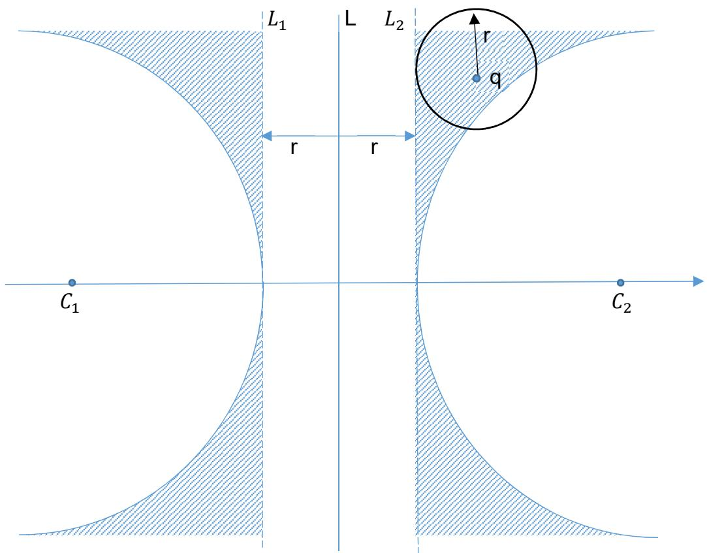  
图30二维数据和一般度量空间的GH树范围查询排除规则临界情况

- 二维平面规则基于平面解析几何知识，一般度量空间不具备这样的数学条件，因而无法推导出类似的规则。二维平面规则虽然性能更好但只适用于二维平面，一般度量空间规则虽然性能较差但可普遍适用于任意度量空间。这再次体现了专用方法和通用方法各自的利弊。  
- 通俗/直观地看，可以认为二维平面是以  $\mathrm{L}$  为中心，向两侧用与  $\mathrm{L}$  平行的直线扩张/生长出来的。而在度量空间中，直线的概念仅体现于中垂线的情况，而双曲线  $(|d(q, C_1) - d(q, C_2)| = t$ ）可以随着参数  $t$  的不同有很多。也就是说，度量空间可以看作是一族双曲线扩张/生长出来的（如图31所示），包括中垂线  $\mathrm{L}$  也可以看作是双曲线的极端情况。目前尚无法定义图30中直线  $L_1$  和  $L_2$ ，因此可以认为图中的

斜纹阴影区域在度量空间中实际上是不可定义甚或不存在的。实际上，可以证明，2r是使定理3-3的排除规则成立的t的最小值，更小的t值已经无法保证定理3-3的排除规则的正确性了。从这个意义上讲定理3-3的排除规则已经是最紧致的了。

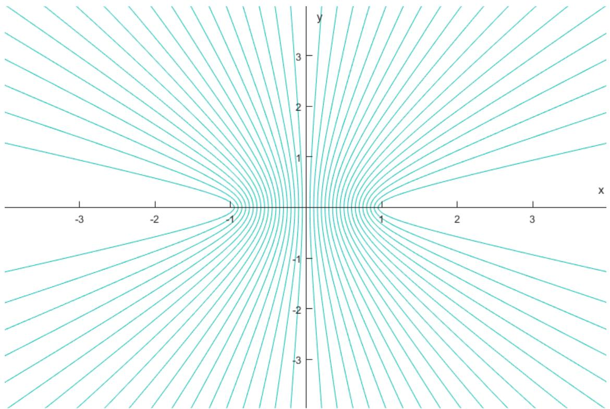  
图31以双曲线/面扩张/生长出度量空间

- 后续章节中将会介绍支撑点空间的概念。度量空间映射到支撑点空间以后，数据的划分边界 L 依然是直线，而定理 3-3 的排除规则临界情况的双曲线也映射成为和 L 平行的直线（详见第 6 章），与二维平面上排除规则临界情况的  $\mathrm{L}_{1}$  和  $\mathrm{L}_{2}$  是与 L 平行的直线的情形很相似。这也从侧面表明了图 30 中的斜纹阴影区域在度量空间中是不存在/不可定义的，以及定理 3-3 排除规则的紧致性。

基于定理3-3，GH树范围查询算法如表5所示。需要注意的是算法中没有直接使用定理3-3的原始形式以排除子树，而是使用其否命题，即若子树不能排除则搜索。

表 5GH 树的范围查询算法  

<table><tr><td colspan="2">Algorithm: GHTRangeSearch</td></tr><tr><td colspan="2">Input: GH 树的根节点（内部节点 GHTInternalNode，或叶子节点 PivotTable），q, r</td></tr><tr><td colspan="2">Output: GH 树的范围查询结果集 result</td></tr><tr><td>1: if node is PivotTable</td><td>//叶子节点</td></tr><tr><td>2: return PTRangeSearch(node, q, r);</td><td></td></tr><tr><td>3: end if</td><td></td></tr></table>

4: result  $= \emptyset$  
5: if  $\mathrm{d}(\mathbf{q}, c_{I}) \leqslant \mathrm{r}$  
6: result  $+ = \{c_{i}\}$  
7: end if  
8: if  $\mathrm{d}(q, c_2) \leqslant r$  
9: result  $+ = \{c_2\}$  
10: end if  
11: if  $\mathrm{d}(\mathbf{q}, c_1) - \mathrm{d}(\mathbf{q}, c_2) \leqslant 2\mathbf{r}$  
12: result  $+=$  GHTRangeSearch(node.left, (q, r));  
13: end if  
14: if  $\mathrm{d}(q, c_2) - \mathrm{d}(q, c_1) < 2\mathrm{r}$  
15: result  $+=$  GHTRangeSearch(node.right, (q, r));  
16: end if  
17: return result;

//支撑点是否是查询结果

//左子树不能排除，搜索左子树

//右子树不能排除，搜索右子树

需要说明的是，虽然约简既可以是排除掉肯定不可能包含查询结果的子集（排除规则），也可以是把肯定全部都是查询结果的子集直接添加到查询结果集之中（包含规则），但是据笔者所知目前尚未发现上面讨论的GH树存在包含规则，仅有排除规则。这是因为上述基本形式的GH划分所产生的数据子集在远离支撑点的方向是没有边界的，因而无法被完全包围在范围查询中。下节介绍的一些GH树的扩展形式中存在着有完整边界的数据子集，因而其约简存在包含规则（详见第六章）。

# 3.4.3 GH 树的扩展

GH树最常见的扩展就是增加支撑点的数目。当支撑点的数目多于2个的时候，超平面划分一般就是依照维诺图（Voronoi Diagram，泰森多边形）进行。GNAT采用的就是多支撑点的超平面划分，同时在树的各层调整支撑点数目以达到平衡划分，但是其搜索是类似VP树的，可以算作是VP树和GH树划分的结合[53]。EGNAT是GNAT的支持插入删除等动态操作的版本[54]。BM-index根据数据到支撑点距离的加权信息进行划分，其划分方式本身和GNAT是基本相同的[55]。

SA-tree首先找到一个起始点，然后按照特定算法找出其“邻居”集合，最后以邻居点作为支撑点对数据进行超平面划分[56]。DSAT是SAT的动态版本，并且往往具有更好的搜索性能[57]。DSAT+是DSAT扩展到外存的版本[58]。DiSAT采用了和SA-tree正好相反的插入策略，获得了更快的性能[59]，而DiSAF是其动态版本[60,61]。i-distance是一种使用很

广的索引方法，先对数据做超平面划分，再把数据映射到一维空间用B+树进行索引[64]。MH-tree把超平面划分用于高维数据[65]。Matthew Skala提出了对数据到支撑点的距离信息进行排列组合的划分方法[62]。在此基础上，Metric Index进一步扩展了超平面划分，对依据Voronoi图划分后的每个子集（就是Voronoi图的每个格子里面的数据）继续根据数据到其它支撑点的距离进行超平面划分[63]。

以上方法都只定性地考虑了数据到不同支撑点的距离之间的大小关系，没有定量地考虑距离之间差异的多少。李建中和张兆功设计的超平面树[68]和广义超平面树[67]分别根据数据到两个支撑点的距离的差值或比值的大小划分数据，具有很高的创新性，将在第6章深入讨论。

笔者2014年提出的完全超平面树（Complete General Hyper-plane Tree）[66]根据数据到两个支撑点的距离之和及距离之差的大小进行多路数据划分，充分利用了支撑点蕴含的信息，将在第6章深入讨论。

# 3.5 优势点树（Vantage Point Tree）

上节讨论的超平面树至少需要两个支撑点才能划分数据，本节将要讨论的优势点树采用另一类数据划分方式，只需要一个支撑点就可以划分数据了。

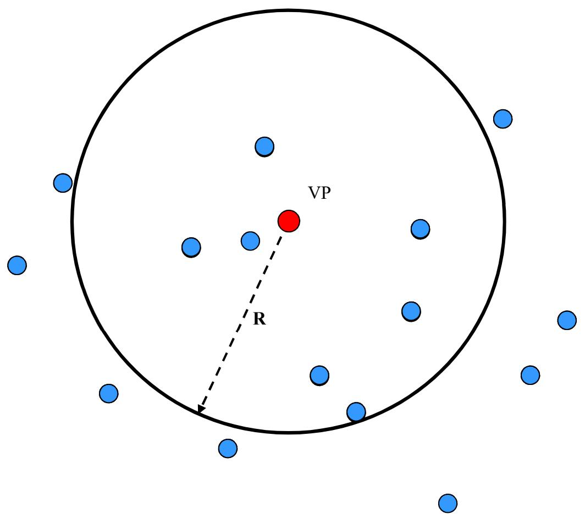  
图32VP树的划分

# 3.5.1 VP 树的结构和批建

优势点树（Vantage Point Tree，VPT）的原始形式分别由Uhlmann于1991年[44,45]和Yianilos于1993年[46]独立提出，Burkhard和Keller也曾于1973年[47]提出过类似的想法。其划分的基本思路是按照数据到支撑点距离的不同进行划分。

图32给出了VP树划分的例子。先选择一个支撑点（优势点，vantage point）VP和一个半径R，那么以VP为圆心，R为半径的球面就把数据划分成了内外两个部分，球内部分可以作为左子树，球外部分可以作为右子树，如此递归划分就产生了索引树。VP树划分也称为球形划分。VP树的内部节点的数据结构如图33所示。

```txt
VPTInternalNode  
{ pivot; //支撑点 splitRadius; //划分半径 left,right; //左右子树 }
```

图33VP树内部节点的数据结构

VP树的批建算法如表6所示。递归算法的出口是当数据的数目不超过常数MaxLeafSize的时候直接构建一个Pivot Table。否则，首先从数据中选择一个支撑点VP（详见第5章），然后根据数据到支撑点的距离确定划分半径R。划分半径的确定是一个重要的研究内容，将在第6章深入讨论。一个常见的做法是选择数据到支撑点距离的中位数作为划分半径以期得到平衡划分。最后，根据划分半径把数据分为左（划分球面内）右（划分球面外）两个部分，分别递归批建左右子树。

表 6VP 树的批建算法  
Algorithm: VPTBulkload  
Input: data[1...n], 叶子节点大小上界 MaxLeafSize  
Output: VP 树根节点（内部节点 VPTInternalNode，或叶子节点 PivotTable）  
1: if n ≤ MaxLeafSize  
2: return new PivotTable(data); //构建 Pivot Table 作为叶子  
3: end if  
4:  $VP = \text{pivotSelection}(data)$  //选支撑点  
5: data = data - {VP};  
6:  $R = \text{determineSplitRadius}(data, VP)$  //确定划分半径  
7: leftData = rightData = ∅;  
8: for i = 1:n  
9: if d(si, VP) ≤ R  
10: leftData += {si};  
11: else  
12: rightData += {si};  
13: end if  
14: end for  
15: return VPTInternalNode(VP, R, VPTBulkload(leftData), VPTBulkload(rightData));

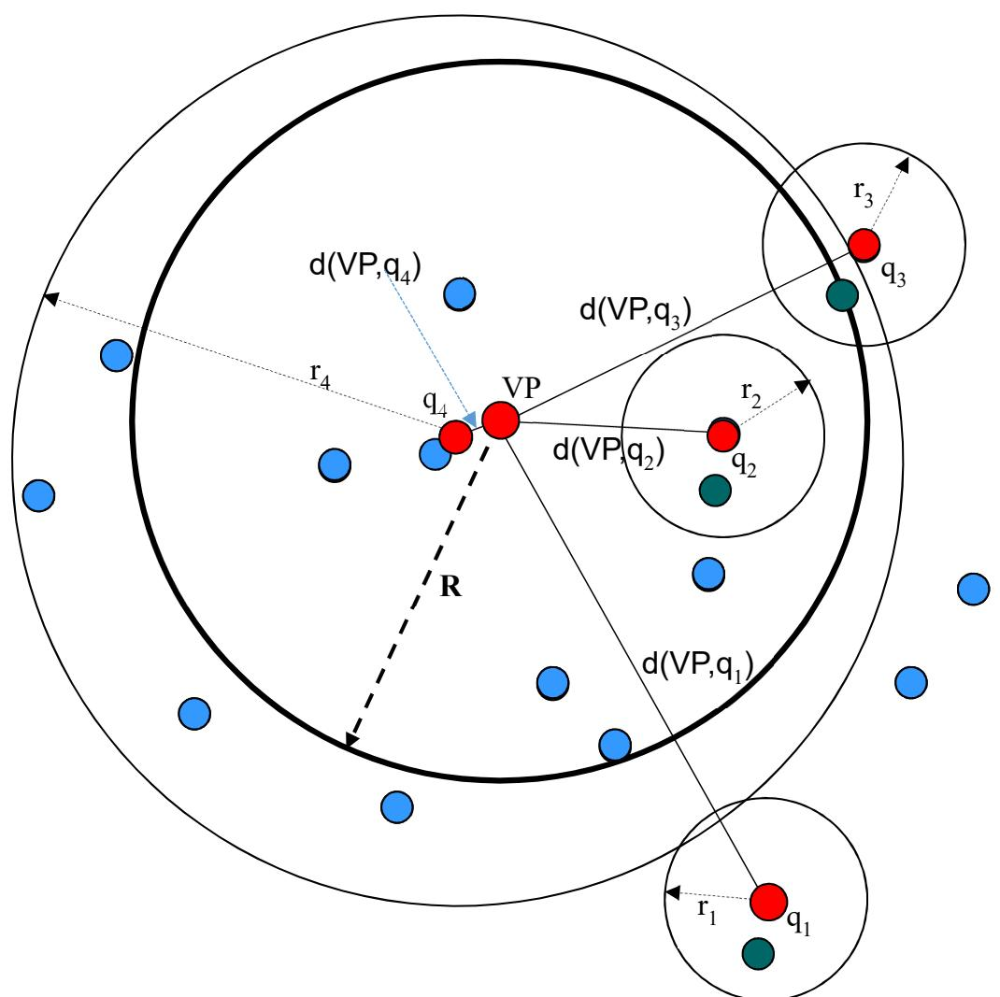  
图34VP树内部节点范围查询的4种情况

# 3.5.2 VP 树的范围查询

与其它树状度量空间相似性索引类似，VP 树范围查询的基本思路也是利用距离函数的三角不等性尽可能约简子树。

图34展示了VP树内部节点范围查询的4种情况。其中VP是该内部节点的支撑点，用红色点表示，R是该内部节点的划分半径，用粗断续箭头线表示，该内部节点的划分边界圆形用粗实线表示；  $(\mathrm{r_i},\mathrm{q_i}),\mathrm{i} = 1,2,3,4$  是四个不同的范围查询，查询对象用红点表示，查询半径用细断续箭头线表示，查询边界的圆形用细实线表示，查询结果用绿点表示；支撑点和查询对象间的距离用细实线表示。下面分别讨论4种情况：

情况1：范围查询  $(r_1, q_1)$  代表了情况1，从图上可以观察到，范围查询的圆完全处在VP树内部节点划分圆（图上粗实线所示）的外侧，因而划分圆内侧不可能有查询结果，可以排除。两个子树排除了一个，是查询性能较好的情况。定理3-4描述了情况1，其证明可以利

用距离函数的三角不等性直接得出，此处不再赘述。

定理3-4（排除规则）：给定任意数据s、VP树内部节点（VP，R）和范围查询（q，r），如果  $\mathrm{d}(\mathrm{VP},\mathrm{q}) > \mathrm{r} + \mathrm{R}$  且  $\mathrm{d}(\mathrm{VP},\mathrm{s})\leqslant \mathrm{R}$ ，那么  $\mathrm{d}(q,s) > r$ 。

情况2：范围查询  $(\mathbf{r}_2,\mathbf{q}_2)$  代表了情况2，从图上可以观察到，范围查询的圆完全处在VP树内部节点划分圆（图上粗实线所示）的内侧，因而划分圆外侧不可能有查询结果，可以排除。两个子树排除了一个，是查询性能较好的情况。定理3-5描述了情况2，其证明可以利用距离函数的三角不等性直接得出，此处不再赘述。

定理3-5（排除规则）：给定任意数据s、VP树内部节点（VP，R）和范围查询（q，r），如果  $\mathrm{d}(\mathrm{VP},\mathrm{q}) + \mathrm{r}\leqslant \mathrm{R}$  且  $\mathrm{d(VP,s)} > \mathrm{R}$ ，那么  $\mathrm{d(q,s)} > \mathrm{r}$ 。

情况3：范围查询  $(\mathbf{r}_3,\mathbf{q}_3)$  代表了情况3，从图上可以观察到，范围查询的圆和VP树内部节点划分圆（图上粗实线所示）相交，因而划分圆的两侧都可能有查询结果，无法排除，这是查询性能较坏的情况。

情况4：范围查询  $(\mathrm{r}_4,\mathrm{q}_4)$  代表了情况4，从图上可以观察到，范围查询的圆完全覆盖VP树内部节点划分圆(图上粗实线所示)，因而划分圆的内侧所有数据都可以判定为查询结果，实现了约简，这是查询性能较好的情况。定理3-6描述了情况4，其证明与定理3-2类似，此处不再赘述。

定理3-6（包含规则）：给定任意数据s、VP树内部节点（VP，R）和范围查询（q，r），如果  $\mathrm{d}(\mathrm{VP},\mathrm{q}) + \mathrm{R}\leqslant \mathrm{r}$  且  $\mathrm{d(VP,s)}\leqslant \mathrm{R}$  ，那么  $\mathrm{d(q,s)}\leqslant \mathrm{r}$  。

表 7VP 树的范围查询算法  

<table><tr><td colspan="2">Algorithm: VPTRangeSearch</td></tr><tr><td colspan="2">Input: VP 树根节点（内部节点 VPTInternalNode (VP, R)，或叶子节点 PivotTable), q, r</td></tr><tr><td colspan="2">Output: VP 树的范围查询结果集 result</td></tr><tr><td>1: if node is PivotTable</td><td>//叶子节点</td></tr><tr><td>2: return PTRangeSearch(node, q, r);</td><td>//支撑点表的范围查询</td></tr><tr><td>3: end if</td><td></td></tr><tr><td>4: result = ∅;</td><td></td></tr><tr><td>5: if d(node. \(VP, q)\) ≤ r</td><td>//支撑点是查询结果</td></tr><tr><td>6: result += {node. \(VP\});</td><td></td></tr><tr><td>7: end if</td><td></td></tr><tr><td>8: if d(node. \(VP, q)\) + node. \(R \leqslant r\)</td><td>//球内数据全部是查询结果</td></tr><tr><td>9: result += getAllData(node.left);</td><td></td></tr><tr><td>10: else if d(node. \(VP, q)\) ≤ node. \(R + r\)</td><td>//球内侧不能排除</td></tr><tr><td>11: result += VPTRangeSearch(node.left, (q, r));</td><td></td></tr><tr><td>12: end if</td><td></td></tr><tr><td>13: if d(node. \(VP, q)\) + r &gt; node. \(R\)</td><td>//球外侧不能排除</td></tr></table>

14: result += VPTRangeSearch(node.right, (q, r));  
15: end if  
16: return result;

表7给出了VP树的范围查询算法。为了简化代码，该算法首先判断划分球内数据是否可以全部包含，即情况4。然后判断球内数据可否被排除，即情况1。情况4发生的同时情况1不可能发生，即球内数据全部包含的同时显然球内侧是不能被排除的。需要注意的是，情况1和情况4可能都不发生，即球内数据不能全部包含但也不能完全排除的情况，也就是表7第10行的情况。最后判断球外数据可否被排除，即情况2。

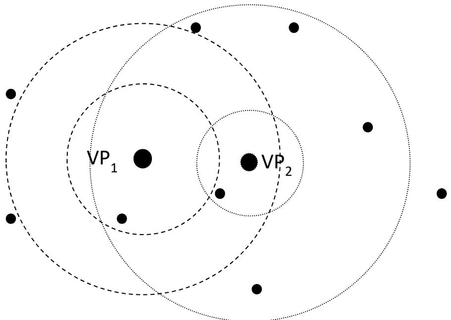  
图35MVP(2,3)树的逻辑结构

# 3.5.3 MVP 树

多优势点树（Multiple Vantage Point Tree, MVPT）[48]从两个方面对 VP 树进行了扩展：①原始的 VP 树只使用了 1 个支撑点，MVP 树使用 k 个支撑点，k≥1；②原始的 VP 树基于数据到支撑点的距离把数据划分为 2 个部分，MVP 树逐个支撑点地基于数据到该支撑点的距离使用多个划分半径把数据划分为 f 个部分，f ≥ 2，因而总的划分的数目是  $\mathbf{f}^{\mathrm{k}}$  。MVP 树可以记为 MVP(k,f)树，VP 树可以记为 MVP(1,2)树。图 35 展示了 MVP(2,3)树的逻辑结构。

```txt
MVPTInternalNode  
{ pivot[]; //支撑点 children[]; //子树 lowerBound[][]; //每棵子树到每个支撑点的距离下界 upperBound[][]; //每棵子树到每个支撑点的距离上界 }
```

图36 MVP树内部节点的数据结构

表 8 MVP 树的批建算法  

<table><tr><td colspan="2">Algorithm: MVPTBulkload</td></tr><tr><td colspan="2">Input: data[1...n], 叶子节点大小上界 MaxLeafSize, 支撑点数目 k</td></tr><tr><td colspan="2">Output: MVP 树根节点（内部节点 MVPTInternalNode，或叶子节点 PivotTable）</td></tr><tr><td colspan="2">1: if n ≤ MaxLeafSize</td></tr><tr><td>2: return new PivotTable(data);</td><td>//构建 Pivot Table 作为叶子</td></tr><tr><td colspan="2">3: end if</td></tr><tr><td>4: VP[] = pivotSelection(data);</td><td>//选支撑点</td></tr><tr><td>5: data = data - {VP};</td><td></td></tr><tr><td>6: partitions = {data};</td><td>//划分产生的数据子集的集合</td></tr><tr><td colspan="2">7: for i = 1:k //逐个按照支撑点把当前每个子集划分成 f 个子集，一共产生 f^k 个子集</td></tr><tr><td>8: newPartitions = ∅;</td><td></td></tr><tr><td colspan="2">9: for every par in partitions</td></tr><tr><td colspan="2">10: newPartitions += split(par, VP[i]); //每个现子集基于当前支撑点划分成 f 个新子集</td></tr><tr><td colspan="2">11: end for</td></tr><tr><td colspan="2">12: partitions = newPartitions;</td></tr><tr><td colspan="2">13: end for</td></tr><tr><td colspan="2">14: for every par in partitions</td></tr><tr><td colspan="2">15: compute lower][][par];</td></tr><tr><td colspan="2">16: compute upper][][par];</td></tr><tr><td colspan="2">17: children[par] = MVPTBulkload(par);</td></tr><tr><td colspan="2">18: end for</td></tr><tr><td colspan="2">19: return MVPTInternalNode(VP, children, lower, upper);</td></tr></table>

MVP 树依然使用 Pivot Table 作为叶子节点，其内部节点的数据结构如图 36 所示。为了提高数据刻画的紧致性，划分半径没有记录在内部节点中，取而代之的是每棵子树到每个支撑点的上下界。

表8展示了MVP树批建算法的基本流程。其核心思想在于每次把当前所有划分按照到一个尚未使用的支撑点的距离划分为f个新的划分，因此最终一共产生了f个划分。当然，支撑点的使用顺序以及划分半径的确定都对索引的性能有影响，将在第6章深入讨论。

根据 MVP 树批建算法可以看出，图 35 给出的 MVP(2,3)树的逻辑结构是不严谨的。因为数据先按照到  $\mathrm{VP}_1$  的距离划分为 3 个部分，然后每个部分再各自按照到  $\mathrm{VP}_2$  的距离划分

为3个部分，所以第一轮产生的3个部分进行第2轮划分的时候使用的划分半径可能是不同的，因而以  $\mathrm{VP}_2$  为圆心的划分圆弧可能无法组成完整的圆。其按照批建算法产生的逻辑结构如图37所示。

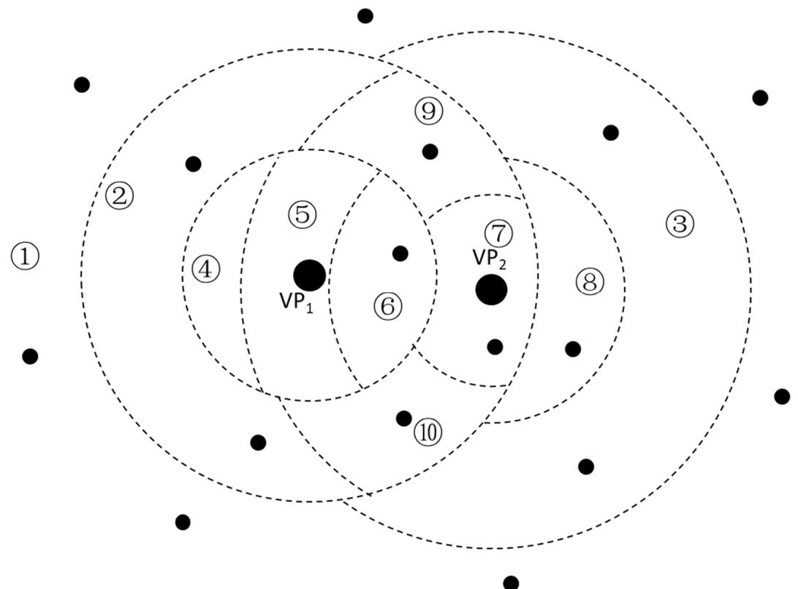  
图37MVP(2,3)树基于批建算法的逻辑结构

此外，对于MVP(2,3)树来说，其划分应该得到  $3^{2} = 9$  个数据划分，但是图37却似乎显示有10个数据划分。这是由于用平面展示空间结构的局限性。具体地说，第⑨和⑩部分可以看作是一个类似空间环形的结构在平面上的截面的两个不连续的部分，他们其实是同一个数据划分。

MVP 树范围查询（表 9）的基本思路与 VP 树范围查询是一致的，只是形式略有不同。MVP 树中，子树可以用其到所有支撑点的距离区间的集合来表示。基于距离函数的三角不等性可以证明，范围查询也被其到所有支撑点的距离区间的集合覆盖，但是该集合覆盖的数据不一定都在范围查询内（详见 4.4 节及图 21）。因此，与定理 3-1、3-4、3-5 的排除规则类似，如果某棵子树的区间集合和范围查询的区间集合没有交集，则该子树肯定不会包含查询结果，可以安全地排除。但是，如果某棵子树的区间集合和范围查询的区间集合有交集，只是表明该子树可能包含查询结果因而不能排除，而并非一定包含查询结果。同时，与定理 3-2 和 3-6 的包含规则类似，也可以判定某些子树内的数据全部都是查询结果，无需进一步的距离计算。

表 9 MVP 树的范围查询算法  

<table><tr><td colspan="2">Algorithm: MVPTRangeSearch</td></tr><tr><td colspan="2">Input: MVP 树根节点（内部节点 MVPTInternalNode, 或叶子节点 PivotTable), q, r</td></tr><tr><td colspan="2">Output: MVP 树的范围查询结果集 result</td></tr><tr><td>1: if node is PivotTable</td><td>//叶子节点</td></tr><tr><td>2: return PTRangeSearch(node, q, r);</td><td></td></tr><tr><td>3: end if</td><td></td></tr><tr><td>4: result = ∅;</td><td></td></tr><tr><td>5: for every VP in node.pivot</td><td>//检查支撑点是否为查询结果</td></tr><tr><td>6: if d(VP, q) ≤ r</td><td></td></tr><tr><td>7: result += {VP};</td><td></td></tr><tr><td>8: end if</td><td></td></tr><tr><td>9: end for</td><td></td></tr><tr><td>10: for every c in node.children</td><td>//逐个约简子树</td></tr><tr><td>11: done = false;</td><td></td></tr><tr><td>12: for every VP in node.pivot</td><td></td></tr><tr><td>13: if d(VP, q) + node upperBound[VP][c] ≤ r</td><td>//子树数据全部是查询结果</td></tr><tr><td>14: result += getAllData(c);</td><td></td></tr><tr><td>15: done = true;</td><td></td></tr><tr><td>16: break;</td><td></td></tr><tr><td>17: end if</td><td></td></tr><tr><td>18:</td><td>//子树可以完全排除</td></tr><tr><td>19: if d(VP, q) + r ≤ node.lowBound[VP][c] or d(VP, q) - r ≥ node-upperBound[VP][c]</td><td></td></tr><tr><td>20: done = true;</td><td></td></tr><tr><td>21: break;</td><td></td></tr><tr><td>22: end if</td><td></td></tr><tr><td>23: end for</td><td></td></tr><tr><td>24: if done == false</td><td>//子树无法被任何支撑点约减，递归搜索</td></tr><tr><td>25: result += MVPTRangeSearch(c, q, r);</td><td></td></tr><tr><td>26: end if</td><td></td></tr><tr><td>27: end for</td><td></td></tr><tr><td>28: return result;</td><td></td></tr></table>

# 3.5.4 VP 树的其它扩展

VP 树采用的按照数据到支撑点距离的不同进行划分的思路是最朴素的数据划分思路之一，被多种相似性索引结构采用。Burkhard 和 Keller 针对有限离散取值的距离函数设计过类似思路的索引结构 BKT[47]。Fixed Queries Tree (FQT)[49]是对 BKT 的扩展，其同一层的节点使用相同的支撑点。Fixed Height FQT (FHQT) [49, 50]是对 FQT 的扩展，其所有的叶子节点的高度是相同的。Fixed Queries Array (FQA)[51]可以认为是从工程实现的角度对 FHQT 的优化，其用数组来存储索引树，并且可以使用更多的支撑点。

VP 森林[52]是对 VP 树的扩展。VP/MVP 树中，因为范围查询对应一个区间，往往会跟多个相邻的区间有交集，导致相应的子树无法排除，而需要搜索多路子树。VP 森林在构建过程中，把区间相邻的子树分开，构建单独的索引树，形成 VP 树的森林。这样可以保证森林中的每棵树每次查询只搜索一个分支，但是要搜索多棵树。实验表明 VP 森林仅对查询半径非常小的范围查询有比较高的性能[52]。

# 3.6 度量树（Metric Tree）

以度量树（Metric Tree，M-Tree）为代表的树状度量空间相似性索引的基本思路是逐层细分数据，并用球把数据包络起来，因此也称为包络球（covering sphere）划分。

M-Tree是第一个面向外存并支持插入删除等动态操作的度量空间索引方法[69]，其很多算法受到了一维索引的B-树[5]和多维索引的R-树[7]的启发。其数据划分的方式和GH树基本上是完全相同的，即先选定若干个支撑点，然后把其它数据分配到以距其最近的支撑点为代表的子树。但是，M-Tree用一个球来表示一棵子树，即每棵子树都用一个中心（支撑点）和一个覆盖半径来表示，所有数据都被这个球覆盖。

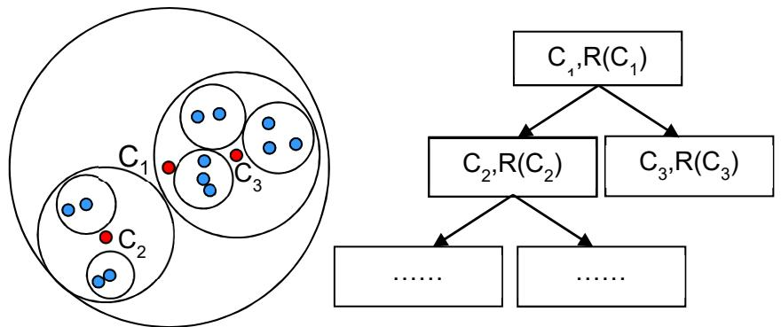  
图38M-Tree的逻辑结构

M-Tree 的逻辑结构如图 38 所示，在索引树的第一层，数据全体被以  $\mathbf{C}_1$  为圆心 R（ $\mathbf{C}_1$ ）为半径的圆包络；在索引树的第二层，数据划分为两个集合，分别被以  $\mathbf{C}_2$  及  $\mathbf{C}_3$  为圆心 R（ $\mathbf{C}_2$ ）及 R（ $\mathbf{C}_3$ ）为半径的圆包络。在对一层进行划分的时候，采用的是超平面划分，即以  $\mathbf{C}_2$  及  $\mathbf{C}_3$  为中心，其余数据划分到相对较近的中心所属的包络球。从逻辑结构来看，M-Tree 和 R-树是相似的。

最早的包络球划分是BiSectorTree（BST）[75]。BST只有2个中心/支撑点，数据划分与原始的GHT完全一致，只是在存储索引和查询时都把子树当作球考虑，而没有当作超平面划分考虑。Monotonous BST[76]扩展了BST，每个节点的两个中心有一个是从父节点继承

的，这样就保证了覆盖半径逐渐减小。

因为所有子树都用球表示，覆盖半径要足以覆盖所有数据，因此M-Tree最大的缺点是不同划分之间的重叠问题。Slim-tree[70]和DAHC-tree[71]及[74]都是针对这个问题对M-tree的改进。笔者早年优化了M-tree计算覆盖半径的方式，并提出了先从上到下再从下到上的双向M-Tree批建算法，相关成果获BIBE2003优秀论文奖[73,78]。Ives R.V. Pola等人2015年提出包络球划分和哈希方法相结合的混合索引，并将该技术应用在Slim-tree上，提出了一种动态索引结构Bucket-Slim-Tree[72]。

总的来说，M-Tree 这类索引的数据划分与 GH 树完全一致，但是用球表示子树的做法存在明显的问题，性能相对较差，因此本节只作简单的介绍。在第 6 章中将深入讨论如何将 M-Tree 和 GH 树统一起来。

# 3.7 本章讨论与展望

为了给读者提供一些直观的度量空间数据管理分析的例子，以促进对后续章节的理解，本章介绍了基于划分和约简思想的树状度量空间相似性索引。相似性索引是度量空间数据管理分析研究最集中的领域之一。本章介绍的基本都是领域中较为成熟经典的成果，同时也加入了笔者角度的理解和思考。本章讨论集中于数据划分的方式，以及由之决定的数据结构和范围查询算法等，而基本未涉及支撑点选择和划分参数（如划分个数和划分半径）的确定。这两部分实际上是本书的重点，将分别在第6、7章深入讨论。

# 第4章 支撑点空间模型

基于度量空间的大数据泛构的最大的优势就是其高度的通用性。它对数据的内部结构没有限制，只需定义满足三角不等性等特性的距离函数。然而，度量空间的优势也同时是其劣势。数据被抽象成度量空间中的点，虽然提高了通用性，但同时也损失了坐标信息，唯一可用的信息就是距离值。坐标的缺失导致很多数学工具无法直接应用，度量空间数据管理分析往往都是采用启发式的方法，缺乏系统的理论框架。

本章提出的支撑点空间模型提供了一个从度量空间映射到多维空间，为度量空间数据重建坐标的机制，并探讨了映射前后数据的扭曲问题，可以作为度量空间数据管理分析的理论框架。本章首先介绍以数据到参考点（支撑点）的距离作为其坐标，把数据从度量空间映射到多维的支撑点空间的方法。其次，在支撑点空间中，数据间的距离往往和度量空间中的间距不同，存在扭曲。为解决这一问题，本章提出了没有扭曲的完全支撑点空间。最后，针对度量空间中表示数据集合的最常见方式-球形，本章探讨了球形数据集在支撑点空间中映像的分布情况，为后续相关研究提供了依据。

# 4.1 支撑点空间

支撑点空间模型的基本思路是以度量空间数据到多个参考点的距离向量作为其坐标。

定义4-1 支撑点空间（pivot space $^{16}$ ）：对于度量空间  $(M, d)$ ，令S是M的元素构成的有限集合（元素不可重复）， $S = \{s_i | s_i \in M, i = 1, 2, \dots, n\}$ ；P是从S中选定大小为k的支撑点（Pivot）或参考点的集合  $P = \{p_1, p_2, \dots, p_k\}$ ， $P \subseteq S$ 。对于S中的任意元素s，以其到所有支撑点的距离向量作为其坐标，可以定义一个从M到k维非负实数空间的映射。上标  $p$  表示映射后的像，例如  $s^p$  表示s的像  $F_{P,d}(s)$ ：

$$
F _ {P, d} \colon \mathbb {M} \to R ^ {k} \colon s ^ {p} \equiv F _ {P, d} (s) = \big (d (s, p _ {1}), d (s, p _ {2}), \ldots , d (s, p _ {k}) \big).
$$

支撑点空间（pivot space）[82, 83]就是S在  $\mathbf{R}^{\mathrm{k}}$  中的像  $F_{P,d}(\mathbf{S})$

$$
F _ {P, d} (S) = \left\{s ^ {p} | s ^ {p} = F _ {P, d} (s) = \left(d (s, p _ {1}), d (s, p _ {2}), \ldots , d (s, p _ {k})\right), s \in S \right\}.
$$

如果把支撑点集合P和距离函数d也看成参数，  $F_{P,d}(s)$  和  $F_{P,d}(S)$  也可以分别写作  $\mathrm{F(s,P,d)}$

和  $\mathrm{F}(\mathrm{S},\mathrm{P},\mathrm{d})$  ，表示数据集S在以P作为支撑点集合、以d作为距离函数的情况下得到的支撑点空间。在不会引起混淆的情况下，我们把包含支撑点空间的  $\mathbf{R}^{\mathrm{k}}$  也称为支撑点空间，把原度量空间称为数据空间（data space）。也就是说，支撑点空间就是一个多维空间，其维度就是支撑点的个数，其坐标轴和支撑点相对应。数据在支撑点空间中某个坐标轴上的坐标分量就是该数据在度量空间中和该坐标轴对应的支撑点的距离。根据度量空间距离函数的正定性，所有的距离都是非负的，因此度量空间数据在支撑点空间中的映像点只分布于第一象限中或与其相邻的坐标轴或坐标平面上。下面的定理给出了更精准的描述。

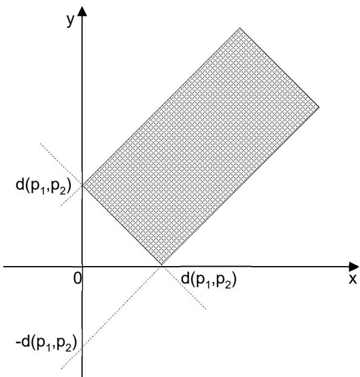  
图39二维和三维支撑点空间中数据的分布范围

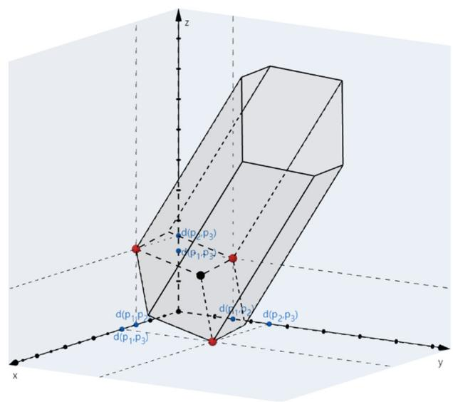

定理4-1：令  $S = \{s_i \mid i = 1, 2, \dots, n\}$  是一个度量空间数据集，距离函数为  $d$ ， $P = \{p_1, p_2, \dots, p_k\}$  是支撑点集合， $P \subseteq S$ ， $(x_1, x_2, \dots, x_k)$  是支撑点空间中的任意坐标。则支撑点空间中的数据分布满足以下条件：

$$
x _ {i} \geqslant 0, i, j \in [ 1, k ], i \neq j
$$

$$
\mathrm {x} _ {\mathrm {i}} + \mathrm {x} _ {\mathrm {j}} \geqslant \mathrm {d} (\mathrm {p} _ {\mathrm {i}}, \mathrm {p} _ {\mathrm {j}})
$$

$$
\mathrm {d} (\mathrm {p} _ {\mathrm {i}}, \mathrm {p} _ {\mathrm {j}}) \geqslant \mathrm {x} _ {\mathrm {i}} - \mathrm {x} _ {\mathrm {j}} \geqslant - \mathrm {d} (\mathrm {p} _ {\mathrm {i}}, \mathrm {p} _ {\mathrm {j}})
$$

证明：

根据支撑点空间的定义，对于任意  $s \in S$ ， $x_i = d(s, p_i)$ 。

根据度量空间距离函数的正定性和三角不等性，对于  $i,j\in [1,k],i\neq j$

$$
\mathrm {x} _ {\mathrm {i}} = \mathrm {d} (\mathrm {s}, \mathrm {p} _ {\mathrm {i}}) \geqslant 0
$$

$$
\mathrm {x} _ {\mathrm {i}} + \mathrm {x} _ {\mathrm {j}} = \mathrm {d} (\mathrm {s}, \mathrm {p} _ {\mathrm {i}}) + \mathrm {d} (\mathrm {s}, \mathrm {p} _ {\mathrm {j}}) \geqslant \mathrm {d} (\mathrm {p} _ {\mathrm {i}}, \mathrm {p} _ {\mathrm {j}})
$$

$$
| \mathbf {x} _ {\mathrm {i}} - \mathbf {x} _ {\mathrm {j}} | = | \mathbf {d} (\mathbf {s}, \mathbf {p} _ {\mathrm {i}}) - \mathbf {d} (\mathbf {s}, \mathbf {p} _ {\mathrm {j}}) | \leqslant \mathbf {d} (\mathbf {p} _ {\mathrm {i}}, \mathbf {p} _ {\mathrm {j}}), \text {即} \mathbf {d} (\mathbf {p} _ {\mathrm {i}}, \mathbf {p} _ {\mathrm {j}}) \geqslant \mathbf {x} _ {\mathrm {i}} - \mathbf {x} _ {\mathrm {j}} \geqslant - \mathbf {d} (\mathbf {p} _ {\mathrm {i}}, \mathbf {p} _ {\mathrm {j}})
$$


特别地，根据定理4-1，在2维和3维的支撑点空间中，数据仅可能分布在图39所示的阴影区域（2维）或者空间范围（3维）中。可以看出，随着支撑点间的距离逐渐变大，数据分布区域逐渐远离原点且逐渐变宽广。

下面给出支撑点空间的几个例子。

例4-1：给定3个整数A、B、C，取值分别为1、2、3，其间距离函数可以是两数之差的绝对值。因为数据是1维的，该距离函数可以用各种次数的闵可夫斯基距离表示，本例中假定其为常用的欧几里得距离  $L^2$  。按照支撑点空间的定义，可以构造3个支撑点个数为1的不同的支撑点空间，即分别选择A、B、或C为支撑点。因为支撑点个数为1，所以产生的3个支撑点空间也都是1维的。A、B、C在3个支撑点空间中的映像如表10所示。

表 10 一维支撑点空间的例子  

<table><tr><td></td><td>Ap</td><td>Bp</td><td>Cp</td></tr><tr><td>原始值</td><td>1</td><td>2</td><td>3</td></tr><tr><td>支撑点空间 F(S,{A},L2) 
sP=F(s,{A},L2)=L2(s,A)=|s-A|</td><td>0</td><td>1</td><td>2</td></tr><tr><td>支撑点空间 F(S,{B},L2) 
sP=F(s,{B},L2)=L2(s,B)=|s-B|</td><td>1</td><td>0</td><td>1</td></tr><tr><td>支撑点空间 F(S,{C},L2) 
sP=F(s,{C},L2)=L2(s,C)=|s-C|</td><td>2</td><td>1</td><td>0</td></tr></table>

例4-2：对于度量空间数据集S，距离函数d，包含两个支撑点的支撑点集合  $\mathrm{P} = \{\mathfrak{p}_1,\mathfrak{p}_2\}$  则按照支撑点空间的定义，此处支撑点空间是二维的，对于任意  $s\in S$  ，  $\mathfrak{s}^{\mathfrak{p}}$  是个二维向量：

$$
s ^ {p} = \left(d \left(s, p _ {1}\right), d \left(s, p _ {2}\right)\right)
$$

若S实际是二维向量的数据集，令s.x和s.y分别表示s的x和y坐标，则采用不同的闵可夫斯基距离时  $\mathfrak{s}^{\mathrm{p}}$  为：

$$
L ^ {1} \colon s ^ {p} = \big (L ^ {1} (s, p _ {1}), L ^ {1} (s, p _ {2}) \big) = \big (| s. x - p _ {1}. x | + | s. y - p _ {1}. y |, | s. x - p _ {2}. x | + | s. y - p _ {2}. y | \big)
$$

$$
L ^ {2}: s ^ {p} = \left(L ^ {2} \left(s, p _ {1}\right), L ^ {2} \left(s, p _ {2}\right)\right) = \left(^ {2} \sqrt {\left| s . x - p _ {1} . x \right| ^ {2} + \left| s . y - p _ {1} . y \right| ^ {2}}, ^ {2} \sqrt {\left| s . x - p _ {2} . x \right| ^ {2} + \left| s . y - p _ {2} . y \right| ^ {2}}\right)
$$

$$
L ^ {\infty}: s ^ {p} = \left(L ^ {\infty} (s, p _ {1}), L ^ {\infty} (s, p _ {2})\right) = \left(\max  \left(| s. x - p _ {1}. x |, | s. y - p _ {1}. y |\right), \max  \left(| s. x - p _ {2}. x |, | s. y - p _ {2}. y |\right)\right)
$$

考虑二维平面上的5个点，即单位正方形的4个拐角和中心， $\mathrm{S} = \{\mathrm{A}:(0,0),\mathrm{B}:(1,0),$  C:(1,1)，D:(0,1)，E:(0.5,0.5)}。分别考虑两个各自包含2个支撑点的支撑点集合，其中 $\mathrm{P_1}$  包含的是单位正方形两个相对的拐角A和C，即  $\mathrm{P_1} = \{\mathrm{A}:(0,0),\mathrm{C}:(1,1)\}$  ，  $\mathrm{P_2}$  包含的是单位正方形两个相邻的拐角A和D，即  $\mathrm{P_2} = \{\mathrm{A}:(0,0),\mathrm{D}:(0,1)\}$  。距离函数分别考虑3个常见的闵可夫斯基距离  $L^1$  ，  $L^2$  或  $L^{\infty}$  ，这样支撑点集合和距离函数有6个不同的组合，可以得

到6个两维的支撑点空间。表11给出了数据在各支撑点空间中的坐标及其计算过程，图40给出了数据在各支撑点空间中的分布情况。

表 11 二维数据在 6 个支撑点空间中的坐标  

<table><tr><td></td><td colspan="2">原始坐标</td><td colspan="2">支撑点空间坐标</td></tr><tr><td rowspan="6">P1L1</td><td colspan="4">P1 = {A:(0,0), C:(1,1)}, sp=(|s.x-p1.x|+|s.y-p1.y|, |s.x-p2.x|+|s.y-p2.y|)</td></tr><tr><td>A</td><td>(0,0)</td><td>(|0-0|+|0-0|, |0-1|+|0-1|) =</td><td>(0,2)</td></tr><tr><td>B</td><td>(1,0)</td><td>(|1-0|+|0-0|, |1-1|+|0-1|) =</td><td>(1,1)</td></tr><tr><td>C</td><td>(1,1)</td><td>(|1-0|+|1-0|, |1-1|+|1-1|) =</td><td>(2,0)</td></tr><tr><td>D</td><td>(0,1)</td><td>(|0-0|+|1-0|, |0-1|+|1-1|) =</td><td>(1,1)</td></tr><tr><td>E</td><td>(0.5,0.5)</td><td>(|0.5-0|+|0.5-0|, |0.5-1|+|0.5-1|) =</td><td>(1,1)</td></tr><tr><td rowspan="6">P2L1</td><td colspan="4">P2 = {A:(0,0), D:(0,1)}, sp=(|s.x-p1.x|+|s.y-p1.y|, |s.x-p2.x|+|s.y-p2.y|)</td></tr><tr><td>A</td><td>(0,0)</td><td>(|0-0|+|0-0|, |0-0|+|0-1|) =</td><td>(0,1)</td></tr><tr><td>B</td><td>(1,0)</td><td>(|1-0|+|0-0|, |1-0|+|0-1|) =</td><td>(1,2)</td></tr><tr><td>C</td><td>(1,1)</td><td>(|1-0|+|1-0|, |1-0|+|1-1|) =</td><td>(2,1)</td></tr><tr><td>D</td><td>(0,1)</td><td>(|0-0|+|1-0|, |0-0|+|1-1|) =</td><td>(1,0)</td></tr><tr><td>E</td><td>(0.5,0.5)</td><td>(|0.5-0|+|0.5-0|, |0.5-0|+|0.5-1|) =</td><td>(1,1)</td></tr><tr><td rowspan="6">P1L2</td><td colspan="4">P1 = {A:(0,0), C:(1,1)}, sp=(√|s.x-p1.x|2+|s.y-p1.y|2, √|s.x-p2.x|2+|s.y-p2.y|2)</td></tr><tr><td>A</td><td>(0,0)</td><td>(√|0-0|2+|0-0|2, √|0-1|2+|0-1|2) =</td><td>(0,√2)</td></tr><tr><td>B</td><td>(1,0)</td><td>(√|1-0|2+|0-0|2, √|1-1|2+|0-1|2) =</td><td>(1,1)</td></tr><tr><td>C</td><td>(1,1)</td><td>(√|1-0|2+|1-0|2, √|1-1|2+|1-1|2) =</td><td>(√2,0)</td></tr><tr><td>D</td><td>(0,1)</td><td>(√|0-0|2+|1-0|2, √|0-1|2+|1-1|2) =</td><td>(1,1)</td></tr><tr><td>E</td><td>(0.5,0.5)</td><td>(√|0.5-0|2+|0.5-0|2, √|0.5-1|2+|0.5-1|2) =</td><td>(1/√2, 1/√2)</td></tr><tr><td rowspan="6">P2L2</td><td colspan="4">P2 = {A:(0,0), D:(0,1)}, sp=(√|s.x-p1.x|2+|s.y-p1.y|2, √|s.x-p2.x|2+|s.y-p2.y|2)</td></tr><tr><td>A</td><td>(0,0)</td><td>(√|0-0|2+|0-0|2, √|0-0|2+|0-1|2) =</td><td>(0,1)</td></tr><tr><td>B</td><td>(1,0)</td><td>(√|1-0|2+|0-0|2, √|1-0|2+|0-1|2) =</td><td>(1,√2)</td></tr><tr><td>C</td><td>(1,1)</td><td>(√|1-0|2+|1-0|2, √|1-0|2+|1-1|2) =</td><td>(√2,1)</td></tr><tr><td>D</td><td>(0,1)</td><td>(√|0-0|2+|1-0|2, √|0-0|2+|1-1|2) =</td><td>(1,0)</td></tr><tr><td>E</td><td>(0.5,0.5)</td><td>(√|0.5-0|2+|0.5-0|2, √|0.5-0|2+|0.5-1|2) =</td><td>(1/√2, 1/√2)</td></tr><tr><td rowspan="6">P1L∞</td><td colspan="4">P1 = {A:(0,0), C:(1,1)}, sp=(max(|s.x-p1.x|, |s.y-p1.y|), max(|s.x-p2.x|, |s.y-p2.y|))</td></tr><tr><td>A</td><td>(0,0)</td><td>(max(|0-0|, |0-0|), max(|0-1|, |0-1|)) =</td><td>(0,1)</td></tr><tr><td>B</td><td>(1,0)</td><td>(max(|1-0|, |0-0|), max(|1-1|, |0-1|)) =</td><td>(1,1)</td></tr><tr><td>C</td><td>(1,1)</td><td>(max(|1-0|, |1-0|), max(|1-1|, |1-1|)) =</td><td>(1,0)</td></tr><tr><td>D</td><td>(0,1)</td><td>(max(|0-0|, |1-0|), max(|0-1|, |1-1|)) =</td><td>(1,1)</td></tr><tr><td>E</td><td>(0.5,0.5)</td><td>(max(|0.5-0|, |0.5-0|), max(|0.5-1|, |0.5-1|)) =</td><td>(0.5,0.5)</td></tr><tr><td rowspan="6">P2L∞</td><td colspan="4">P2 = {A:(0,0), D:(0,1)}, sp=(max(|s.x-p1.x|, |s.y-p1.y|), max(|s.x-p2.x|, |s.y-p2.y|))</td></tr><tr><td>A</td><td>(0,0)</td><td>(max(|0-0|, |0-0|), max(|0-0|, |0-1|)) =</td><td>(0,1)</td></tr><tr><td>B</td><td>(1,0)</td><td>(max(|1-0|, |0-0|), max(|1-0|, |0-1|)) =</td><td>(1,1)</td></tr><tr><td>C</td><td>(1,1)</td><td>(max(|1-0|, |1-0|), max(|1-0|, |1-1|)) =</td><td>(1,1)</td></tr><tr><td>D</td><td>(0,1)</td><td>(max(|0-0|, |1-0|), max(|0-0|, |1-1|)) =</td><td>(1,0)</td></tr><tr><td>E</td><td>(0.5,0.5)</td><td>(max(|0.5-0|, |0.5-0|), max(|0.5-0|, |0.5-1|)) =</td><td>(0.5,0.5)</td></tr></table>

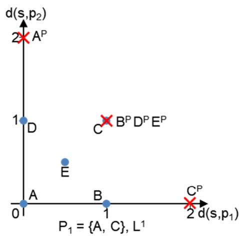

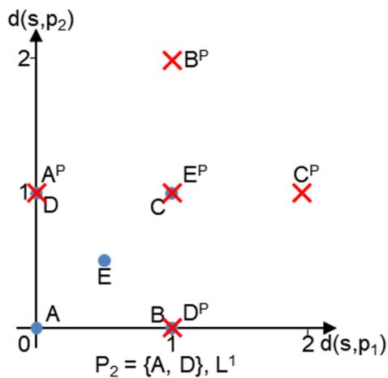

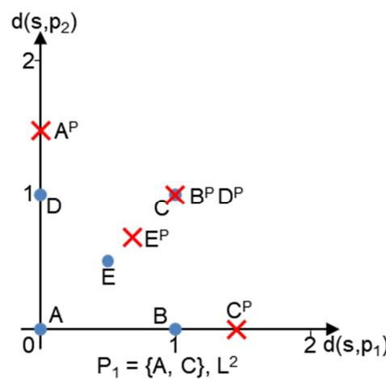

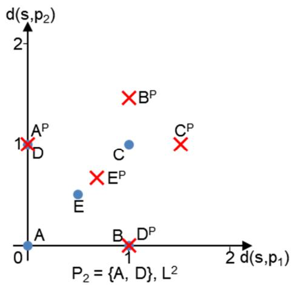

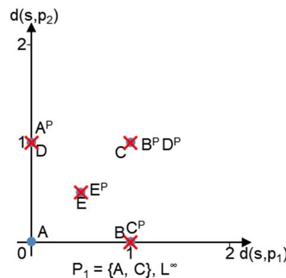  
图40二维数据在6个支撑点空间中的分布情况

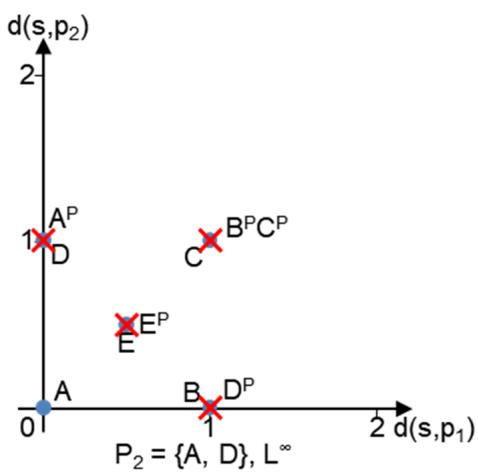

为度量空间重建坐标的方式可以有很多种，例如最简单的办法可以为每个数据赋予随机坐标。不同的重建方法得到不同的坐标。从上面的例子可以看出，基于不同的支撑点集合和距离函数可以得到不同的支撑点空间。那么，如何评价坐标重建的好坏呢？

一个常用的评价标准是看数据间距离的变化。也就是说，对于度量空间中的任意两个点  $x$  和  $y$ ，一个好的坐标重建方法或者支撑点空间应该使  $x$  和  $y$  重建后的坐标，即  $x^p$  和  $y^p$ ，之间的距离和  $d(x, y)$  尽量接近。

支撑点空间中的数据是向量，而向量之间的最常见的距离函数就是闵可夫斯基距离族  $\mathbf{L}^{\mathrm{t}}$ 。但是，根据闵可夫斯基距离的定义和度量空间距离函数的三角不等性可以得出，一般来说  $\mathbf{d}(\mathbf{x},\mathbf{y}) \neq \mathbf{L}^{\mathrm{t}}(\mathbf{x}^{\mathrm{p}},\mathbf{y}^{\mathrm{p}})$ ，即数据从度量空间映射到支撑点空间以后存在距离扭曲。那么通过支撑点空间映射为度量空间重建坐标的方法还有没有合理性或可行性呢？下节将详细讨论这个问题。

# 4.2 支撑点空间中的距离扭曲

本节首先讨论数据从度量空间映射到支撑点空间以后相互间距离的变化，支撑点空间中的距离函数以闵可夫斯基距离为例。以下定理描述了这个情况。

定理4-2（支撑点空间距离扭曲）：令  $\mathrm{S} = \{\mathrm{s_i}\mid \mathrm{i} = 1,2,\dots ,\mathrm{n}\}$  是一个度量空间数据集，距离函数为d，  $\mathrm{P = \{p_1,p_2,\ldots,p_k\}}$  是支撑点集合，  $\mathrm{P}\subseteq \mathrm{S}$  ，  $x,y\in S$  ，则  $\mathrm{L^t(x^p,y^p)}$  具有如下性质：

①随着  $\mathrm{k}$  增大， $\mathrm{L}^{\mathrm{t}}(\mathbf{x}^{\mathrm{p}},\mathbf{y}^{\mathrm{p}})$  递增；  
②随着t增大，L(t(xp,yp)递减，即L1(xp,yp)≥L2(xp,yp)≥……≥L∞(xp,yp);  
③令  $\mathbf{m}$  为  $x$  和  $y$  二者被选为支撑点的个数，则：

$$
\sqrt [ t ]{m} d (x, y) \leq L ^ {t} (x ^ {p}, y ^ {p}) \leq \sqrt [ t ]{k} d (x, y), m = 0, 1, 2;
$$

④特别地，如果支撑点空间采用切比雪夫距离，则从度量空间到支撑点空间的映射是一个收缩映射(contractive mapping)，即  $L^{\infty}(x^{p},y^{p})\leq d(x,y)$  
⑤若  $\mathrm{m} = 1$  或2，即  $x$  和  $y$  二者至少有1个被选为支撑点，则  $L^{\infty}(x^{p},y^{p}) = d(x,y)$  。

证明：

根据支撑点空间定义：

$$
x ^ {p} = \left(\mathrm {d} (x, p _ {1}), \dots , \mathrm {d} (x, p _ {k})\right)
$$

$$
y ^ {p} = \left(\mathrm {d} \left(y, p _ {1}\right), \dots , \mathrm {d} \left(y, p _ {k}\right)\right)
$$

根据闵可夫斯基距离定义：

$$
L ^ {t} (x ^ {p}, y ^ {p}) = L ^ {t} \left(\left(d (x, p _ {1}), \ldots , d (x, p _ {k})\right), \left(d (y, p _ {1}), \ldots , d (y, p _ {k})\right)\right) = \sqrt [ t ]{\sum_ {i = 1} ^ {k} | d (x , p _ {i}) - d (y , p _ {i}) | ^ {t}}
$$

显然，①可以根据闵可夫斯基距离的定义直接得出。

(2)可由例 2- 2 中关于原点距的证明稍作修改得出。

对于③，根据度量空间距离函数的三角不等性：

$$
0 \leq | d (x, p _ {i}) - d (y, p _ {i}) | \leq d (x, y), i = 1, 2, \dots , k, x \neq p _ {i}, y \neq p _ {i}
$$

$$
\left| d \left(x, p _ {i}\right) - d \left(y, p _ {i}\right) \right| = d (x, y), i = 1, 2, \dots , k, x = p _ {i} o r y = p _ {i}
$$

用上面给出的上下限替换  $L^{t}(x^{p},y^{p})$  定义中的各累加项即可得出③。进一步地，随着  $\mathbf{t}$  增大，③给出的  $L^{t}(x^{p},y^{p})$  的上下限是递减的；随着  $\mathbf{k}$  增大，③给出的  $L^{t}(x^{p},y^{p})$  的上限是递增的，下限不变。

在③给出的上限中取t趋向于  $\infty$  的极限即可得出④。

在③给出的上下限中取  $t$  趋向于  $\infty$  的极限并考虑  $m = 1$  或2即可得出⑤。

定理4-2没有明确给出  $\mathrm{d}(\mathbf{x},\mathbf{y})$  和  $\mathrm{L}^{\mathrm{t}}(\mathrm{x}^{\mathrm{p}},\mathrm{y}^{\mathrm{p}})$  的大小关系，一般可以认为大部分情况下数据从度量空间映射到支撑点空间后存在距离扭曲，即  $L^{t}(x^{p},y^{p})\neq d(x,y)$  。

虽然定理4-2展现了距离的扭曲，但是数据从度量空间映射到支撑点空间还是存在一定的不变性的，可以一定程度上展现用支撑点空间映射为度量空间重建坐标的合理性，定理4-3揭示了这一规律。

定理4-3（不动点定理）：给定一个度量空间  $(\mathbf{M},\mathrm{d})$  ，数据集S，支撑点集P，则F(S,P,d)是函数F(·,F(P,P,d),L∞)的不动点，即：

$$
\mathrm {F} (\mathrm {F} (\mathrm {S}, \mathrm {P}, \mathrm {d}), \mathrm {F} (\mathrm {P}, \mathrm {P}, \mathrm {d}), L ^ {\infty}) = \mathrm {F} (\mathrm {S}, \mathrm {P}, \mathrm {d})
$$

证明：

根据支撑点空间的定义：

$$
\mathrm {F} (\mathrm {S}, \mathrm {P}, \mathrm {d}) = \left\{s ^ {p} \mid s ^ {p} = \mathrm {F} (\mathrm {s}, \mathrm {P}, \mathrm {d}) = \left(\mathrm {d} (\mathrm {s}, p _ {1}), \dots , \mathrm {d} (\mathrm {s}, p _ {k})\right), \mathrm {s} \in \mathrm {S} \right\}
$$

$$
\mathrm {F} (\mathrm {P}, \mathrm {P}, \mathrm {d}) = \left\{p ^ {p} \mid p ^ {p} = \mathrm {F} (p, \mathrm {P}, \mathrm {d}) = \left(\mathrm {d} (\mathrm {p}, p _ {1}), \dots , \mathrm {d} (\mathrm {p}, p _ {k})\right), \mathrm {p} \in \mathrm {P} \right\}
$$

$$
\mathrm {F} (\mathrm {F} (\mathrm {S}, \mathrm {P}, \mathrm {d}), \mathrm {F} (\mathrm {P}, \mathrm {P}, \mathrm {d}), L ^ {\infty}) = \left\{\mathrm {F} (s ^ {p}, \mathrm {F} (\mathrm {P}, \mathrm {P}, \mathrm {d}), L ^ {\infty}) | s ^ {p} \in \mathrm {F} (\mathrm {S}, \mathrm {P}, \mathrm {d}) \right\}
$$

其中：

$$
\mathrm {F} (s ^ {p}, \mathrm {F} (\mathrm {P}, \mathrm {P}, \mathrm {d}), L ^ {\infty}) = \left(L ^ {\infty} \big (s ^ {p}, p _ {1} ^ {p} \big), \dots , L ^ {\infty} \big (s ^ {p}, p _ {k} ^ {p} \big)\right), s ^ {p} \in \mathrm {F} (\mathrm {S}, \mathrm {P}, \mathrm {d})
$$

其中：

$$
\begin{array}{l} L ^ {\infty} \left(s ^ {p}, p _ {i} ^ {p}\right) = L ^ {\infty} \left[ \left(d (s, p _ {1}), \dots , d (s, p _ {k})\right), \left(d \left(p _ {i}, p _ {1}\right), \dots , d \left(p _ {i}, p _ {k}\right)\right) \right] \\ = \max  \left\{\left| d (s, p _ {j}) - d (p _ {i}, p _ {j}) \right|, j = 1, 2, \dots , k \right\}, i = 1, 2, \dots , k \\ \end{array}
$$

根据三角不等性：

$$
\left| d \left(s, p _ {j}\right) - d \left(p _ {i}, p _ {j}\right) \right| \leq \mathrm {d} (s, p _ {i}), \mathrm {j} = 1, 2, \dots , k
$$

因为  $p_i \in \mathbb{P} \subseteq \mathbb{S}$ ，存在  $\mathrm{j}$  使得  $\mathrm{i} = \mathrm{j}, p_i = p_j$ ，使三角不等式中的等号成立。

因此可以得出：

$$
L ^ {\infty} \big (s ^ {p}, p _ {i} ^ {p} \big) = \mathrm {d} (s, p _ {i})
$$

即：

$$
\mathrm {F} (s ^ {p}, \mathrm {F} (\mathrm {P}, \mathrm {P}, \mathrm {d}), L ^ {\infty}) = \left(\mathrm {d} (s, p _ {1}), \dots , \mathrm {d} (s, p _ {k})\right) = s ^ {p}
$$

因此  $\mathrm{F}(\mathrm{F}(\mathrm{S},\mathrm{P},\mathrm{d}),\mathrm{F}(\mathrm{P},\mathrm{P},\mathrm{d}),L^{\infty}) = \mathrm{F}(\mathrm{S},\mathrm{P},\mathrm{d})$  得证。

需要重点指出的是，定理4-3表明，没有坐标的任意度量空间数据集S经由支撑点集合P和任意度量空间距离函数d映射得到的支撑点空间，与有坐标的向量数据集F(S,P,d)经由支撑点集合F(P,P,d)和距离函数  $L^{\infty}$  映射得到的支撑点空间是完全相同的，从一定程度上或某种意义上揭示了用有坐标的向量数据集F(S,P,d)代替无坐标的任意度量空间数据集S的合理性或可行性，即通过支撑点空间映射为度量空间重建坐标的合理性或可行性。

定理4-3相对比较晦涩，其效用将在下节更清晰地体现出来。

定理4-4给出了定理4-3迭代运用的情况。

定理4-4（迭代不变性）：定义  $F^{(1)}(\mathrm{F}(\mathrm{S},\mathrm{P},\mathrm{d}),\mathrm{F}(\mathrm{P},\mathrm{P},\mathrm{d}),L^{\infty}) = \mathrm{F}(\mathrm{F}(\mathrm{S},\mathrm{P},\mathrm{d}),\mathrm{F}(\mathrm{P},\mathrm{P},\mathrm{d}),L^{\infty}),$ $F^{(n)}(\mathrm{F}(\mathrm{S},\mathrm{P},\mathrm{d}),\mathrm{F}(\mathrm{P},\mathrm{P},\mathrm{d}),L^{\infty}) = \mathrm{F}\big(F^{(n - 1)}(\mathrm{F}(\mathrm{S},\mathrm{P},\mathrm{d}),\mathrm{F}(\mathrm{P},\mathrm{P},\mathrm{d}),L^{\infty}),\mathrm{F}(\mathrm{P},\mathrm{P},\mathrm{d}),L^{\infty}\big)$  ，则：

$$
F ^ {(n)} (F (S, P, d), F (P, P, d), L ^ {\infty}) = F (S, P, d) 。
$$

定理4-4的本质含义和效用尚待进一步讨论。

上述定理并不能完全解决数据度量空间映射到支撑点空间的距离扭曲，下节讨论的完全支撑点空间就是为了解决这一问题提出的。

# 4.3 完全支撑点空间及其距离扭曲

完全支撑点空间（complete pivot space）就是所有数据点都被选作支撑点得到的支撑点空间，是为了解决支撑点空间中的距离扭曲问题而提出的。本节将首先给出完全支撑点空间的定义并举例，然后讨论其距离扭曲性质。

定义4-2完全支撑点空间（complete pivot space）：对于度量空间  $(M, d)$ ，令S是M的元素构成的有限集合（元素不可重复）， $\mathbf{S} = \{\mathbf{s}_i | \mathbf{s}_i \in \mathbf{M}, i = 1, 2, \dots, n\}$ 。对于S中的任意元素s，以其到S中所有元素的距离向量作为其坐标，可以定义一个从M到n维非负实数空间的映射（上标P表示映射后的像）：

$$
F _ {d} ^ {c} \colon M \to R ^ {n} \colon s ^ {p} \equiv F _ {d} ^ {c} (s) = (d (s, s _ {1}), \dots , d (s, s _ {n}))
$$

完全支撑点空间（complete pivot space）[82, 83]就是S在  $\mathbf{R}^n$  中的像  $F_{d}^{c}(S)$ 。

定理4-5给出了完全支撑点空间的基本性质。

定理4-5（完全支撑点空间性质）：完全支撑点空间  $F_{d}^{c}(S)$  具有如下性质：

①完全支撑点空间的维度和S的大小相等。  
(2)完全支撑点空间中的每个点的坐标中有且只有 1 个分量是 0 , 其它都是正数。  
(3)完全支撑点空间中的点和原始度量空间中的点是一一对应的。  
④完全支撑点空间中的坐标轴和原始度量空间中的点是一一对应的。

表 12 完全支撑点空间中的坐标和坐标轴  

<table><tr><td rowspan="2">数据\(s_i^p\)</td><td colspan="4">坐标轴 \(\mathbf{X}_{\mathrm{i}}\) (基于度量空间原始数据 \(\mathbf{s}_{\mathrm{i}}\))</td></tr><tr><td>\(\mathbf{X}_1\)</td><td>\(\mathbf{X}_2\)</td><td>......</td><td>\(\mathbf{X}_{\mathrm{n}}\)</td></tr><tr><td>\(s_1^p\)</td><td>d(s1,s1)</td><td>d(s1,s2)</td><td>......</td><td>d(s1,sn)</td></tr><tr><td>\(s_2^p\)</td><td>d(s2,s1)</td><td>d(s2,s2)</td><td>......</td><td>d(s2,sn)</td></tr><tr><td>...</td><td>...</td><td>...</td><td>......</td><td>...</td></tr><tr><td>...</td><td>...</td><td>...</td><td>......</td><td>...</td></tr><tr><td>\(s_n^p\)</td><td>d(sn,s1)</td><td>d(sn,s2)</td><td>......</td><td>d(sn,sn)</td></tr></table>

证明：

表12根据完全支撑点空间的定义列出了其数据的坐标和相应的坐标轴，其中每行是一个数据的坐标，每列表示一个坐标轴。

(1)可以由完全支撑点空间的定义直接得出。

关于②，根据完全支撑点空间的定义，每个点的坐标就是其到所有数据的距离；根据度量空间距离函数的性质，上述距离中只有到自身的距离是0，到其它数据的数据都是正的。准确地说，表12所示的坐标矩阵中只有主对角线的值是0，其它都是正的。故②得证。

关于③，根据完全支撑点空间的定义， $F_{d}^{c}(S)$  是  $S$  在  $\mathbf{R}^n$  中的像，因此满射的性质成立。根据②，每个点的坐标分量中只有与自身对应的那个是0，其余都是正的，因此每个点的坐标是各不相同的，即单射的性质成立。故③得证。

准确地说，④表示的是表12的列向量与原始数据间的一一对应，其证明过程与③的类似，此处不再赘述。

实际上，不难看出，表12就是度量空间数据集元素间的距离矩阵。

下面给出例 4-1 所用数据的完全支撑点空间例子。

例 4- 3: 给定 3 个整数 A、B、C, 取值分别为 1、2、3, 其间距离函数可以是两数之差的绝对值。因为数据是 1 维的, 该距离函数可以用各种次数的闵可夫斯基距离表示, 本例

中假定其为常用的欧几里得距离  $L^2$  。按照完全支撑点空间的定义，因为数据点个数为 3，所以产生的完全支撑点空间也是 3 维的。A、B、C 在完全支撑点空间中的坐标如表 13 所示，分布情况如图 41 所示。

表 13 例 4-3 中数据在完全支撑点空间中的坐标  

<table><tr><td></td><td>X: d(s, A)</td><td>Y: d(s, B)</td><td>Z: d(s, C)</td></tr><tr><td>Ap</td><td>0</td><td>1</td><td>2</td></tr><tr><td>Bp</td><td>1</td><td>0</td><td>1</td></tr><tr><td>Cp</td><td>2</td><td>1</td><td>0</td></tr></table>

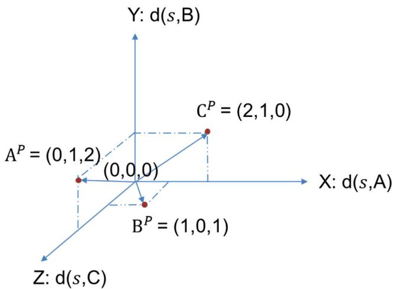  
图41例4-3中数据在完全支撑点空间中的分布情况

将定理4-3应用于完全支撑点空间可以发现一个基于切比雪夫距离的从度量空间到多维空间的保距映射。

定理4-6（保距映射）：给定一个度量空间  $(\mathbf{M},\mathrm{d})$  ，数据集S，完全支撑点空间  $F_{d}^{c}(S)$  ，则对于S中的任意两个元素  $\mathbf{x}$  和y,有  $L^{\infty}(x^{p},y^{p}) = \mathrm{d}(x,y)$  。即，对于任意度量空间，其完全支撑点空间中两点间的切比雪夫距离等于该两点在原始度量空间中的距离。

证明：

将定理4-3的证明结尾处的结论  $L^{\infty}\big(s^{p},p_{i}^{p}\big) = \mathrm{d}(s,p_{i})$  中的s和  $p_i$  分别替换为  $\mathbf{x}$  和y即可证明本定理。

本定理也可以从定理4-2的⑤得出，或者按照定义直接进行证明。需要说明的是，定理4-6是数学界的一个已知结论，并且从完全支撑点空间的支撑点集合中去掉任意单一元素也是成立的[84]。

需要重点指出的是，定理4-6表明，没有坐标的任意度量空间数据集S的完全支撑点空间，与有坐标的向量数据集  $F_{d}^{c}(S)$  的完全支撑点空间是完全相同的，从一定程度上或某种意义上揭示了用有坐标的向量数据集  $F_{d}^{c}(S)$  代替无坐标的任意度量空间数据集S的合理性或可行性，即通过支撑点空间映射为度量空间重建坐标的合理性或可行性。

完全支撑点空间虽然避免了距离扭曲的问题，但由于其维度与数据集合大小相同，往往会导致维度过高的问题，需要进行降维处理。这个问题将在下一章重点讨论。

# 4.4 球形在支撑点空间中的像

因为度量空间中只有距离信息，球形是描述一个度量空间数据集最简单的方式之一。本节采用范围查询的定义（定义3-1）描述一个度量空间中的球形，即  $\mathrm{R}(\mathbf{q},\mathbf{r},\mathbf{d})$  表示度量空间中到点  $\mathbf{q}$  的基于距离函数  $\mathbf{d}$  的距离不超过  $\mathbf{r}$  的数据的集合，或度量空间中以  $\mathbf{q}$  为球心  $\mathbf{r}$  为半径距离函数为  $\mathbf{d}$  的球形。需要注意的是，度量空间中球形的真实形状是与其距离函数紧密相关的。如果原始度量空间是多维空间，则基于曼哈顿距离的球形实际是超菱形，而基于切比雪夫距离的球形实际是超立方体。详见本书2.1节。

第三章介绍的几种常见的树状度量空间索引中，度量树就是采用球形描述数据子集；优势点树采用环形描述数据子集，即除了像球形那样规定了数据到球心的上界外也规定了数据到球心的下界；超平面树则是采用维诺图(Voronoi Diagram)的维诺区域(Voronoi Cell，亦称为维诺原胞)描述数据子集，即每个数据子集是到相应的中心点最近的数据点的集合。

下面的定理描述了球形在支撑点空间中映像的分布范围。

定理4-7（球形映像）：令  $\mathrm{S} = \{\mathrm{s_i}\mid \mathrm{i} = 1,2,\dots,\mathrm{n}\}$  是一个度量空间数据集，距离函数为 $\mathrm{d},\mathrm{P} = \{\mathrm{p}_1,\mathrm{p}_2,\dots,\mathrm{p_k}\}$  是支撑点集合，  $\mathrm{P}\subseteq \mathrm{S}$  ，  $x,y\in \mathbf{S}$  ，  $\operatorname {R}(q,r,d)$  表示度量空间中的一个球形，上标“p”表示数据点或数据集合映射到支撑点空间后的像，则有：

$$
R ^ {p} (q, r, d) \subseteq R (q ^ {p}, r, L ^ {\infty}) \subseteq \dots \subseteq R \big (q ^ {p}, \sqrt [ t ]{k} r, L ^ {t} \big) \subseteq \dots \subseteq R \big (q ^ {p}, \sqrt {k} r, L ^ {2} \big) \subseteq R (q ^ {p}, k r, L ^ {1})
$$

证明：

上述结论中球形在支撑点空间中的映像  $R^{p}(q,r,d)$  与支撑点空间中基于闵可夫斯基距离的球形  $R\left(q^{p}, \sqrt[t]{kr}, L^{t}\right)$  之间的包含关系可以由定理4-2直接证明。而不同次数  $t$  的闵可夫斯基距离球形  $R\left(q^{p}, \sqrt[t]{kr}, L^{t}\right)$  之间的逐次包含关系是一个纯粹的几何问题，不在本书的范围之内，此处不再赘述，仅在稍后给予说明。

以下展开说明上述定理的内涵/影响：

① 定理 4-7 包含结论:  $R^{p}(q, r, d) \subseteq R(q^{p}, r, L^{\infty})$ , 也就是说, 度量空间的一个球形被映射到支撑点空间中一个相同半径的切比雪夫球 (其实是个立方体) 中。支撑点个数为 2 在度量空间和支撑点空间中的情形如图 42 所示。需要说明的是, 支撑点空间中的切比雪夫球也受限于定理 4-1 所述的数据在支撑点空间中的分布范围, 当  $q^{p}$  靠近数据分布范围的边界时,该切比雪夫球可能是不完整的。

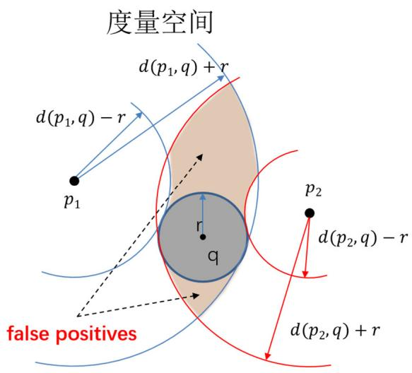  
图42度量空间的一个球形被映射到支撑点空间中一个相同半径的切比雪夫球中

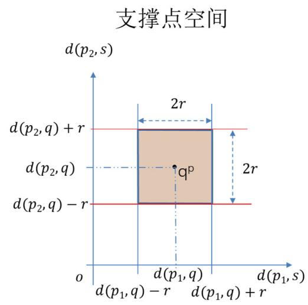

需要特别强调的是，从度量空间球到切比雪夫球的映射一般来说并非一一映射，切比雪夫球中存在一些度量空间球以外的数据的像(假阳性数据）（图42左侧）。这个问题在定理3-1的讨论中已经详细说明，详见本书3.3.2节。

当q被选作支撑点时，度量空间球和切比雪夫球的数据是一一对应的。

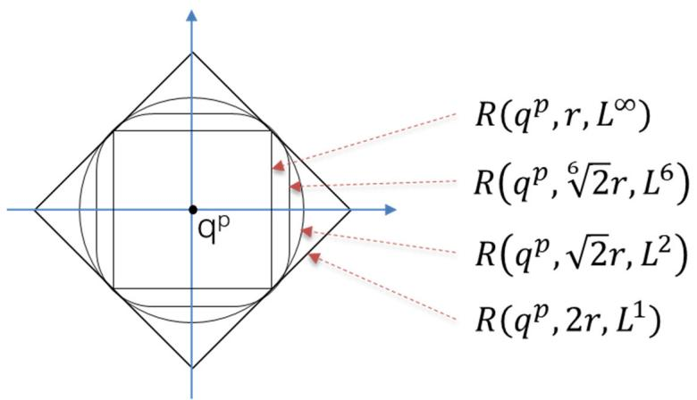  
图43不同次数  $\mathfrak{t}$  的闵可夫斯基距离球形  $R\left(q^{p},\sqrt[t]{kr},L^{t}\right)$  间的逐次包含关系

② 定理 4-7 表明了不同次数  $t$  的闵可夫斯基距离球形  $R\left(q^{p}, \sqrt[t]{k} r, L^{t}\right)$  间的逐次包含关系，其两个支撑点的情形如图 43 所示。需要说明的是图 43 从一个与本书 2.1 节例 2-2 不同的

角度说明了不同次数闵可夫斯基距离之间的关系。

目前研究中暂未发现比定理4-7更紧致的结论，也就是说，当次数  $t$  固定而半径可变的时候，闵可夫斯基球  $R\left(q^{p}, \sqrt[t]{k} r, L^{t}\right)$  是度量空间球在支撑点空间中的映像  $R^{p}(q, r, d)$  最紧致的界，即  $\sqrt[t]{k} r$  是包含该度量空间球的映像的  $t$  次闵可夫斯基球的最小半径；而切比雪夫球  $R(q^{p}, r, L^{\infty})$  是  $R^{p}(q, r, d)$  在次数  $t$  和半径都可变的闵可夫斯基球中最紧致（即体积最小）的界。

需要特别讨论的是，切比雪夫距离包含取最大值的步骤。从前述多个定理/结论的证明过程可以看出切比雪夫距离与度量空间距离函数三角不等性之间“天生的”或“自然的”契合性。从这个角度说，定理4-7给出的基于切比雪夫距离的球形在支撑点空间中的界可能甚或应该是（常见（多维数据）距离函数中）最紧致的界。而这个界是包含了假阳性数据的，这表明了度量空间数据管理分析本质上的缺陷，这个缺陷可能是为了获取通用性不得不付出的代价。进而，切比雪夫界包含的假阳性数据的多少也可以作为度量空间数据管理分析性能上界的某种指标。

# 4.5 本章讨论与展望

本章介绍的支撑点空间模型提供了一个为度量空间建立坐标的机制，架起了从没有坐标的度量空间到有坐标的多维空间的桥梁，为基于坐标系统的数学工具在度量空间的直接应用提供了可能性。

本书的核心概念是大数据泛构，即在度量空间中对数据进行通用处理的模式。本章内容提供了大数据泛构的实现途径：首先把数据映射到支撑点空间为数据建立坐标，然后采用已有的针对有坐标数据的数学工具和算法等完成包括索引、聚类、分类、异常点检测等等数据分析任务。

需要特别指出的是，保距定理的建立并不意味着度量空间数据管理分析研究的大功告成。实际上，还有多个关键研究问题需要解决。

首先，本章虽然从一定程度上定性或定量地讨论了数据从度量空间映射到支撑点空间的扭曲问题，但是，需要指出的是，这些讨论相对还比较初步宽泛，只是研究的开始。需要进一步研究的方向至少包括：一，基于完全支撑点空间的保距映射是针对切比雪夫距离的，而常见的数学工具往往是基于欧几里得距离的；二，完全支撑点空间的维度和数据集大小相同，对于较大数据集来说显然只有理论意义，难以付诸实际算法和系统；三，距离扭曲需要进一步的定量研究，例如支撑点空间映射后数据的分布有没有什么总体变化规律，度量空间和支撑点空间中典型分布/曲线等等之间的关联变化关系，以及针对特定原始度量空间距离函数

的规律等等。

其次，定理4-3和定理4-6只是表明从“某种意义”上说，用有坐标的支撑点空间代替无坐标的度量空间具有“一定”的合理性/可行性，而并没有也不能作为这种代替的严格证明。目前的研究表明，用支撑点空间代替度量空间至少带来了两个问题，或者说是支撑点空间数据管理分析和多维空间数据管理分析的两个关键区别。一、完全支撑点空间维度过高，必须进行降维，但是研究表明支撑点空间的降维一般不能产生新的维度，只能选择原有维度（即支撑点选择），这是和多维空间降维之间的一个关键区别。二、度量空间的球被映射到支撑点空间的超立方体（切比雪夫球）中，而立方体和球的一个巨大区别是后者是中心对称旋转不变的而前者不是，这影响了多维空间数据管理分析中常用的数据旋转技术在支撑点空间中的适用性，是支撑点空间数据管理分析和多维空间数据管理分析的另一个关键区别。

进一步地说，度量空间数据管理分析存在两个基本问题/组件需要深入研究：首先是支撑点选择，其重要性显而易见，将在本书第五章中深入讨论，包括对前述降维方面关键区别的讨论等；其次是数据划分，这也是各种数据管理分析任务中的一个基本步骤，将在本书第六章中深入讨论，包括对前述数据旋转方面关键区别的讨论等。

# 第5章 支撑点选择

对于度量空间数据集  $\mathbf{S}$ ,  $\mathbf{S} = \{s_1, s_2, \ldots, s_n\}$ , 和距离函数  $\mathrm{d}$ , 支撑点选择从  $\mathbf{S}$  中选择子集  $\mathbf{P}$  作为支撑点的集合,  $\mathbf{P} = \{p_1, p_2, \ldots, p_k\}$ ,  $\mathbf{P} \subseteq \mathbf{S}$  。进而, 对于  $\mathbf{S}$  中的任意元素  $s$ , 以其到所有支撑点的距离向量作为其坐标, 可以定义一个从度量空间到  $\mathbf{k}$  维非负实数空间的映射  $s^p = (d(s, p_1), d(s, p_2), \ldots, d(s, p_k))$  。

关于支撑点选择第一个自然而然的问题是：既然上一章已经介绍了在所有数据都作为支撑点的完全支撑点空间中存在保距定理，为什么还需要降维且只能是以支撑点选择的形式？因此，本章第1节将论述支撑点选择的必要性。下一个问题是：能不能简单地随机选择支撑点？上一章已经讨论了支撑点空间的距离扭曲问题，本章第2节将举例展示不同支撑点集合产生的距离扭曲的显著差异，进一步说明支撑点选择方法的重要性。在明确了支撑点选择的必要性和重要性之后，第3节将讨论支撑点的个数，其基本结论是支撑点个数应该接近数据的内在/本征维度（Intrinsic dimension），并给出了估算本征维度的几种方法。具体的支撑点选择方法将在第4节介绍，包括两个紧密关联的部分：目标函数和选择算法。最后在第5节将讨论一个方向性的问题：支撑点选择的性能上限，即支撑点选择研究还有多少提升空间，如果还多，该如何前行？

需要说明的是，作为一个通用的数据管理分析模式，大数据泛构（度量空间数据管理分析）中一般假设数据是用户或应用提供的，数据内部结构是未知的，无法在数据管理分析的过程中生成新的数据。也就是说，支撑点选择只能在数据集中选择已有数据作为支撑点。虽然大数据泛构的目标一般不是向量数据，但是在研究中往往以向量数据为例。这是因为向量数据的可视性以及较为明确可量化的统计/分布特性等，如维度。本章或本书中多处以单位正方形或单位圆中随机分布的数据为例。但是，必须牢记的是，从向量数据上得到的结论、规律、方法等必须可以适用于一般度量空间数据才是有价值的。此外，虽然度量空间数据管理分析中研究最多的是索引，很多支撑点选择方法是为索引设计的，但是在聚类、分类、异常点检测等其它数据分析任务中也往往需要进行支撑点选择，应加以研究。

# 5.1 支撑点选择的必要性

上一章已经证明，在以全部数据作为支撑点的完全支撑点空间中，任意数据间的切比雪夫距离与其在原始度量空间中的距离是相等的。那么，能不能不做支撑点选择，而是首先把数据从度量空间保距映射到有坐标的完全支撑点空间，然后在其中进行多维数据管理分析呢？

笔者认为这个做法受到计算复杂度的限制，在很多情况下是不可行的。对于度量空间 \((M,

$d)$  ，令S是M的  $\mathbf{n}$  个元素构成的有限集合，  $S = \{s_i|s_i\in M,i = 1,2,\dots ,n\}$  。以下分别从数据管理分析任务中是否涉及S以外的M的元素的角度进行讨论。

一方面，类似聚类、异常点检测这样的数据分析任务，只是在给定的数据集上进行，不涉及S以外额外的数据，可以把数据首先映射到完全支撑点空间，然后用多维空间的办法展开相应处理。但是，仅仅是把数据映射到完全支撑点空间就需要  $O(n^{2})$  次的距离计算，在数据量小的时候可能不是问题，在大数据的背景下往往是不可行的。此时可以进行降维，选择k个支撑点，支撑点空间的构建代价变为0  $(nk)$  次的距离计算，可以通过k的取值调节性能与计算代价的折衷。

另一方面，类似索引、分类等数据管理分析任务是涉及到S以外额外的数据的。例如，对于索引，一般首先在预处理阶段（线下索引构建）要在S上建立索引，然后对额外的查询对象q进行查询（线上查询）；对于分类，一般首先在预处理阶段（训练）要在S上训练分类器，然后对额外的判别对象x进行类别的判定（推理）。如果要在完全支撑点空间中完成数据管理分析任务，首先需要把额外数据映射到完全支撑点空间，笔者用定理5-1来强调这个步骤产生的计算代价，及其对支撑点选择必要性的决定性。

定理5-1：对于度量空间  $(M,d)$ ，令S是M的  $\mathfrak{n}$  个元素构成的有限集合，  $S = \{s_i|s_i\in M,i = 1,2,\dots,n\}$ ，q是数据管理分析任务涉及的S以外的M的元素，则把q映射到S的完全支撑点空间中需要  $\mathfrak{n}$  次距离计算。

上述定理从完全支撑点空间的定义来看是显而易见的。此处包含的重要信息是，把额外数据映射到完全支撑点空间需要对原有数据集进行线性扫描，这在索引、分类等数据管理分析任务的线上步骤是不可接受的。例如，对于索引来说，在线上查询的时候线性扫描数据集是索引查询性能的下界，而且线性扫描本身就可以完成查询任务，线下构建的索引完全失去了意义；对于分类来说，在推理阶段线性扫描训练集一般也是不可接受的。

一个似乎可行的解决上述构建代价过大和线性扫描问题的办法是对完全支撑点空间进行降维，笔者用定理5-2来强调这个做法面临的限制。

表 14 支撑点选择所得支撑点空间的数据和坐标  

<table><tr><td rowspan="2">数据\(s_i^p\)</td><td colspan="4">坐标轴 X (基于支撑点 p=sj)</td></tr><tr><td>X1</td><td>X2</td><td>......</td><td>Xk</td></tr><tr><td>\(s_1^p\)</td><td>d\((s_1,s_{j_1})\)</td><td>d\((s_1,s_{j_2})\)</td><td>......</td><td>d\((s_1,s_{j_k})\)</td></tr><tr><td>\(s_2^p\)</td><td>d\((s_2,s_{j_1})\)</td><td>d\((s_2,s_{j_2})\)</td><td>......</td><td>d\((s_2,s_{j_k})\)</td></tr><tr><td>...</td><td>...</td><td>...</td><td>......</td><td>...</td></tr><tr><td>...</td><td>...</td><td>...</td><td>......</td><td>...</td></tr><tr><td>\(s_n^p\)</td><td>d\((s_n,s_{j_1})\)</td><td>d\((s_n,s_{j_2})\)</td><td>......</td><td>d\((s_n,s_{j_k})\)</td></tr></table>

定理5-2：如果一个完全支撑点空间的降维方法需要基于数据在完全支撑点空间中所有维度上的坐标来计算该数据降维后的新坐标，则这一坐标计算需要对完全支撑点空间对应的度量空间数据集进行线性扫描。

类似地，上述定理从完全支撑点空间的定义来看也是显而易见的。此处包含的重要信息是，基于全体原始坐标的降维方式（如PCA）在完全支撑点空间中避免不了  $O(n^{2})$  次的距离计算，也避免不了额外数据的线性扫描。

当然，有些降维方式只需要基于数据的部分原始坐标计算其降维后的新坐标，即只需要计算数据与一部分原始数据间的距离。笔者认为，本质上，这里说的一部分原始数据的取舍就已经是支撑点选择了。从这个意义上进一步说，能够避免  $O(n^{2})$  构建代价或额外数据线性扫描的唯一的完全支撑点空间降维方式就是支撑点选择。

对于原始度量空间数据集  $S = \{s_i | s_i \in M, i = 1,2,\dots,n\}$ ，令支撑点集  $P = \{p_1 = s_{j_1}, p_2 = s_{j_2}, \dots, p_k = s_{j_k}\}$ ，则经过支撑点选择后得到的支撑点空间的数据和坐标如表 14 所示，请注意其与表 12 的区别，即表 14 仅保留了表 12 中与支撑点对应的那些列，删除了其它列。

综上所述，首先，不进行支撑点选择而在完全支撑点空间中进行数据管理分析往往是不切实际的。这一方面是因为构建完全支撑点空间需要  $O(n^{2})$  次的距离计算，这在大数据的背景下即使是作为线下的预处理也往往是不可行的。另一方面是对于索引、分类等涉及额外数据的数据管理分析任务，无法避免完全支撑点空间中额外数据的线性扫描。其次，支撑点选择是唯一可行的完全支撑点空间降维方式。这就是支撑点选择的必要性。

# 5.2 支撑点选择方法重要性的例证

上一章已经从理论和分析的角度定量地讨论了数据从度量空间映射到支撑点空间产生的距离扭曲，本节以例子体现不同支撑点伴随的距离扭曲的巨大差异，以定性地说明采用好的支撑点选择方法的重要性。例子中采用的数据基本与上一章相同和类似，以易于观察的向量数据为主。上一章的例子中只给出了数据在支撑点空间中的坐标，本章的例子更关注数据整体在支撑点空间中的分布情况和扭曲程度，并试图总结出优秀支撑点的特点，以期为后续支撑点选择研究提供启发式的规律。

例5-1：续例4-1，给定数轴上3个点A、B、C，取值分别为1、2、3，其间距离函数可以是两数之差的绝对值。则以A为支撑点的话3个点分别映射为0、1、2；以B为支撑点的话3个点分别映射为1、0、1；以C为支撑点的话3个点分别映射为2、1、0（表10）。显然，从B的角度来看其到A和C的距离是一样的，距离是没有方向的，所以B为支撑点的话产生了“对折”的情况，A和C映射到一起，无法区分，扭曲严重；而以A或C为支撑点的话映射后数据间距离不变，可能有平移或旋转但没有扭曲。因此，这个例子的

结论是应该选择数据集边缘的点为支撑点，这和聚类等数据分析任务中一般以数据集中心位置的点作为聚类中心等的做法是相反的。

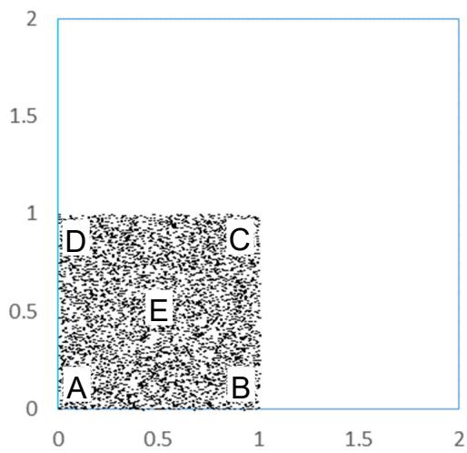  
图44平面上单位正方形内5千个随机分布的点及其中心和4个拐角

例5-2：续例4-2，考虑二维平面上单位正方形内均匀分布的5千个数据点（图44）及 $L^1$ ， $L^2$ 和 $L^\infty$ 三个常见的向量距离函数。按照例5-1的结论，应该选数据集边缘的点作为支撑点，此处最边缘的应该是4个拐角点。因为原始数据是2维的，所以本例中也选择2个支撑点。去除对称性因素后，有两种选择方式，一种是选择相邻的两个拐角点作为支撑点，即{A,D}；另一种是选择相对的两个拐角点作为支撑点，即{A,C}。

图45给出了分别采用3个距离函数和2个支撑点集合的共6个支撑点空间中数据的分布情况。

对于  $L^1$  ，可以看出采用相邻拐角作为支撑点的时候，支撑点空间中数据旋转了  $45^{\circ}$  并且放大了，分布比较均匀，而采用相对拐角作为支撑点的时候，支撑点空间中数据映射成了一条直线，过于集中，难以区分，扭曲较严重。这是因为对于单位正方形内的点(x,y)来说，其到第一个支撑点(0,0)的  $L^1$  距离（即其在支撑点空间中的第一个坐标）是  $\mathrm{x} + \mathrm{y}$  ，到第二个支撑点(1,1)的  $L^1$  距离（即其在支撑点空间中的第二个坐标）是  $2 - (\mathrm{x} + \mathrm{y})$  ，也就是说其在支撑点空间中两个坐标的和是常数2，即斜率为-1的直线。因此，相邻的拐角是较好的选择。

对于  $L^{2}$ , 可以看出两个支撑点集合的情况下数据在支撑点空间中都有扭曲, 但是采用相对拐角作为支撑点的时候扭曲更加严重。因此, 相邻的拐角是较好的选择。

对于  $L^{\infty}$ , 可以看出当采用相邻拐角作为支撑点的时候, 数据在支撑点空间中都分布于单位正方形的右上三角区里面, 除了斜率为 -1 和 1 的两条线段上较为集中以外, 其余大部分较为均匀, 相对稀疏。令  $(x, y)$  是单位正方形中任意一点, 当采用相邻拐角  $(0, 0)$  和  $(0, 1)$  为支撑点的时候, 其在支撑点空间中的坐标是  $(\max(x, y), \max(x, 1 - y))$  。原始单位正方形中以 BCE 为顶点的三角形中的数据满足  $x > y$  且  $x > 1 - y$ , 所以其在支撑点空间中的坐标是  $(x, x)$ , 在斜率为 1 的线段上; 原始单位正方形中以 ADE 为顶点的三角形中的数据满足  $x < y$  且  $x < 1 - y$ , 所以其

在支撑点空间中的坐标是(y,1-y)，在斜率为-1的线段上。

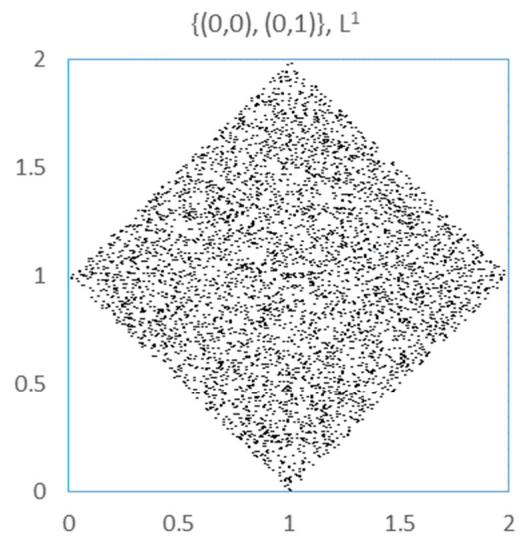  
{0,0),(0,1)}L²

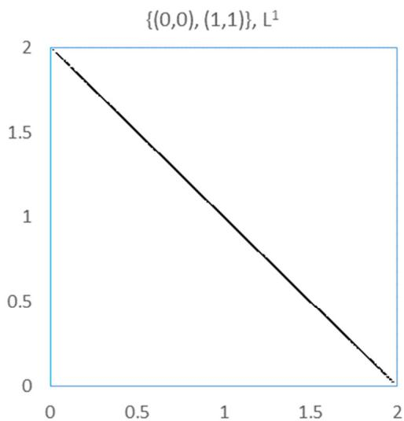  
$\{(0,0),(1,1)\},\mathsf{L}^2$

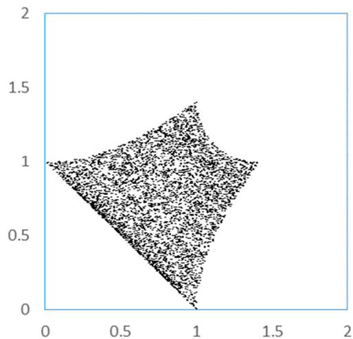

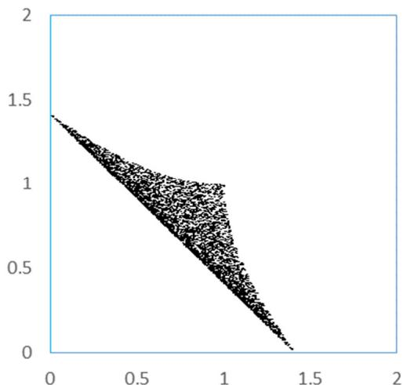

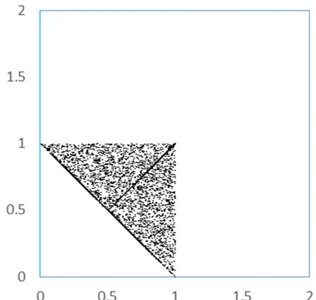  
$\{(0,0),(0,1)\} ,L^{\infty}$  
图45 单位正方形内5千个点采用3个距离函数和2个支撑点集合的支撑点空间

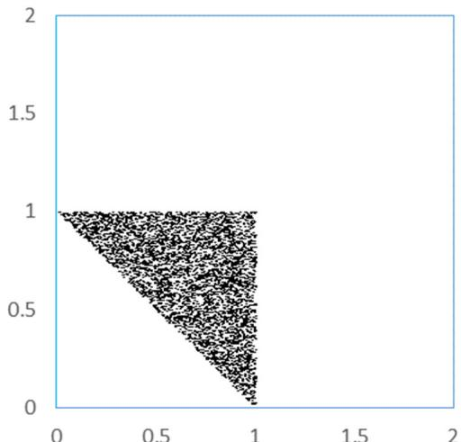  
$\{(0,0),(1,1)\} ,\mathsf{L}^{\infty}$

对于  $L^{\infty}$ , 当采用相对拐角作为支撑点的时候, 数据在支撑点空间中也都分布于单位正方形的右上三角区里面, 总体均匀, 较为密集。令  $(\mathrm{x}, \mathrm{y})$  是单位正方形中任意一点, 当采用相对

拐角(0,0)和(1,1)为支撑点的时候，其在支撑点空间中的坐标是  $(\max(x,y), \max(1-x, 1-y))$ ，所以点  $(x,y)$  和点  $(y,x)$  在支撑点空间中的坐标是一样的，映射到了一起，所以就会比较密集。因此，相邻拐角和相对拐角作为支撑点各有利弊，总体上看相对拐角稍好。

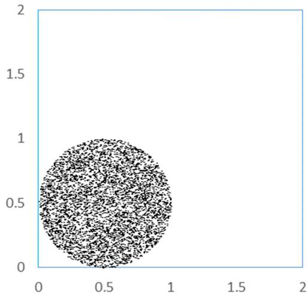  
图46平面上单位正方形内切圆内5千个随机分布的点

例5-3：续例5-2，考虑二维平面上单位正方形的内切圆内均匀分布的5千个数据点（图46)，采用和例5-2相同的三个距离函数，和两个支撑点集合。图47给出了分别采用3个距离函数和2个支撑点集合的共6个支撑点空间中数据的分布情况，其规律与例5-2一致，此处不再赘述。

例5-4[85]：考虑长度为16的“0”或“1”组成的串，采用海明距离，相邻拐角的支撑点集合{“0000000000000000”，“0000000011111111”}和相对拐角的支撑点集合{“000000000000000”，“1111111111111111”}。图48给出了两个支撑点空间中数据的分布。“0/1”串的海明距离和向量的  $L^1$  距离相近，因此本例中数据在支撑点空间中的分布和前面两个例子中 $L^1$  距离下的分布情况类似。特别地，一个“0/1”串到全“0”串的海明距离是其所含“1”的个数，到全“1”串的海明距离是其所含“0”的个数，两者相加恒等于其长度，因此在以相对拐角作为支撑点的时候数据在支撑点空间中分布在一条直线上。本例的结论也是相邻的拐角是比相对的拐角更好的支撑点。

本节给出了几个支撑点空间的例子，从数据在支撑点空间的分布情况可以大致定性地得出相邻的拐角点是较好的支撑点的结论。后续章节将会进一步讨论。此外，本节中基本上所有支撑点都来自数据集合（除了例5-3中支撑点靠近数据集合），关于数据集合以外的支撑点的性能将在5.6节中进一步讨论。

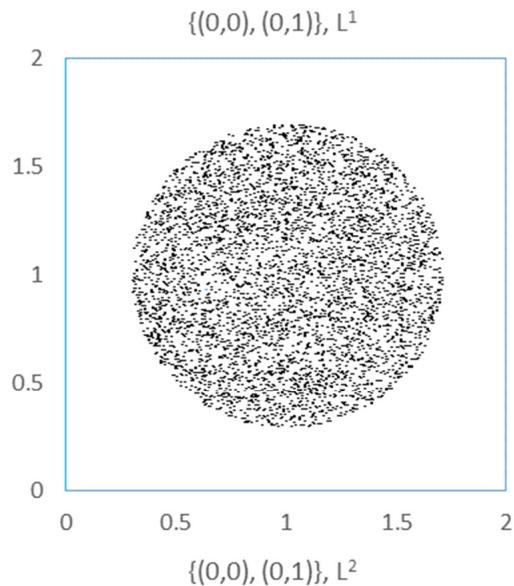

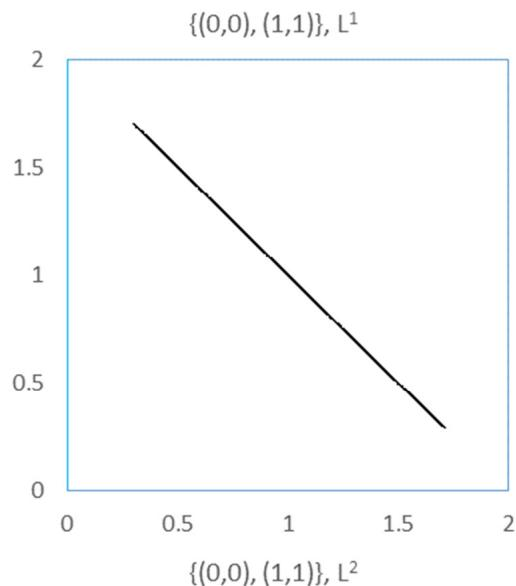

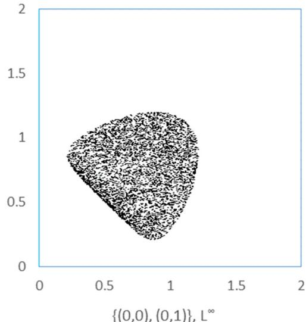

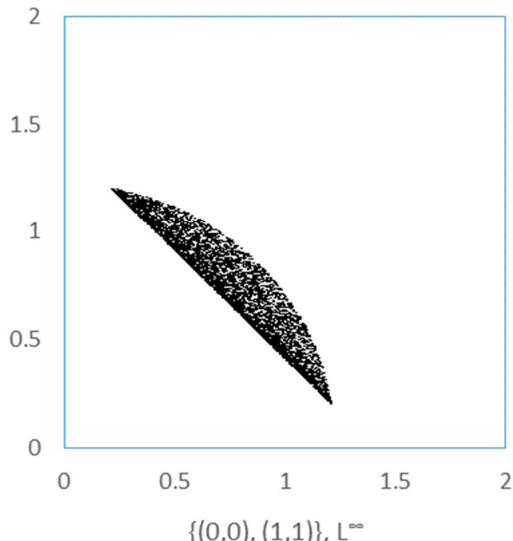

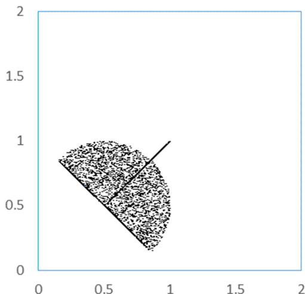  
图47 单位正方形内切圆内5千个点采用3个距离函数和2个支撑点集合的支撑点空间

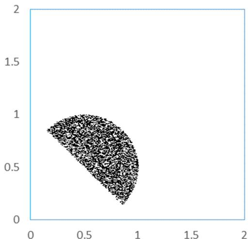

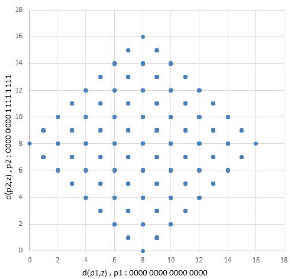  
图48长度16的“0/1”串采用海明距离的两个支撑点空间

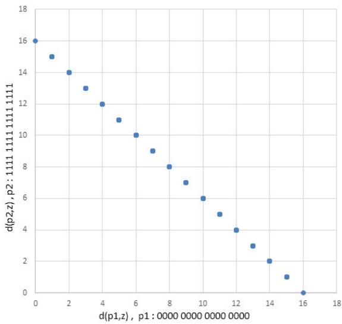

# 5.3 支撑点个数

本节首先讨论最优支撑点个数应该与数据的本征维度相近的观点，然后介绍几种度量空间本征维度估算方法。

# 5.3.1 支撑点个数与本征维度

表 15 支撑点选择对应的距离信息选择  

<table><tr><td rowspan="2">数据\(s_i^p\)</td><td colspan="3">支撑点集合P对应的坐标轴</td><td colspan="3">其余数据Q对应的坐标轴</td></tr><tr><td>X1</td><td>......</td><td>Xk</td><td>Xk+1</td><td>......</td><td>Xn</td></tr><tr><td>\(s_1^p\)</td><td>d\((s_1,p_1)\)</td><td>......</td><td>d\((s_1,p_k)\)</td><td>d\((s_1,q_1)\)</td><td>......</td><td>d\((s_1,q_{n-k})\)</td></tr><tr><td>\(s_2^p\)</td><td>d\((s_2,p_1)\)</td><td>......</td><td>d\((s_2,p_k)\)</td><td>d\((s_2,q_1)\)</td><td>......</td><td>d\((s_2,q_{n-k})\)</td></tr><tr><td>...</td><td>...</td><td>......</td><td>...</td><td>...</td><td>......</td><td>...</td></tr><tr><td>...</td><td>...</td><td>......</td><td>...</td><td>...</td><td>......</td><td>...</td></tr><tr><td>\(s_n^p\)</td><td>d\((s_n,p_1)\)</td><td>......</td><td>d\((s_n,p_k)\)</td><td>d\((s_n,q_1)\)</td><td>......</td><td>d\((s_n,q_{n-k})\)</td></tr></table>

支撑点的个数是支撑点选择的一个必须明确的参数。对于度量空间数据集  $S = \{s_1, s_2, \ldots, s_n\}$ ，距离函数  $d$ ，支撑点集合  $P = \{p_1, p_2, \ldots, p_k\}$ ，令  $Q = \{q_1, q_2, \ldots, q_{n-k}\}$  为没有被选做支撑点的其余数据。如5.1节所述，支撑点选择实际上是把表12所表示的完全支撑点空间的数据（或者说是度量空间全部点对间距离的矩阵）通过保留支撑点集合  $P$  中数据对应的坐标轴、删除其余数据集合  $Q$  中数据对应的坐标轴、但不产生新坐标轴的方式降维成表14所表示的支撑点空间的数据。换句话说，支撑点选择是把表12所表示的度量空间全部点对间距离的对称矩阵通过保留支撑点集合  $P$  中数据对应的列、删除其余数据集合  $Q$  中数据

对应的列的方式缩减成表 14 所表示的全部度量空间数据到支撑点集合 P 中数据（即部分度量空间数据）的距离矩阵。表 15 展示了上述情况，其中阴影部分的列经过支撑点选择以后被删除了。

表 16 个性化支撑点选择对应的距离信息选择  

<table><tr><td rowspan="2">数据\(s_i^p\)</td><td colspan="3">支撑点集合P对应的坐标轴</td><td colspan="3">其余数据Q对应的坐标轴</td></tr><tr><td>X1</td><td>......</td><td>Xk</td><td>Xk+1</td><td>......</td><td>Xn</td></tr><tr><td>\(s_1^p\)</td><td>d\((s_1,p_1)\)</td><td>......</td><td>d\((s_1,p_k)\)</td><td>d\((s_1,q_1)\)</td><td>......</td><td>d\((s_1,q_{n-k})\)</td></tr><tr><td>\(s_2^p\)</td><td>d\((s_2,p_1)\)</td><td>......</td><td>d\((s_2,p_k)\)</td><td>d\((s_2,q_1)\)</td><td>......</td><td>d\((s_2,q_{n-k})\)</td></tr><tr><td>...</td><td>...</td><td>......</td><td>...</td><td>...</td><td>......</td><td>...</td></tr><tr><td>...</td><td>...</td><td>......</td><td>...</td><td>...</td><td>......</td><td>...</td></tr><tr><td>\(s_n^p\)</td><td>d\((s_n,p_1)\)</td><td>......</td><td>d\((s_n,p_k)\)</td><td>d\((s_n,q_1)\)</td><td>......</td><td>d\((s_n,q_{n-k})\)</td></tr></table>

有的学者认为应该为不同的数据选择不同的支撑点，或者说为每个数据元素选择个性化的支撑点[90, 91]。这就相当于在表 12 中除了删除非支撑点数据集合 Q 中数据对应的列以外，还删除了支撑点集合 P 中数据对应的各列的部分元素，即如表 16 中的阴影部分都被删除了。这个做法往往会导致支撑点总数的增加，进而导致与支撑点相关的计算（例如查询对象和支撑点之间的距离计算）增加，其具体的支撑点选择动机和算法将在下节详细讨论。

支撑点的个数越多，所保留的数据到支撑点的距离信息就越多，越有利于数据的各种处理，但是所需要的与支撑点相关的计算（例如查询对象和支撑点之间的距离计算）和存储（例如数据和支撑点间的距离）也越多，进而所需要的计算和访存时间也就越多。也就是说，支撑点个数的多少体现了信息量和存储开销的折衷，或者说是时间和空间的折衷。

虽然大数据泛构中距离函数是黑盒的，但是从距离信息中往往能挖掘出距离函数的一些特性，距离信息之间往往是有冗余的。例如，如果度量空间是由二维平面上的点和欧几里得距离构成的，那么通过一个点到3个不在一条直线上的支撑点的欧几里得距离就可以精确计算出其坐标，再增加支撑点也不会带来信息的增加。因而，虽然支撑点越多所保留的距离信息就越多，但每增加一个支撑点所带来的信息增加量往往体现出逐渐减少的趋势，导致超过某个阈值以后增加支撑点带来的信息增量或收益少于其伴随的额外计算和存储代价，系统整体收益在达到最大值以后开始减少。这个阈值可以被认为是最优的支撑点个数。一般认为，最优的支撑点个数基本是由距离函数或者数据本身的分布特性决定的。从统计的角度说，充分推定一个数据分布所需要的采样数目往往不是无限的。在数据量足够大以后，不同大小的同样分布的数据集的最优支撑点个数可能差不多。从这个角度说，最优支撑点个数可能和数据集大小的关系不大。

那么，该如何估算最优的支撑点个数呢？一些学者提出支撑点个数应该与数据的本征维度（intrinsic dimension，内在维度）相近[82, 83, 92]。

本征维度是与领域维度（domain dimension，数据的原始维度）相对应的。例如，n维空间中的一条直线上的每个点都是高维的，但是这些点形成的数据集依然分布在一条直线上，也就是说这个直线数据集的领域维度是 n，但是其本征维度是 1。本征维度是由数据间的距离，或者说数据的分布决定的，不受数据的缩放或旋转影响，是数据分布的一个性质，以数据的领域维度为上界但与之没有其它必然的关系。据笔者不完全调研，目前尚无普遍接受的本征维度的严格数学定义。本征维度一般被理解为把高领域维度数据集在扭曲不大的前提下映射到低维空间所需要的最小维数，使用更大的维数不会显著减少扭曲。学界已经存在多个本征维度的定义，或者说是估算方法，其核心思想基本与前述本征维度的一般理解一致，但是往往因为数学要求过于严苛或者计算代价太高而难以应用于度量空间[93, 94, 95]。

根据支撑点空间模型，大数据泛构模式本质上是首先把度量空间映射到多维的支撑点空间，然后利用多维空间的数学工具和算法完成各种数据处理任务。特别是，度量空间到完全支撑点空间的映射是保持距离不变的。从这个意义上说，在大数据泛构模式中，可以把完全支撑点空间的本征维度当作度量空间的本征维度。

完全支撑点空间按照其本征维度， $\rho$ ，映射到的低维空间，T，可能包含新的坐标，因而T不是一个支撑点空间。但一般认为支撑点个数或维度等于  $\rho$  的支撑点空间可以较好地近似T。按照这一思路，可以认为度量空间选择支撑点的最优数目应该与度量空间的本征维度或者完全支撑点空间的本征维度， $\rho$ ，接近。下面介绍几种完全支撑点空间本征维度的估算方法。

# 5.3.2 度量空间本征维度估算方法

在讨论具体的估算方法之前，有必要先明确估算方法的评价标准。一般的度量空间是看不见摸不着难以可视化的，给本征维度的估算带来了挑战。按照前面的讨论，可以把完全支撑点空间的本征维度当作度量空间的本征维度，也就是说可以把完全支撑点空间本征维度的估算当作度量空间本征维度的估算。由于支撑点空间是多维的，因此一般认为一个好的度量空间本征维度估算方法应该也是一个好的多维空间本征维度估算方法，即其对于本征维度已知的多维数据集（例如均匀分布充满d维空间的数据集的本征维度应该就是d）的估算应该是准确的。这可以作为度量空间本征维度估算方法的一个验证标准。

以下介绍几种度量空间本征维度， $\rho$ ，的估算方法，其中数据元素的个数假设为  $n$ 。

方法1：基于点对距离均值和方差的估算[17]：令  $\mu$  和  $\sigma^2$  分别是度量空间所有点对间距离的平均值和方差，则

$$
\rho = \mu^ {2} / _ {2 \sigma^ {2}}
$$

方法1的表达式比较简单，与正态分布的概率密度公式，  $\frac{1}{\sqrt{2\pi}\sigma} e^{-\frac{(x - \mu)^2}{2\sigma^2}}$  ，的指数部分比较

相似，其计算时间复杂度为  $\mathrm{O}(n^2)$ 。

方法2来源于半径为  $r$  维数为  $\rho$  的超球体的体积与  $r^{\rho}$  成正比的结论。假设数据在度量空间中是均匀分布的，则超球体的体积与其所包含的数据元素个数也是成正比的，而超球体中数据元素的个数可以用范围查询的结果数目表示。

方法2：基于范围查询结果数目和查询半径的估算[96]：令  $m$  为查询半径  $r$  的范围查询的平均结果个数，则  $m$  与  $r^{\rho}$  成正比，即  $m = cr^{\rho}$ ， $c$  为常数，两边取对数得到  $\log m = \rho \log r + \log c$ ，可以通过线性回归估算  $\rho$ 。

在实际的估算中，可以首先确定多个范围查询半径，然后对于每个半径  $r$  ，选择一部分数据对象作为查询对象，以其范围查询结果数目的平均值作为  $m$  。为了提高估算的准确性，可以把所有数据对象都作为查询对象。

方法2关于数据均匀分布的假设在实际场景中一般不能成立，所以会影响其估算结果的准确性。但是，从另一个方向考虑，方法2使用了实际数据范围查询的结果个数，可能更能反映实际数据的特性。

方法2与数学上的Assouad维度[97]较为相似，可以看作是后者的简化。

方法3的基本思路是在数据集所包含的信息量随着逐步降维而逐步减少的过程中，寻找信息量开始实质性减少的拐点。具体地说，数据集的本征维度是小于领域维度的，多于本征维度的维度是冗余的。对数据集降维时，将会首先移除这些冗余的维度，数据集包含的信息量损失不大。当冗余的维度已经移除，数据集的维度会和其本征维度接近。如果进一步降维，就会移除一些非冗余维度，数据集包含的信息量就会实质性减少，因此可以用此时数据集的维度作为其本征维度的估算值。

主成分分析（PCA:Principal Components Analysis）[98]是一个常见的向量数据降维工具，其目标函数是信息损失最小化。PCA把原始向量数据坐标旋转到一个维数不变的新正交坐标系，每条原始向量数据在新坐标系下的坐标是其在相应新坐标轴向量上的投影，且数据集在第一个新坐标轴向量上投影所得坐标的方差是在所有可能向量上投影所得坐标的方差的最大值，并且后续逐个选定的新坐标轴向量是所有与全部已选定新坐标轴向量都正交的向量中原始数据集投影所得坐标的方差最大的那个。按照顺序，每个新坐标轴上坐标的方差大小递减。方差可以用来衡量信息量的多少，排序越靠后的新坐标轴所对应的信息量越少。因此，把最后的一些坐标轴移除就实现了信息损失最小化前提下的降维。

符合上述信息损失最小化标准的新坐标轴向量实际上就是原始向量数据集居中处理后的协方差矩阵的特征向量，即主成分（Principal Components），而每个新坐标轴上坐标的方差就是相应主成分或特征向量所对应的特征值。所以，按照新坐标轴或主成分的顺序，相应特征值是递减的，前  $\rho$  个特征值应该明显大于0，之后的特征值对应的新坐标轴或者新维度应该是冗余的，特征值应该急剧减小，越往后越接近0。因此，可以把拐点之前的特征值个数作为本征维度的估算值。虽然不能对度量空间数据集直接计算PCA，但可以对其完全支

撑点空间（即距离矩阵）进行计算。

方法3：基于距离矩阵PCA特征值的估算[81,82,83]：令  $q_{1}$  ，  $q_{2}$  ，.，  $q_{n}$  和  $\lambda_1$  ，  $\lambda_{2}$  ，.， $\lambda_{n}$  分别为对度量空间数据集的完全支撑点进行PCA得到的特征向量和相应的特征值，则 $\lambda_{1}\geq \lambda_{2}\geq \dots \geq \lambda_{n}\geq 0$  ，且假设特征值已经归一化处理，即  $\sum_{i = 1}^{n}\lambda_{i} = 1$  。特征值序列  $\lambda_1,\lambda_2,\ldots ,$ $\lambda_{n}$  中拐点出现前的特征值个数可以作为本征维度的估算值，常见的估算方式有：

①  $\rho = \arg\min_{i} \left( \sum_{j=1}^{i} \lambda_{j} \geq C \right), 0 \leq C \leq 1, i = 1, \ldots, n$  
②  $\rho = \arg\max_{i} (\lambda_i - \lambda_{i+1}), i = 1, \ldots, n-1$  
③  $\rho = \arg\max_{i} (\lambda_i / \lambda_{i+1}), i = 1, \dots, n-1$

其中①是要保留足够多的信息（即特征值），C的常见取值可以是0.8，0.85，0.9等，而②和③分别是要找特征值的变化量绝对最大和相对最大的地方。笔者早期的实验结果表明，③能够计算出相对于其它两种估算方式更稳定的估算值[81]。进而，在对保留的总信息量和排除的最大特征值进行限制以后，③能够较准确地估算本征维度已知的测试数据集的本征维度，同时对于本征维度未知的测试数据集给出更为合理的估算值[82, 83]。

方法3中完全支撑点空间PCA的计算时间复杂度高达  $O(n^{3})$  ，主要包括协方差矩阵计算  $O(n^{3})$  和协方差矩阵特征值分解等，不适用于较大的数据集。几个减少计算量的方法如下：

- 对完全支撑点空间进行支撑点选择，在  $k$  维支撑点空间上计算 PCA[82, 83]。这样协方差矩阵的计算时间复杂度降低为  $O(k^{2}n)$ ，特征值分解的时间复杂度降低为  $O(k^{3})$ 。为了避免支撑点选择导致过多信息损失，可以选择介于本征维度  $\rho$  和数据量  $n$  之间的支撑点个数  $k$ ， $\rho \ll k \ll n$ 。  
- 方法3其实只关心特征值序列中前端的大约  $\rho$  个特征值，不需要把所有特征值都计算出来。EM-PCA[99]是一个基于最大期望(Expectation Maximization)的PCA求解算法，不需要计算协方差矩阵，并可以只计算前端的部分特征值，通过迭代求解，每次迭代的计算时间复杂度为  $O(\rho kn)$ ，且收敛速度一般很快。  
- 跳过协方差矩阵计算，直接对原始数据特征值分解[85]。此时得到的特征值可能是负的，可以用其绝对值代替。

# 总结及进一步的工作

未完，待续。。。

# 实验数据集概况

# 参考文献

[1] Charles Darwin and Francis Darwin (ed.), Chap. 2, 'Autobiography', The Life and Letters of Charles Darwin: Including an Autobiographical Chapter (1887), Vol. 1, 48.  
[2] 钱德沛，陈文光，范东睿，毛睿，“新一代计算机体系结构特邀研讨会回顾”，《中国计算机学会通讯》，第15卷第1期，2019年1月，77-79页。  
[3] Laney, Douglas. "The Importance of 'Big Data': A Definition". Gartner. Retrieved 21 June 2012.  
[4] D. Laney, "3D data management: Controlling data volume, velocity and variety," META Group Research Note, vol. 6, p. 70, 2001.  
[5] Bayer, R.; McCreight, E., "Organization and Maintenance of Large Ordered Indexes", Acta Informatica, 1 (3): 173-189 (1972).  
[6] J. L. Bentley, "Multidimensional binary search trees used for associative searching," Communications of the ACM, vol. 18, pp. 509-517, 1975.  
[7] A. Guttman, R-trees: a dynamic index structure for spatial searching, in the Proceedings of the 1984 ACM SIGMOD international conference on Management of data, June 1984, pp. 47-57.  
[8] C. Böhm, S. Berchtold, and D. A. Keim, "Searching in high-dimensional spaces: Index structures for improving the performance of multimedia databases," ACM Computing Surveys (CSUR), vol. 33, pp. 322-373, 2001.  
[9] V. Gaede and O. Günther, "Multidimensional access methods," ACM Computing Surveys (CSUR), vol. 30, pp. 170-231, 1998.  
[10] S. B. Needleman and C. D. Wunsch, "A general method applicable to the search for similarities in the amino acid sequence of two proteins," Journal of molecular biology, vol. 48, pp. 443-453, 1970.  
[11] D. Gusfield, Algorithms on strings, trees and sequences: computer science and computational biology: Cambridge University press, 1997.  
[12] S. F. Altschul, W. Gish, W. Miller, E. W. Myers, and D. J. Lipman, "Basic local alignment search tool," Journal of molecular biology, vol. 215, pp. 403-410, 1990.  
[13] John L. Kelly, General topology. New York, Van Nostrand, 1955.  
[14] W. Xu and D. P. Miranker, "A metric model of amino acid substitution," Bioinformatics, 20(8): 1214-1221, 2004.  
[15] R. Mao, H. Xu, W. Wu, J. Li, Y. Li, and M. Lu, "Overcoming the challenge of variety: big data abstraction, the next evolution of data management for AAL communication systems," IEEE Communications Magazine, vol. 53, pp. 42-47, 2015.  
[16] 陈国良主编，毛睿、陆克中、廖好、周明洋、刘刚、李廉编著，《大数据计算理论基础-并行和交互式计算》，高等教育出版社，2017.10。  
[17] E. Chávez, G. Navarro, R. Baeza-Yates, and J. L. Marroquin, "Searching in metric spaces," ACM Computing Surveys (CSUR), vol. 33, pp. 273-321, 2001.  
[18] P. Zezula, G. Amato, V. Dohnal, and M. Batko, Similarity search: the metric space approach vol. 32: Springer Science & Business Media, 2006.  
[19] H. Samet, Foundations of multidimensional and metric data structures: Morgan Kaufmann, 2006.  
[20] G. R. Hjaltason and H. Samet, "Index-driven similarity search in metric spaces (survey article)," ACM Transactions on Database Systems (TODS), vol. 28, pp. 517-580, 2003.  
[21] Daniel Miranker, Weijia Xu, Rui Mao. "MoBloS: a Metric-Space DBMS to Support Biological Discovery". Appeared as short paper In the Proceedings of the 15th International Conference on

Scientific and Statistical Database Management (SSDBM 2003), pages 241-244, July 9-11, 2003, Cambridge, MA, USA.  
[22] Rui Mao, Qasim Iqbal, Wenguo Liu, Daniel P. Miranker. "Case Study: Distance-Based Image Retrieval in the MoBloS DBMS". In the Proceedings of the 5th International Conference on Computer and Information Technology (CIT2005), pages 49-57, September 21-23, 2005, Shanghai, China.  
[23] Wei Lu, Jiajia Hou, Ying Yan, Meihui Zhang, Xiaoyong Du, and Thomas Moscibroda. SQL: efficient similarity search in metric spaces using SQL. The VLDB Journal, 2017, 26(6): 829-854.  
[24] Wei Lu, Zhiyu Shui, Xinyi Zhang, Zhe Peng, Xiao Zhang, Xiaoyong Du, Hao Huang, Xiaoyu Wang, Anqun Pan, Haixiang Li, SQL+: A Plugin Toolkit for Similarity Search under Metric Spaces in Distributed Relational Database Systems, PVLDB, 11(12):1970-1973, 2018  
[25] Santiago Ontañón. An overview of distance and similarity functions for structured data. Artificial Intelligence Review (2020). https://doi.org/10.1007/s10462-020-09821-w  
[26] Xu, Weijia, Willard J. Briggs, Joanna Padolina, Wenguo Liu, C. Randall Linder, and Daniel P. Miranker. Using MoBloS' Scalable Genome Joins to Find Conserved Primer Pair Candidates Between Two Genomes. In the proceedings of the 12th International Conference on Intelligent system for Molecular Biology (ISMB 2004). 2004. Galsgow, UK: Oxford University Press.  
[27] Dayhoff, M.O., Schwartz, R. and Orcutt, B.C. Atlas of protein sequence and structure. 5 (Suppl. 3), 345-358, 1978.  
[28] Henikoff, S. and Henikoff, J.G. Amino acid substitution matrices from protein blocks. Proc. Natl. Acad. Sci. USA, 89, 10915–10919, 1992.  
[29] Needleman, S.B. and Wunsch, C.D. An efficient method applicable to the search for similarities in the amino acid sequences of two proteins. J. Mol. Biol., 48, 443-453, 1970.  
[30] Smith, T.F. and Waterman, M.S. Identification of common molecular subsequences. J. Mol. Biol., 147, 195-197, 1981.  
[31] Sellers, P.H. On the theory and computation of evolutionary distances. J. Appl. Math. (SIAM), 26, 787-793, 1974.  
[32] Waterman, M.S., Smith, T.F. and Beyer, W.A. Some biological sequence metrics. Adv. Math., 20, 367-387, 1976.  
[33] W. Xu and D. P. Miranker, "A metric model of amino acid substitution," (An erratum of the original paper), Bioinformatics, 20(18): 3716, 2004.  
[34] Q. Iqbal and J. K. Aggarwal, "Image retrieval via isotropic and anisotropic mappings," Pattern Recognition, vol. 35, pp. 2673-2686, 2002.  
[35] S. R. Ramakrishnan, R. Mao, A. A. Nakorcevskiy, J. T. Prince, W. S. Willard, W. Xu, E. M. Marcotte, and D. P. Miranker, "A fast coarse filtering method for peptide identification by mass spectrometry," Bioinformatics, vol. 22, pp. 1524-1531, 2006.  
[36] Weber, R., H. J. Schek, and S. Blott. A quantitative analysis and performance study for similarity-search methods in high-dimensional spaces. in International Conference on Very Large Data Bases. 1998. New York City, New York, USA.  
[37] 冯玉才.曹奎.曹忠升.一种支持快速相似检索的多维索引结构，软件学报2002(8):1678-1685.  
[38] Goble, R. S. C., Baker, P., and Brass, A. (2001). A classification of tasks in bioinformatics. Bioinformatics, 17:180-188.  
[39] Marco Patella and Paolo Ciaccia, Approximate similarity search: A multi-faceted problem, Journal of Discrete Algorithms, Volume 7, Issue 1, 2009, Pages 36-48.

[40] H. Jégou, M. Douze and C. Schmid, "Product Quantization for Nearest Neighbor Search," in IEEE Transactions on Pattern Analysis and Machine Intelligence, vol. 33, no. 1, pp. 117-128, Jan. 2011.  
[41] G. Navarro, Analyzing metric space indexes: What for?, in: The Proceedings of the Second International Conference on Similarity Search and Applications (SISAP2009), 2009, pp. 3-10.  
[42] Ruiz, E. V., An algorithm for finding nearest neighbours in (approximately) constant average time. Pattern Recogn. Lett., 1986. 4(3): p. 145-157.  
[43] Mico, Maria Luisa, Jos Oncina, and Enrique Vidal, A new version of the nearest-neighbour approximating and eliminating search algorithm (AESA) with linear preprocessing time and memory requirements. Pattern Recogn. Lett., 1994. 15(1): p. 9-17.  
[44] J. K. Uhlmann, "Satisfying general proximity/similarity queries with metric trees," Information Processing Letters, vol. 40, pp. 175-179, 1991.  
[45] J. K. Uhlmann, "Metric trees," Applied Mathematics Letters, vol. 4, no. 5, pp. 61-62, 1991.  
[46] P. N. Yianilos, "Data structures and algorithms for nearest neighbor search in general metric spaces," in SODA, 1993, pp. 311-321.  
[47] Burkhard, W. A. and R. M. Keller, Some approaches to best-match file searching. Commun. ACM, 1973. 16(4): p. 230-236.  
[48] T. Bozkaya and M. Ozsoyoglu, "Indexing large metric spaces for similarity search queries," ACM Transactions on Database Systems (TODS), vol. 24, pp. 361-404, 1999.  
[49] BAEZA-YATES, R., CUNTO, W., MANBER, U., AND WU, S. 1994. Proximity matching using fixed-queries trees. In Proceedings of the Fifth Combinatorial Pattern Matching (CPM'94), Lecture Notes in Computer Science, vol. 807, 198–212.  
[50] BAEZA-YATES, R. 1997. Searching: An algorithmic tour. In Encyclopedia of Computer Science and Technology, vol. 37, A. Kent and J. Williams, Eds., Marcel Dekker, New York, 331-359.  
[51] CHAVEZ, E. AND NAVARRO, G. 2001b. A probabilistic spell for the curse of dimensionality. In Proceedings of the Third Workshop on Algorithm Engineering and Experimentation (ALENEX'01), 147-160. Lecture Notes in Computer Science v. 2153.  
[52] YIANILOS, P. 1999. Excluded middle vantage point forests for nearest neighbor search. In DIMACS Implementation Challenge, ALENEX'99 (Baltimore, Md).  
[53] S. Brin, "Near Neighbor Search in Large Metric Spaces," presented at the 21th International Conference on Very Large Data Bases (VLDB'95), Zurich, Switzerland, 1995.  
[54] G. Navarro and R. U. Paredes. Fully dynamic metric access methods based on hyperplane partitioning. Inf. Syst., 36(4), pp. 734-747, 2011.  
[55] M. Antol and V. Dohnal. BM-index: Balanced Metric Space Index Based on Weighted Voronoi Partitioning. ADBIS, pp. 337-353, 2019.  
[56] Navarro, G. 2002. Searching in metric spaces by spatial approximation. VLDBJ 11 (1): 28-46.  
[57] G. Navarro and N. Reyes. Dynamic spatial approximation trees. ACM Journal of Experimental Algorithms, 12(1), 2008  
[58] G. Navarro, N. Reyes. New dynamic metric indices for secondary memory. Inf. Syst. 59, pp.48-78,2016.  
[59] E. Chavez, V. Luduena, N. Reyes, and P. Roggero. Faster proximity searching with the distal sat. Inf. Syst., 59, pp. 15-47,2016.  
[60] E. Chavez, M. E. Di Genaro, N. Reyes and P. Roggero. Decomposability of DiSAT for Index Dynamization. Journal of Computer Science & Technology, 17(2): 110–116, 2017.  
[61] Edgar Chavez, Veronica Luduena, Nora Reyes, Fernando Kasian. "All Near Neighbor Graph

Without Searching," Journal of Computer Science & Technology, pages 61-67, 18(1), 2018.  
[62] M. Skala. Counting distance permutations. Journal of Discrete Algorithms, 7(1):49-61, 2009.  
[63] D. Novak, M. Batko, and P. Zezula. Metric Index: An efficient and scalable solution for precise and approximate similarity search. Inf.Syst., 36(4), pp. 721-733, 2011.  
[64] H. V. Jagadish, Beng Chin Ooi, Kian-Lee Tan, Cui Yu and Rui Zhang iDistance: An Adaptive B+-tree Based Indexing Method for Nearest Neighbor Search, ACM Transactions on Data Base Systems (ACM TODS), 30, 2, 364-397, June 2005.  
[65] Guoren Wang, Xiangmin Zhou, Bin Wang, Baiyou Qiao, Donghong Han, “A hyperplane based indexing technique for high-dimensional data”, Information Systems 177(2007): 2255-2268, 2007.  
[66] Rui Mao, Sheng Liu, Honglong Xu, Dian Zhang and Daniel P. Miranker, "On Data Partitioning in Tree Structure Metric-Space Indexes, in the Proceedings of The 19th International Conference on Database Systems for Advanced Applications (DASFAA2014), pages 141-155, April 21-24, 2014, Bali, Indonesia.  
[67] 张兆功，李建中．基于广义超曲面树的相似性搜索算法．软件学报，2002，13(10)：1969～1976  
[68] 李建中, 张兆功, 超平面树: 度量空间中相似性搜索的索引结构, 计算机研究与发展, 40(8), 2003, pp.1209~1216.  
[69] P. Ciaccia, M. Patella, and P. Zezula, "M-tree: An Efficient Access Method for Similarity Search in Metric Spaces," presented at the 23rd International Conference on Very Large Data Bases (VLDB'97), Athens, Greece, 1997.  
[70] C. Traina, Jr., A. Traina, C. Faloutsos, and B. Seeger, "Fast Indexing and Visualization of Metric Data Sets using Slim-Trees," IEEE Transactions on Knowledge and Data Engineering, vol. 14, pp. 244-260, 2002.  
[71] J.Almeida, E. Valle, R. da S. Torres, N. J. Leite. DAHC-tree: An Effective Index for Approximate Search in High-Dimensional Metric Spaces. In JIDM, 1(3):375-390, 2010.  
[72] Ives R.V. Pola, Agma J.M. Traina, Caetano Traina Jr., and Daniel S. Kaster. Improving Metric Access Methods with Bucket Files. In SISAP, pp. 65-76, 2015.  
[73] R. Mao, W. Xu, N. Singh, and D. P. Miranker, "An Assessment of a Metric Space Database Index to Support Sequence Homology," presented at 3rd IEEE International Symposium on BioInformatics and BioEngineering (BIBE 2003), Bethesda, Maryland, USA, 2003.  
[74] Humberto Razente, Maria Camila Nardini Barioni. "Storing Data Once in M-tree and PM-tree", SISAP, pages 18-31, 2019.  
[75] KALANTARI, I. AND MCDONALD, G. 1983. A data structure and an algorithm for the nearest point problem. IEEE Trans. Softw. Eng. 9, 5.  
[76] NOLTEMEEIER, H., VERBARG, K., AND ZIRKELBACH, C. 1992. Monotonous bisector trees—A tool for efficient partitioning of complex schemes of geometric objects. In Data Structures and Efficient Algorithms, Lecture Notes in Computer Science, vol. 594, Springer-Verlag, New York, 186–203.  
[77] V.I. Levenstein. Binary codes capable of correcting insertions and reversals. Sov. Phys. Dokl., 10:707-710, 1966.  
[78] Rui Mao, Weijia Xu, Neha Singh, Daniel P. Miranker. "An Assessment of a Metric Space Database Index to Support Sequence Homology". International Journal on Artificial Intelligence Tools, Vol. 14, No. 5 (2005) 867-885, October 2005.  
[79] Lockwood, E. H. "Bipolar Coordinates." Ch. 25 in A Book of Curves. Cambridge, England:

Cambridge University Press, pp. 186-190, 1967.  
[80] E. Chavez, K. Figueroa, and G. Navarro. Effective proximity retrieval by ordering permutations. IEEE Transactions on Pattern Analysis and Machine Intelligence, 30(9):1647-1658, 2008.  
[81] Mao, Rui, Distance-based indexing and its applications in bioinformatics, Ph.D. Dissertation from The University of Texas at Austin, 2007.  
[82] Rui Mao, Willard L. Miranker and Daniel P. Miranker, Dimension Reduction for Distance-Based Indexing, in the Proceedings of the Third International Conference on Similarity Search and AProplications (SISAP2010), pages 25-32, Istanbul, Turkey, September 18 - 19, 2010.  
[83] R. Mao, W. L. Miranker, and D. P. Miranker, "Pivot selection: Dimension reduction for distance-based indexing," Journal of Discrete Algorithms, vol. 13, pp. 32-46, 2012.  
[84] J. Matousek, Lectures on Discrete Geometry, Springer-Verlag, New York, 2002.  
[85] R. Mao, P. Zhang, X. Li, X. Liu, and M. Lu, "Pivot selection for metric-space indexing," International Journal of Machine Learning and Cybernetics, vol. 7, pp. 311-323, 2016.  
[86] T. Makimoto, "Implications of Makimoto's Wave", in Computer, vol. 46, no. 12, pp. 32-37, Dec. 2013.  
[87] 陈海波, 贾宁, 钱志杨, “面向 2030 的操作系统架构与演进思考”, 《中国计算机学会通讯》, 第 18 卷第 12 期, 2022 年 12 月, 65-72 页。  
[88] 李战怀，李国良，陈跃国，““十四五”数据库发展趋势与挑战”，《中国计算机学会通讯》，第18卷第6期，2022年6月，8-11页。  
[89] Weijia Xu, Rui Mao, Shu Wang, and Daniel P. Miranker. "On integrating peptide sequence analysis and relational distance-based indexing". In the proceedings of the IEEE 6th Symposium on Bioinformatics and Bioengineering (BIBE06), pages 27-34, Oct. 16-18, 2006. Arlington, VA, USA.  
[90] C. Celik, "Priority vantage points structures for similarity queries in metric spaces," in Proc. of EurAsia-ICT 2002: Information and Communication Technology, ser. LNCS(2510). pp. 256-263. Springer, 2002.  
[91] C. Celik, "Effective use of space for pivot-based metric indexing structures," in Proc. of Int. Workshop on Similarity Search and Applications (SISAP'08). IEEE Press, 2008, pp. 402-409.  
[92] Caetano Traina, Jr., Roberto F. Filho, Agma J. Traina, Marcos R. Vieira, and Christos Faloutsos. 2007. The Omni-family of all-purpose access methods: a simple and effective way to make similarity search more efficient. The VLDB Journal 16, 4 (October 2007), 483-505.  
[93] Clarkson K.L., Nearest-neighbor searching and metric space dimensions, In: Nearest-Neighbor Methods for Learning and Vision: Theory and Practice, MIT Press, 2006, pp. 15-59.  
[94] Kegl, B., Intrinsic dimension estimation using packing numbers. Advances in Neural Information Processing Systems, 2003. 15: p. 681-688.  
[95] Camastra, F., Data dimensionality estimation methods: a survey. Pattern Recognition, 2003. 36(12): p. 2945-2954.  
[96] Rui Mao, Weijia Xu, Smriti Ramakrishnan, Glen Nuckolls, Daniel P. Miranker. "On Optimizing Distance-Based Similarity Search for Biological Databases". In the Proceedings of the 2005 IEEE Computational Systems Bioinformatics Conference (CSB 2005), pages 351-361, August 8-11, 2005, Stanford University, California, USA.  
[97] Assouad, P., Plongements lipschitziens dans  $R^n$ . Bulletin de la Societe Mathematique de France, 1983. 111: p. 429-448.  
[98] Simon Haykin, Neural Networks: A Comprehensive Foundation - 2nd edition, Prentice-Hall, 1999.  
[99] Roweis, Sam, EM Algorithms for PCA and SPCA. Neural Information Processing Systems 10

(NIPS'97), 1997: p. 626-632.

# 图索引

图1Makimoto's Wave. 8  
图2数据管理系统从专用到通用化的演进 11  
图3数据管理系统从专用向通用演进的技术途径 12  
图4专用到通用数据管理分析演进的技术路线 12  
图5不同统一数据抽象的性能和通用性对比 14  
图6卡通图片数据库及其度量空间通用查询方案 16  
图7基因序列数据库及其度量空间通用查询方案 18  
图8网格状街区中的外卖送餐距离 22  
图9国际象棋中的切比雪夫距离 23  
图10网格状街区中的外卖送餐切比雪夫距离 23  
图11基于不同闵可夫斯基距离的单位圆 24  
图12基于不同闵可夫斯基距离的原点距 25  
图13  $S1 = "$  awww"和  $S2 = "$  gaccm"的编辑距离 27  
图14氨基酸之间的mPAM打分矩阵 28  
图15  $S1 = "$  aewww"和  $S2 = "$  gacccm"基于mPAM的加权编辑距离 29  
图16范围查询示例 32  
图17k-最近邻查询示例 33  
图18距离限制的k-最近邻查询示例 34  
图19一维数据的相似性查询：学生分数查询 34  
图20 Pivot Table的数据结构 41  
图21 Pivot Table范围查询基于单个支撑点排除数据的情况. 42  
图22 Pivot Table范围查询基于两个支撑点排除数据的情况. 43  
图23 Pivot Table范围查询基于两个支撑点排除数据不存在假阳性的特别情况...44  
图24 Pivot Table范围查询的包含规则 45  
图25GH树的划分 47  
图26GH树内部节点的数据结构 47  
图27GH树范围查询的3种排除情况 49  
图28二维平面的GH树范围查询排除规则 49  
图29只采用不等式的二维向量数据GH树范围查询排除规则 49  
图30二维数据和一般度量空间的GH树范围查询排除规则临界情况 51  
图31以双曲线/面扩张/生长出度量空间 52  
图32VP树的划分 55  
图33VP树内部节点的数据结构 56  
图34VP树内部节点范围查询的4种情况 57  
图35MVP(2,3)树的逻辑结构 59  
图36MVP树内部节点的数据结构 60  
图37MVP(2,3)树基于批建算法的逻辑结构. 61  
图38M-Tree的逻辑结构 63  
图39二维和三维支撑点空间中数据的分布范围. 66  
图40二维数据在6个支撑点空间中的分布情况 69  
图41例4-3中数据在完全支撑点空间中的分布情况. 74

图42度量空间的一个球形被映射到支撑点空间中一个相同半径的切比雪夫球中.....76  
图43不同次数t的闵可夫斯基距离球形Rqp,tkr,Lt间的逐次包含关系. 76  
图44平面上单位正方形内5千个随机分布的点及其中心和4个拐角. 82  
图45单位正方形内5千个点采用3个距离函数和2个支撑点集合的支撑点空间.....83  
图46平面上单位正方形内切圆内5千个随机分布的点 84  
图47单位正方形内切圆内5千个点采用3个距离函数和2个支撑点集合的支撑点空间. 85  
图48长度16的“0/1"串采用海明距离的两个支撑点空间 86

# 表格索引

# 表 1 专用模式和通用模式的对比. 10

表 2 基于划分和约简的索引树的搜索算法框架. 38  
表 3 Pivot Table 的范围查询算法 ..... 45  
表 4GH 树的批建算法 ..... 47  
表5GH树的范围查询算法 52  
表 6VP 树的批建算法 ..... 56  
表 7VP 树的范围查询算法 ..... 58  
表 8 MVP 树的批建算法 ..... 60  
表 9 MVP 树的范围查询算法 ..... 62  
表 10 一维支撑点空间的例子 ..... 67  
表 11 二维数据在 6 个支撑点空间中的坐标 ..... 68  
表 12 完全支撑点空间中的坐标和坐标轴. 73  
表 13 例 4-3 中数据在完全支撑点空间中的坐标. 74  
表 14 支撑点选择所得支撑点空间的数据和坐标 ..... 80  
表 15 支撑点选择对应的距离信息选择. 86  
表 16 个性化支撑点选择对应的距离信息选择 ..... 87

# 名词索引

A

Alignment 13,27

approximate similarity query. 36

B

Big Data Genhierarchy 7

bulkload 40, 41

C

Chebyshev Distance 22

complete pivot space. 72

D

distance-restricted k-nearest neighbor query 34

domain dimension. 88

E

Edit Distance 26

Euclidean Distance 21

G

Global Alignment 27

H

Hamming Distance 26

Hausdorff Distance 29

I

Intrinsic dimension 79,87

J

Jaccard Distance 29

K

k-nearest neighbor query 33, 34

k-最近邻查询 33

L

Levenshtein Distance 26

Local Alignment. 27

M

Manhattan Distance 21

Metric Space 14

Minkowski Distance 21

mPAM 17,28

P

pivot. 40

R

range query 33

reduction 37

S

Scoring Matrix 27

selectivity 40

V

Variety. 7, 10

Velocity 7, 10

Volume. 7, 10

W

Weighted Edit Distance 27

D

大数据泛构 7

ZH

支撑点 40

Q

切比雪夫距离 22

N

内部结构抽象 13

D

打分矩阵 27,28

# B

本征维度 79,86,88

# W

外部关联抽象 13

# J

加权编辑距离 27,28

# Q

全局比对 27

# D

多样性. 7

# Y

约简 37

# P

批建 40,41,46,55

# J

近似相似性查询 36

# M

闵可夫斯基距离 12,21

# W

完全支撑点空间 72

# J

局部比对 27

# B

表征维度 88

# F

范围查询 33

# J

杰卡德距离 29

# 0

欧几里得距离 21

# ZH

征维度 79,87

# X

线性复合度量空间 30

选择率 40

# D

度量空间 14

# T

统一数据抽象 13

# H

海明距离 26

# M

曼哈顿距离 21

# J

距离受限的k-最近邻查询. 34, 35

# B

编辑距离 13,15,26

# H

豪斯多夫距离 29

# 符号和标记列表

d: 距离函数

S: 度量空间数据集；字符串

k: 支撑点个数

$UB^{p}$  基于  $\mathfrak{p}$  次闵可夫斯基距离的单位圆

f: 扇出（fanout）

$\mathbf{X}, \mathbf{X}_{\mathrm{i}}$  向量的分量

H() 海明距离

X 向量

$\mathbf{L}^{\mathrm{op}}$  基于  $\mathfrak{p}$  次闵可夫斯基距离的原点距

y, yi 向量的分量

$\mathrm{L}^{\mathrm{p}}$ $\mathfrak{p}$  次闵可夫斯基距离

Y 向量

n: 数据集合大小

p: 支撑点；闵可夫斯基距离的次数

P: 支撑点集合

s: 度量空间数据元素

# 后记与致谢

I am a metricist